# H2AI Architecture

H2AI Control Plane is a Rust runtime that coordinates pools of LLM adapters as an *adversarial committee*: independent generators, an independent verifier, and an independent auditor produce a resolved output that is more reliable than any single adapter. The runtime treats this committee as a physical system — an ensemble whose throughput, diversity, and quality are computable, calibrated, and bounded.

This document is the system-level map: phases, components, wire protocol, and enterprise deployment. The math is in [`math.md`](math.md). The HTTP/event/config surface is in [`reference.md`](reference.md). Operational details are in [`operations.md`](operations.md). Open questions are in [`research-state.md`](research-state.md). Open research gaps are in [`gaps.md`](gaps.md).

---

## The Epistemological Architecture

H2AI is an **epistemic control plane**. Its job is not to run LLM inference — it is to coordinate the acquisition, validation, and grounding of knowledge about a problem. The output of a successful task is not a string; it is a belief that has survived four nested epistemological tests.

Every task maps to a **knowledge graph**: nodes are beliefs (claims about the problem domain), edges are relationships (support, contradiction, derivation, grounding). The system's goal is to bring this graph to coherent, grounded closure. The four nested loops each test a different property of closure:

| Loop | Scope | Mechanism | Stops when |
|------|-------|-----------|-----------|
| **TAO** (Thought–Action–Observation) | Within one agent | Iterative tool-call reasoning | Agent exhausts productive reasoning paths — last iteration issues no tool call |
| **MAPE-K** (Monitor–Analyse–Plan–Execute) | Across the committee | ZeroSurvival → topology repair → retry | Knowledge graph reaches coherent closure — all proposals pass audit |
| **Calibration** | Across tasks | USL fitting, CG measurement, confidence intervals | Meta-beliefs about agent quality are stable — `(α, β, CG)` confidence widths drop below precision threshold |
| **Oracle / Grounding** | Across reality | Human approval gate or automated oracle | Load-bearing claims have been verified against external truth |

**Why four loops, not one?** Each loop operates at a different time-scale and tests a different epistemic property:

- The TAO loop tests **completeness** within a single reasoning chain: has the agent gathered all evidence its tools can provide?
- The MAPE-K loop tests **coherence** across the committee: do the surviving beliefs form a consistent set, compatible with the constraint corpus?
- The calibration loop tests **meta-accuracy**: are the system's beliefs about its own agents correct? A committee sized by wrong priors produces wrong N_max.
- The oracle loop tests **grounding**: does the coherent belief set correspond to something true in the world?

A system that only has the first two loops is a sophisticated coherence engine. It can produce internally consistent, constraint-compliant outputs that are confidently wrong. The calibration and oracle loops are what prevent this: calibration corrects the system's self-model over time; the oracle gates outputs on external truth verification.

The stopping criteria are epistemic, not mechanical. The system does not stop because it reached a retry limit — it stops because it has acquired enough knowledge. This is the architectural difference between H2AI and a pipeline with retries.

---

## 1. What the system is

### C4 Level 1 — System Context

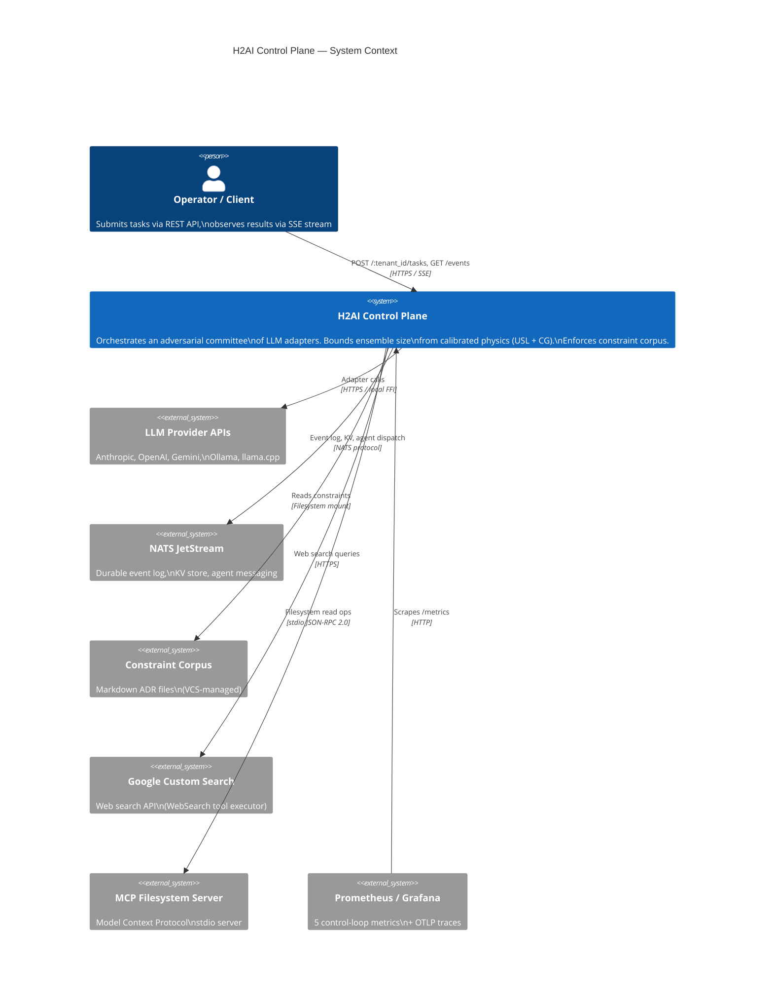

The control plane orchestrates a single task as a 6-phase pipeline. Each phase is event-sourced to NATS JetStream — every state transition is replayable, and every retry decision is auditable. Two independent diversity signals govern execution:

- **Hamming Common Ground (CG)**: pairwise constraint-satisfaction agreement across the adapter pool, measured during calibration. Drives `β_eff = β₀ × (1 − CG_mean)` and the USL ceiling `N_max = round(√((1 − α) / β_eff))`.
- **Cosine N_eff**: participation-ratio diversity from the eigendecomposition of the embedding cosine kernel. A pool-level `n_eff_cosine_prior` is the Bayesian prior at calibration; a task-level `n_eff_cosine_actual` is computed from the wave's raw proposal outputs at every MAPE-K decision point (see math.md §3 for the `from_cosine_matrix` formula).

The two signals are not redundant. Hamming CG measures *behavioural* agreement on the constraint corpus. Cosine N_eff measures *semantic* independence at generation time. Both flow through the planner, the multiplication-condition gate, and the MAPE-K retry loop.

---

## 2. Execution phases

### C4 Level 2 — Containers

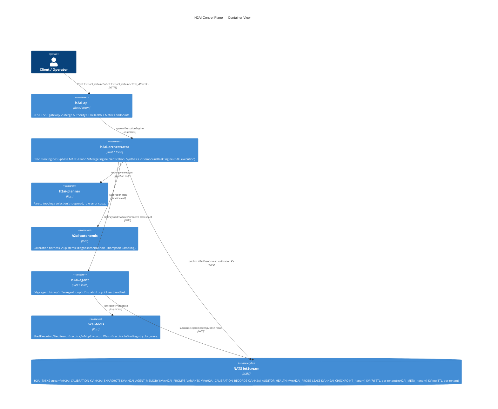

A task moves through six phases. Each phase emits one or more events, and every retry restarts at Phase 2.

### Phase −1 — Thinking Loop (optional pre-execution)

When `thinking_loop.enabled = true`, a coverage-convergence brainstorm runs before Phase 0. A sequence of cognitive archetypes are selected via LLM, each brainstorming the task description independently. The loop iterates until `coverage_score ≥ coverage_threshold` (default 0.75) or `max_iterations` is reached.

**Adaptive archetype count:** On iteration 0, all `max_archetypes` are instantiated. On subsequent iterations, the count contracts to `max(2, ceil(max_archetypes × (1 − coverage_score)))` — proportional to how much coverage remains. A quality floor gate prevents contraction if fewer than `expansion_quality_floor` (default 0.30) of archetypes pass the selection filter.

**Temperature scheduling:** `scheduled_tau` decays linearly from `tau_max` (0.85, broad exploration) to `tau_min` (0.20, exploitation) across iterations.

**Tension injection:** When the previous iteration's `ThinkingReport.tensions` is non-empty, the archetype selection prompt receives an explicit instruction to address the named open tensions.

The loop produces a `ThinkingReport { shared_understanding, tensions, coverage_score, iteration }`. The `shared_understanding` string is injected as `{thinking_context}` into the Phase 0 decomposition prompt. The final `coverage_score` is used as the `thinking_coverage_score` for the `j_eff_min` dynamic threshold.

### Phase 0 — Epistemic Decomposition

Before `EngineInput` is constructed, `run_decomposition_agent()` derives a motivated committee from the task description and constraint corpus. **This phase always runs.** Operator-supplied `slot_configs` are appended to the result as additive context, not as a bypass.

**Path C (production, always):** A pre-dispatch LLM call to the auditor adapter (most capable, τ=0.1) asks: *"What are the N most cognitively distinct expert perspectives needed to solve this problem?"* The structured JSON response is parsed into `Vec<ExplorerSlotConfig>` — each slot has a motivated `role_frame`, `cot_style`, `focus_mandate` (what constraint domains this slot owns), `rejection_criteria` (the specific failure mode to look for), `constraint_domains: Vec<String>` (domain tags owned by this slot — used by the C3 domain coverage guard), and `search_enabled: bool` (when `true`, the researcher adapter is called before Phase 3 generation to provide grounding context). The count of slots is the motivated N. Returns `Result<Vec<ExplorerSlotConfig>, DecompositionError>` — **failure causes `TaskFailed`; there is no silent fallback.**

**Operator context (additive):** If the manifest carries `slot_configs`, they are appended to the Path C result after the LLM response is parsed, then the combined set is re-pruned by orthogonality. They do not bypass decomposition.

**Orthogonality pruning:** If the produced N exceeds the USL cost ceiling `N_max`, `prune_by_orthogonality()` drops the slot with the highest mean cosine similarity to all retained peers — the least independent perspective — until `len ≤ N_max`. Never pads to fill the budget. `N_max` is the **cost ceiling** (from USL calibration), not the quality target — see math.md §2 and §5.1. The quality target is `n_it_optimal` (information-theoretic, `EnsembleCalibration::n_it_optimal()`); the planner uses `min(n_it_optimal, N_max)` as the quality-bounded cost ceiling before applying eigen-cap and quadrant overrides. **Implemented 2026-05-26 (INNOVATION-4).**

**Context injection:** The engine prepends `[MANDATE]: {focus_mandate}` and `[FIND]: {rejection_criteria}` before each agent's system context when those fields are non-empty.

**Adversarial verifier selection:** After slot configs are fixed, `tasks.rs` checks whether any slot has non-empty `rejection_criteria`. If true, `VerificationConfig` is set to use `ADVERSARIAL_EVALUATOR_SYSTEM_PROMPT` (hostile-reviewer framing) instead of the standard rubric-compliance prompt. Since Path C always populates `rejection_criteria`, the adversarial verifier is the default in production.

`n_eff_cosine_roles` is logged per task as a trace event.

### Phase 1 — Bootstrap

The orchestrator compiles the task description and the active constraint corpus into an immutable `system_context`. The `J_eff` gate enforces a minimum context-fill fraction; tasks below the threshold are rejected with `ContextUnderflow` rather than run with insufficient grounding. Emits `TaskBootstrapped`. For the constraint corpus markdown format, predicate kinds, severity levels, and ConstraintSource abstraction, see reference.md §7.

**Knowledge Provider — role-stratified enrichment:** When `[knowledge]` is configured in `H2AIConfig`, `AppState.knowledge_provider` holds a `Bm25WikiProvider` built at startup from the constraint YAML corpus plus any `wiki/` topic nodes. During generation Phase B1, each explorer slot issues a parallel `provider.query()` call. The slot's `ExplorerSlotConfig.agent_role` (Coordinator / Executor / Evaluator / Synthesizer — defaults to `Executor`) maps via `profile_for_role()` (in `h2ai-types::knowledge`) to a `KnowledgeProfile` that selects:
- **RAPTOR mode** — `CollapsedTree` (holistic, all levels simultaneously) for Coordinator and Synthesizer; `TreeTraversal` (cluster-then-leaf, procedural depth) for Executor and Evaluator
- **PPR hops** — `expand_hops=2` for Executor (multi-hop constraint traversal, HippoRAG arXiv 2405.14831), `expand_hops=1` for Synthesizer (cross-domain tension surfacing), `expand_hops=0` for Coordinator and Evaluator
- **domain_tag_boost** — Executor and Evaluator get `topic_knowledge` filtered to domain-matching nodes; Coordinator and Synthesizer get the global view only

Results populate `ContextAssemblerInput.{global_knowledge, topic_knowledge, constraint_tensions}`. Synthesizer slots additionally receive cross-domain `SurfacedTension` entries as `SectionTag::ConstraintTension` (importance=0.85, preserve=false) — cross-domain tension surfacing. The optional `InductionStore` (NATS KV bucket `H2AI_INDUCTION_{tenant}`) records `KnowledgeNodePattern` after accepted merges and boosts `explicit_ids` on subsequent matching tasks (cold start = pure BM25+). Any failure (provider error, store unavailable) degrades silently to `(None, None, None)` — task execution never blocks on knowledge enrichment. When `[knowledge]` is absent, a `PassthroughProvider` delegates to `ConstraintResolver` with no behaviour change.

### Phase 2 — Topology Provisioning

The planner selects topology, explorer roles, and merge strategy from the calibration result and the task's Pareto weights:

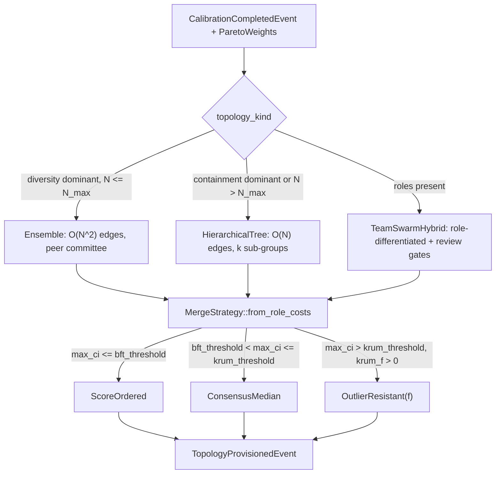

Outputs: `topology_kind`, N explorer configs with τ values, one auditor config, `merge_strategy`, `n_max`, `interface_n_max`, `beta_eff` snapshots, and a `constraint_tombstone` field (populated only when retrying after `ConstrainedExploration`).

### Phase 2.5 — Multiplication Condition Gate

Three conditions must hold before the system commits compute. All three are evaluated against the calibrated `EnsembleCalibration`:

1. `p_mean > min_competence` — adapters are above chance.
2. `rho_mean < max_correlation` — error correlation is below the saturation point.
3. `cg_mean ≥ θ_coord` — the Common Ground floor.

Failure produces `MultiplicationConditionFailed` with one of `InsufficientCompetence`, `InsufficientDecorrelation`, or `CommonGroundBelowFloor`. The retry policy then selects the next topology or fails the task.

A fifth condition — **`QuorumDegradedBelowMinimum`** — is checked at Phase 2.6 by `phases/complexity.rs`. When the unclamped `N_max < 3.0` (AIMD degradation), `n_max_degraded()` returns `true`. Outside shadow mode, this fails fast before generating any proposals. In shadow mode, a `WARN` trace with `unclamped_n_max` is emitted and execution continues — the type-system floor in `n_max_ci()` ensures N≥3 is used regardless. See math.md §2.7 and §4 for the quorum floor derivation.

### Phase 2.6 — Pool Diversity Guard

A separate gate, evaluated only when `cfg.diversity_threshold > 0`. Compares the calibration's `n_eff_cosine_prior` against `1.0 + diversity_threshold`. When the pool's effective independent-adapter count is below the floor, the engine emits a synthetic `ZeroSurvival` with `failure_mode = ModeCollapse` and routes through `RetryPolicy`. This is the fourth multiplication condition: `InsufficientPoolDiversity`. It exists because Hamming CG can mark constraint-profile agreement as "high coordination" while the pool remains semantically near-degenerate (correlated hallucination risk).

**Loud degradation:** When `embedding_model` is `None` (fastembed unconfigured) and `diversity_threshold > 0`, `DiversityGuardDegradedEvent` is emitted to NATS rather than silently falling back to the closed-form `n_eff_cosine_prior`. A startup warning fires when this configuration is detected. When `cfg.require_bivariate_cg = true`, the task fails with `InsufficientPoolDiversity` rather than proceeding in degraded mode.

**Domain coverage guard (C3 pre-loop):** Before the MAPE-K wave loop starts, the engine checks whether the union of `constraint_domains` across all `ExplorerSlotConfig`s covers the corpus domain tag set. Coverage fraction = `|covered| / |corpus_domains|`. Below `cfg.domain_coverage_threshold` (default 0.40), `DiversityGuardDegradedEvent` is emitted. With `require_bivariate_cg = true`, the task fails immediately.

### Phase 3 — Parallel Generation (TAO)

N explorers run their TAO (Thought–Action–Observation) loops in parallel through the Tokio executor. Each explorer independently:

- Receives the immutable `system_context`.
- Iterates up to `cfg.agent_max_tool_iterations` times, emitting `TaoIteration` per turn.
- On each turn: calls the LLM adapter, parses the output for a structured `{"tool": ..., "input": {...}}` JSON tool call, executes the tool locally via its `ToolRegistry`, appends the observation to the running message history, and continues until the output contains no tool call or the iteration cap is reached.
- Produces a `Proposal` event with raw output and token cost — or a `ProposalFailed` event on timeout, OOM, or adapter error.

**Timeout retry:** When `tao_config.retry_on_timeout = true` (default) and the adapter call times out on turn 1 or on the bypass path (reasoning models), the engine retries exactly once with `max_tokens = tao_config.timeout_retry_max_tokens` (default 512). The reduced token budget forces a concise response and recovers proposals that would otherwise fail on verbose slow models. Turns 2+ always propagate timeouts immediately without retry, to prevent double-timeout penalty in multi-turn loops. If the retry call also times out, the error propagates as normal.

`GenerationPhaseCompleted` summarises success/failure counts. Adapter rotation offset (set by `ModeCollapse` retries) is applied at adapter selection time so a retry sees a rotated subset of the pool.

### Phase 3.1 — Correlated Hallucination Detection (C1)

After all explorer proposals arrive and before verification, the engine runs the correlated hallucination check when `cfg.correlated_hallucination_cv_threshold > 0.0` and at least `cfg.correlated_hallucination_min_proposals` proposals are available.

`compute_cv(proposals)` (`crates/h2ai-orchestrator/src/correlated_hallucination.rs`) computes all `N×(N−1)/2` pairwise token-Jaccard distances and returns the coefficient of variation. Low CV = proposals cluster semantically = correlated-regime signal. The N = 2 edge case is handled: a single pairwise distance is a one-point distribution (CV = 0 always); `compute_cv` returns `None` for diverse N = 2 (statistically meaningless) and `Some(cv = 0.0)` only for identical N = 2 proposals (definite signal).

When `cv < correlated_hallucination_cv_threshold` **AND** `mean_jaccard_distance < correlated_hallucination_min_jaccard_floor` (default 0.50): (1) `CorrelatedEnsembleWarningEvent` is appended to the output; (2) the **reactive grounding path** invokes `SraniGroundingChain::resolve` — a three-tier escalating chain: `SpecAnchorGrounder` (always, injects spec entities), then `LlmResearcherGrounder` (tier 0, fetches contradiction evidence via the researcher adapter), then `WebSearchGrounder` (tier 1, live web search distilled by LLM); (3) the MAPE-K retry loop `continue`s to the next generation wave. The joint AND condition prevents spurious retries on high-quality diverse ensembles where all pairwise distances are high (CV=0 but not correlated).

**Proactive researcher path** (separate from C1): slots with `search_enabled: true` (set by decomposition STEP3) trigger a researcher pre-pass *before* Phase 3 generation — the researcher fetches domain-specific grounding context that is injected into the slot's system context before any LLM call. This decouples grounding from hallucination detection.

`CorrelatedEnsembleWarning` and `ResearcherGrounding` events are published to NATS via `tasks.rs` after the shadow audit events block.

### Phase 3.2 — SRANI Correlated Fabrication Detection

After the token-Jaccard CV check (Phase 3.1), the engine runs SRANI (Specification-Relative Architectural Noun Intersection) when `cfg.srani.enabled = true`.

`SraniGroundingChain::compute_cfi(proposals, task_spec)` extracts architectural noun entities from each proposal, intersects them with the set absent from the task specification, and computes CFI = max pairwise overlap of per-proposal ungrounded entity sets. CFI ∈ [0, 1]; CFI = 1 means every entity in one proposal's ungrounded set is shared with another proposal — a strong cross-proposal fabrication signal at the entity level (distinct from token-level CV).

**Adaptive sigmoid gate:** Rather than static warn/inject thresholds, injection pressure is computed as `injection_pressure = σ((CFI − μ) / T)` where:
- `μ` = EMA of observed CFI values (`srani_ema_alpha`, default 0.20, ≈5-task memory horizon), cold-start value 0.45
- `T` = temperature controlling gate sharpness (`srani_temperature`, default 0.15)

When `injection_pressure ≥ srani_gate_threshold`: `SraniGroundingChain::resolve(ctx, tier)` is called. The chain escalates: tier 0 runs `SpecAnchorGrounder` (always, injects spec entities as alternatives) + `LlmResearcherGrounder` (researcher adapter fetches grounding evidence); tier 1 additionally runs `WebSearchGrounder` (live web search, LLM-distilled). The hint is injected into the next generation wave.

**EMA persistence:** `srani_ema_cfi` and `srani_count` are loaded from NATS KV bucket `H2AI_ESTIMATOR` key `"srani_adaptive_state"` at startup and persisted after each task. The EMA tracks the system's operating regime — tasks in low-CFI regimes use a low baseline, letting genuine spikes trigger grounding; tasks in high-CFI regimes raise the baseline so not every wave triggers.

Emits `CorrelatedFabricationEvent { cfi, injection_pressure, shared_ungrounded_entities, hint_injected }` and optionally `ResearcherGroundingEvent { source: GroundingSource, slot: Option<String>, ... }`.

**Slot classification:** `ResearcherGroundingEvent.slot` is populated by `classify_grounding_slot(shared_ungrounded_entities)` — a keyword classifier that maps fabricated entity names to named repair context injection slots: `"message_broker"` (Kafka, RabbitMQ, ActiveMQ), `"distributed_coordination"` (ZooKeeper, etcd, Consul, Chubby), `"cache_layer"` (Redis, Memcached, Dragonfly), `"database_migration"` (Postgres system objects, `replication_slot`), or `"implementation_detail"` for unknowns. First-match wins over the entity list. The slot is used by `build_repair_context()` to inject the grounding summary into the structurally correct section of the repair prompt rather than appending it as free-form text.

### Phase 3.5 — Verification

> **Phase numbering:** Fractional phase numbers (2.5, 2.6, 3.5, 4.5) denote sub-phases introduced after the initial integer numbering was fixed. They fit between the surrounding integer phases in execution order and are used consistently in the event vocabulary (see reference.md §2 variant index).

A multi-variant **judge panel** (`JudgePanel`) scores every proposal against the constraint corpus. Each scoring emits `VerificationScored {score, reason, passed}`. Proposals that fail verification become `BranchPruned` with their `violated_constraints` recorded.

**Panel construction:** The panel is built from the verification adapter plus any explorer adapters from distinct families. If ≥2 distinct adapter families are available the panel uses `PanelDiversityKind::CrossFamily` (one variant per family, cap 3) with supermajority vote (`quorum_fraction` default 0.67) per constraint → `ConstraintVerdict::Pass / Fail / Uncertain`. If only one family is available, `PanelDiversityKind::PersonaOnly` runs 3 variants (Literal, Contextual, Skeptical personas) requiring unanimous agreement — any dissent produces `Uncertain`. Proposals with uncertain-only constraint failures pass with a score penalty (`uncertainty_weight` default 0.7); hard `Fail` verdicts prune. When ≥`ambiguity_threshold` proposals in a wave produce uncertain votes on the same constraint, `ConstraintAmbiguityEvent` is logged as a corpus quality signal. For the full `[judge_panel]` configuration table (`quorum_fraction`, `uncertainty_weight`, `persona_temperatures`, `ambiguity_threshold`), see reference.md §4.

**Rubric independence:** The explorer's `system_context` is compiled with `include_rubric=false` (the production default in `compiler::compile`). `LlmJudge` constraint rubrics and their IDs are **withheld** from the explorer — the verifier retains them via `ConstraintPredicate::LlmJudge` and uses them for scoring, but the explorer must reason from the task description and domain expertise alone. This prevents the verifier from simply confirming that the explorer followed instructions it was already given.

**Adversarial verifier:** When any explorer slot carries non-empty `rejection_criteria`, verification uses `ADVERSARIAL_EVALUATOR_SYSTEM_PROMPT` — a hostile-reviewer framing that asks the verifier to find the single most likely silent failure rather than checking rubric compliance. Since Path C always populates `rejection_criteria`, this is the default in production.

### Phase 4 — Auditor Gate

A separate auditor adapter (typically a stronger reasoning model than the verifier) is the final non-negotiable gate. Its output is required to be JSON `{approved, reason}`. Non-JSON output is treated as rejection (fail-safe). Rejected proposals become additional `BranchPruned` events.

**Shadow auditor strict mode:** When `safety.shadow_auditor.enabled = true`, a second concurrent auditor call produces a shadow vote alongside the primary. The AND-vote (both must approve) is only binding by default for task domains that appear in the `promoted_domains` set — domains accumulate there after a configurable number of disagreements. When `safety.shadow_auditor.strict = true` (set automatically for `SafetyProfile::Production` and `SafetyProfile::Strict`), the AND-vote is binding on every proposal regardless of promotion history. This ensures the shadow auditor acts as a hard gate from the first task, which is essential in benchmark and production deployments where there is no prior disagreement history to warm the promotion set. The `strict` flag has no effect when `shadow_auditor.enabled = false`; a startup warning is emitted if both are set inconsistently.

### Phase 4.5 — Oracle Gate (optional)

When `oracle_gate.enabled = true`, a NATS `request()` call is made to `cfg.oracle_gate.subject` with a timeout of `oracle_gate.timeout_secs`. The oracle receives a JSON payload listing the surviving proposals and their scores. The oracle responds with `OracleGateResultEvent { gate_passed, confidence, summary, checked_proposals, passed_proposals }`.

**On pass** (`gate_passed = true`): the result is attached to the merge output as `oracle_gate_passed = Some(true)`. If the thinking loop produced a candidate solution that the oracle approved, `oracle_confidence_bonus` is added to the synthesis weight.

**On fail** (`gate_passed = false, confidence < min_confidence`): if a matching `ClarificationTemplate` pattern fires, a `PendingClarificationEvent` is published and the engine suspends via `clarification_waiters`. `POST /{tenant_id}/tasks/{id}/clarify` resumes it with an operator-supplied answer.

**On timeout**: behaviour is controlled by `on_timeout`: `pass` (treat as approved), `fail` (treat as rejected), or `skip` (proceed without oracle result, no `oracle_gate_passed` field).

### Adaptive Prompt Harness (OPRO)

When `opro.enabled = true`, the control plane tracks a per-adapter j_eff EMA across tasks. When `j_eff_ema < opro.trigger_j_eff_threshold` and `n_tasks_total ≥ opro.min_tasks_before_trigger`, an OPRO (Optimization by PROmpting, arXiv 2309.03409) cycle is triggered: the auditor LLM is asked to rewrite the current prompt template to improve output quality, the candidate is validated (all template variables must survive), and stored as a new `PromptVariant` in `H2AI_PROMPT_VARIANTS`. A Thompson-sampling bandit (`alpha`, `beta` per variant) selects the active variant each task. After `graduation_tasks` total tasks, the variant with the highest mean reward (by `promotion_margin`) is promoted as the new default and a `PromptVariantPromotedEvent` is emitted.

Bootstrap priors are seeded at startup from `AdapterProfile.tier`: Capable=0.78, Standard=0.62, Fast=0.45 j_eff median priors. This eliminates the cold-start problem by providing principled Bayesian priors before any tasks have run — no empirical data required.

### Phase 5 — Merge

Surviving proposals enter `MergeEngine::resolve` with the strategy chosen at Phase 2:

- **ScoreOrdered**: pick the highest verification score.
- **ConsensusMedian**: pick the proposal with highest mean Jaccard similarity to the rest. *Not Byzantine-resistant — vulnerable to coordinated proposals at f ≥ n/2.*
- **OutlierResistant{f}**: smallest sum of distances to its `n − f − 2` nearest neighbours in Jaccard-distance space (Krum-style, from federated learning Byzantine-robust aggregation — Blanchard et al. 2017). Requires `n ≥ 2f + 3`.
- **MultiOutlierResistant{f, m}**: iteratively select m survivors via OutlierResistant, then take the highest verification score.

**OSP regime layer.** When `[osp]` is configured, `MergeEngine::resolve` classifies the surviving proposals into one of four regimes before strategy dispatch:
- `ZeroSurvival` (N_v=0): short-circuit before any LLM call.
- `SingleSurvivor`: return directly.
- `ClearLeader` (score gap Δ ≥ 2·T_v and P(correct) ≥ 0.92): select leader, skip ConsensusMedian.
- `TightCluster` (Δ < 2·T_v): run ConsensusMedian over passing proposals only.

`SemilatticeResult` carries `valid_proposal_scores: Vec<f64>` (parallel to `valid_proposals`) so scores flow from Phase 3.5 into the regime classifier. `AuditChannelBuilder` constructs Zone 3 audit findings from structured `ConstraintViolation` IR (never raw proposal text) and injects them as `zone3_hints` on `MergeResolvedEvent` for next-retry guidance. `RetryAccumulator` (local variable, task-scoped, never persisted) tracks per-constraint violation rates with λ=0.7 decay across retries.

**The two-layer cost model.** The `HierarchicalTree` orchestration topology reduces *orchestration* coordination to O(N) (α). The synthesis step is a separate, unavoidable O(N²) cost: computing `CG_mean` requires `N×(N−1)/2` pairwise Hamming comparisons, and the synthesis LLM must hold all N proposals in context and resolve their pairwise constraint conflicts. The β coefficient is fitted from merge-phase timing and captures this synthesis cost directly. DAG topology reduces α, not β — the two costs are independent.

Emits `SelectionResolved` and either `MergeResolved` (success) or `ZeroSurvival` (zero-survival → MAPE-K retry).

> The CRDT semilattice resolves to a single winning proposal by selection (LUB over `(generation, score)` tuples); content synthesis, if enabled, is a separate Phase 5a operation.

### Phase 5a — Synthesis (optional)

When `synthesis_enabled` and at least `synthesis_min_proposals` have survived audit, the synthesis adapter performs a critique→synthesis→re-verify pass over the candidate set. The re-verified score is compared against `max(individual_scores)`; the difference is recorded as `synthesis_gain` on `HarnessAttribution`. If synthesis improves the maximum, its output replaces the merge result.

### GAP-D6: Constraint-Informed Synthesis Wave (terminal, closed 2026-05-24)

When all MAPE-K retries exhaust with `verified=0` (constraint dispersion — each proposal passes a different subset of binary checks), the engine fires one terminal synthesis wave before returning `MaxRetriesExhausted`. This path is guarded by `synthesis_wave_enabled` (default `true`).

**Three-mechanism approach:**

- **B1 — Compliance checklist injection** (`repair.rs`, `F1_COMPLIANCE_CHECKLIST` prompt template): at retry ≥ 1, `ConstraintDoc.binary_checks` (preserved through YAML compilation) are injected verbatim as a numbered checklist into the generation system prompt. The LLM sees each binary requirement as a distinct enumerated item.

- **B2 — Orthogonal partial-pass examples** (`repair.rs`, `select_orthogonal_partials`): pruned proposals carrying `BranchPrunedEvent.violated_constraints` are scored as `PartialPass` structs (passed-check bitmask + score + text, 1500-char line-safe truncation). Greedy set-cover selects the max_k=2 most diverse partials (maximises newly-covered constraint indices per selection step; index 0 = widest coverage, exploits primacy bias). Each partial is labelled with per-check PASS ✓ / FAIL ✗ markers in the repair context.

- **A — Terminal synthesis wave** (`engine.rs` post-retry block): `select_orthogonal_partials(controller.all_pruned(), &all_checks, 3)` builds the synthesis context. Two execution paths:
  - **Sequential grafting (when `sequential_grafting_enabled = true` and ≥2 sorted partials):** Iterative grafting loop — seed `base` from highest-scoring partial; each round: `missing_constraint_ids(base, candidate, offsets)` identifies constraint clusters covered by the candidate but not yet in the base; `build_graft_context` builds a focused prompt (base + candidate text for those clusters only); one LLM call; intermediate `VerificationPhase::run` checks `new_score ≥ base_score` (Monotonicity Invariant — rollback if regression). Loop terminates after at most `sequential_grafting_max_rounds` iterations. Eliminates "Lost in the Middle" attention diffusion on long multi-partial contexts — each call sees at most O(|base| + |candidate|) tokens. Literature: Sequential Edge (Xie et al. 2025) — 46.7% improvement in constraint satisfaction vs. parallel merge.
  - **Single-shot synthesis (default):** `build_synthesis_context` (system context + B1 checklist + ≤3 partial examples + Coherence Mandate). One LLM call (synthesis adapter or first explorer adapter).
  - Both paths re-verify: `verif_out.passed` non-empty → `Ok(EngineOutput)` via `controller.finalize()`; empty → `MaxRetriesExhausted { best_partial_text: Some(global_best) }` where `global_best` is the highest-scored partial across **all** pruned events, surfaced for HITL via `tasks.rs` log.

### Coherence State (per-wave)

After each verification round (`all_pruned.extend()`), the engine computes `wave_coherence: CoherenceState` with two closure dimensions:

- **`uncovered_domains`:** constraint domains where any pruned proposal had violations. Derived from `BranchPrunedEvent.violated_constraints` mapped through the constraint corpus domain tags.
- **`active_contradictions`:** pairs of surviving proposals that score on opposite sides of the 0.5 threshold on any constraint in the same domain. Derived from the Phase 4.5 static-constraint satisfaction matrix.

`is_closed()` returns `true` only when both fields are empty. `wave_coherence` is reused at all exit paths (synthesis bypass, `MergeOutcome::Resolved`) without recomputation. It is traced per-wave at `h2ai.coherence` level.

At task close (in `tasks.rs`), if `!output.coherence_state.is_closed()`, a `CoherenceIncomplete` event is published to NATS before `MergeResolved`, carrying the `uncovered_domains` list and retry count.

### MAPE-K loop on zero survival

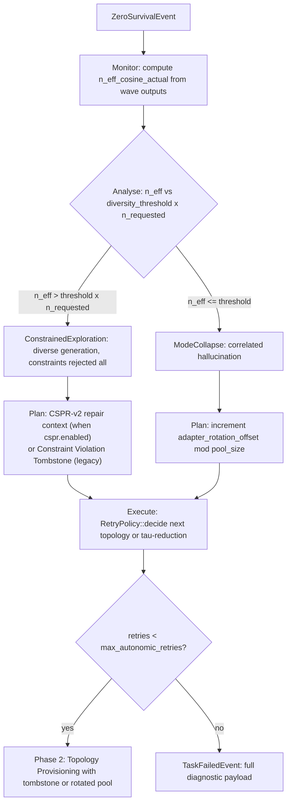

Both interventions are bookkept as Prometheus counters with a `failure_mode` label (`mode_collapse` and `constrained_exploration`).

### Post-merge async event

After `MergeResolved`, the engine spawns an async task that publishes `EpistemicYield {n_eff_cosine_actual, n_eff_prior, yield_ratio, adapters}`. `yield_ratio = n_eff_actual / N_requested` — the "financial yield": you paid for N adapters, you received `n_eff_actual` independent perspectives. This event never blocks task close.

---

## 2.1 Orchestrator implementation — three-layer decomposition

The `h2ai-orchestrator` crate implements the MAPE-K loop as three distinct layers. This decomposition separates concerns that are orthogonal but were previously entangled in a single `run_offline` function:

| Layer | File | Responsibility |
|-------|------|----------------|
| **Phase modules** | `src/phases/` (16 modules) | Pure data transformations. Each module exposes an `Input` struct, an `Output` struct, and a `run()` function returning `StepResult<Output>`. No retry state; no cross-wave memory. |
| **ExecutionPipeline** | `src/pipeline.rs` | Sequences the 16 phase modules for one wave. Stateless — receives `PipelineParams` each wave, returns `PipelineWaveResult`. Can be tested in isolation without a running controller. |
| **MapeKController** | `src/mape_k.rs` | Owns all retry state. Implements `observe(wave)` (aggregates events across waves — also updates `global_best_proposal: Option<(f64, String)>` cross-wave accumulator), `params()` (projects current state into `PipelineParams` for the next wave), and `decide(outcome)` (maps `PipelineOutcome` to `MapeKDecision`). Carries `conflict_graph: ConstraintConflictGraph` (built once at task start) and `binary_checks: Vec<String>` (flat list of all `ConstraintDoc.binary_checks` across the corpus — used by B1 and B2 injection). Exposes `all_pruned() -> &[BranchPrunedEvent]` and `system_context_with_rubric() -> &str` for the terminal synthesis wave. When `cspr.enabled = true`, `apply_retry_action` handles `RetryWithTargets { topology, targets: Vec<RepairTarget> }` from `RetryPolicy::decide()`: calls `build_repair_context(RepairInput { targets, conflict_graph, checks, partial_passes, prior_best_score, … })`. Each `RepairTarget.verifier_reasons: Vec<(f64, String)>` carries scored, Jaccard-deduped reasons selected by `top_k_unique_reasons(k=tried_topologies.len()+1, dedup_j=0.7)` — wave 1 → top-1, wave 2 → top-2, wave 3+ → all unique. Slot A emits a `TARGET BEHAVIOR` block when `RepairTarget.criteria_pass` is non-empty (sourced from `ConstraintDoc.rubric.pass`, propagated `ComplianceResult → ConstraintViolation → RepairTarget`), then "VERIFIER INTERPRETATION (best attempt: N% compliance)" with secondary reasons as "ALTERNATIVE DIAGNOSIS"; when `criteria_pass` is None the YOUR TASK text reads "satisfies the constraint requirement" (positive framing, not prohibition-forward — see Mayne et al. arXiv 2605.13829). Slot B falls back to "GUIDANCE" (remediation_hint); Slot C uses constraint description only. `prior_best_score` emits a global compliance header. Adds `[COMPETING CONSTRAINTS DETECTED]` MetaRepair block when two violated constraints are in the conflict graph. B1 checklist and B2 partial-pass examples appended when `checks` is non-empty and `retry_count >= 1`. |
| **Coordinator** | `src/engine.rs` (~30 lines) | Creates controller and pipeline, runs the `loop { pipeline.run → controller.observe → controller.decide }` cycle, routes `MapeKDecision` to return/continue/error. |

### Phase execution sequence

Phases split into two groups with different retry semantics:

**Pre-loop (run once per task, before the retry loop — `engine.rs`):**

| Order | Module | What it does | Returns on failure |
|-------|--------|-------------|-------------------|
| 1 | `bootstrap` | Compiles system context (with and without rubric) via `compiler::compile`, applies compaction, checks family conflict gate (`RequireDiverse` / `SingleFamilyOk`) | `Err(EngineError)` — task fails immediately |
| 2 | `complexity` | Calls `assess_task_complexity()`, assigns `TaskQuadrant`, guards against `Degenerate` in non-shadow mode, derives `cg_mean` and `n_max_ceiling` from calibration | `Err(EngineError)` — task fails immediately |
| 3 | `domain_coverage` | Computes corpus domain tag coverage across slot configs; emits `DiversityGuardDegradedEvent` (non-blocking unless `require_bivariate_cg = true`) | `Err(EngineError)` — task fails immediately |

> **Two distinct diversity events.** `DiversityGuardDegradedEvent` (pre-loop module 3, Phase 2.6 domain coverage) and `MultiplicationConditionFailed { InsufficientPoolDiversity }` (per-wave module 3, Phase 2.6 semantic pool guard) are different events. The first fires when the task's constraint domain tags do not cover the corpus — it is a corpus alignment warning. The second fires when the cosine N_eff of the adapter pool is below floor — it is a pool composition block. A task can trigger both independently.

**Per-wave (run inside the retry loop — `pipeline.rs`, `ExecutionPipeline::run()`):**

| Order | Module | What it does | `EarlyExit` reason |
|-------|--------|-------------|-------------------|
| 1 | `topology` | `TopologyPlanner::provision()`: selects topology, assigns explorer roles with τ-spread/reduction from `PipelineParams`, checks OutlierResistant quorum (`n ≥ 2f+3`) | `Fatal(InsufficientQuorum)` |
| 2 | `multiply` | `MultiplicationChecker::check()` against `p_mean`, `ρ_mean`, CG threshold from calibration (Phase 2.5) | `MultiplicationFailed { tau_values }` |
| 3 | `diversity` | `n_eff_cosine_prior < 1.0 + diversity_threshold` check (Phase 2.6) | `MultiplicationConditionFailed { InsufficientPoolDiversity { n_eff, threshold } }` |
| 4 | `generation` | Parallel TAO agent dispatch — one `TaoAgent::run()` per explorer; collects `ProposalEvent`s | — (never `EarlyExit`) |
| 5 | `hallucination` | CV + Jaccard correlated hallucination detection; triggers SRANI grounding when both thresholds fire | `HallucinationDetected { retry_context_hint }` |
| 6 | `srani` | SRANI escalating grounding chain: `SpecAnchorGrounder` → `LlmResearcherGrounder` → `WebSearchGrounder`; updates SRANI EMA-CFI | — |
| 7 | `verify` | `LlmJudgeVerifier` batch verification in parallel; scores each proposal against the constraint corpus | — |
| 8 | `audit` | `AuditorAdapter` gate; selects auditor-survivor proposals; emits `ShadowAuditorResultEvent` | — |
| 9 | `frontier` | Static constraint satisfaction matrix (proposal × static-constraint); computes `pareto_coverage` | — (returns `None` when no static constraints) |
| 10 | `oracle` | NATS request/reply oracle gate with `timeout_secs`; `on_timeout = "pass"` → `Some(true)` | `OracleBlocked` |
| 11 | `synthesis` | Filters proposals to auditor survivors; builds merge candidate set; derives `coherence_state` | `ZeroSurvival { filter_ratio }` when no survivors |
| 12 | `merge` | `MergeEngine` dispatch: Krum / OutlierResistant / Hierarchical / Plurality depending on topology | `ZeroSurvival` on merge failure |

### Wave result flow

Every phase function returns a `StepResult` — a uniform envelope that lets `ExecutionPipeline` handle failures without pattern-matching on each phase's specific error type:

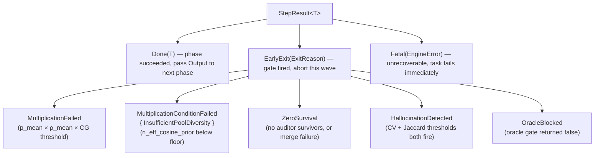

`MapeKController::decide()` maps every `ExitReason` to one of three controller decisions:

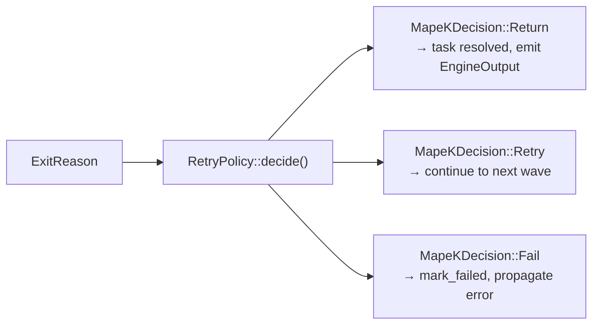

Phase modules only classify failures — they never call `RetryPolicy`. The controller owns all cross-wave state mutation: topology overrides, τ-reduction, retry context injection, self-optimizer updates, Talagrand τ-spread feedback.

### PipelineParams — controller state projected into each wave

`MapeKController::params()` produces an immutable snapshot before each wave. The pipeline consumes it without holding a reference back to the controller, keeping the two layers fully decoupled:

| Field | Purpose |
|-------|---------|
| `optimizer` | Agent count and merge thresholds from the self-optimizer |
| `force_topology` | Topology override set by `RetryPolicy` on previous wave failure |
| `tau_reduction_factor` | Accumulated τ-reduction multiplier across retries |
| `tau_spread_factor` | τ-spread expansion factor driven by Talagrand feedback |
| `adapter_rotation_offset` | Round-robin offset to rotate adapter assignment across waves |
| `retry_context` | Injected constraint-feedback hint text from `RetryPolicy` |
| `tao_config` | Per-turn TAO configuration (may be relaxed on retry) |
| `verification_config` | Verification gate thresholds |
| `srani_ema_cfi` | SRANI correlated fabrication index EMA carried forward |
| `srani_count` | SRANI trigger count accumulated across waves |
| `srani_tier` | SRANI escalation tier: 0 = SpecAnchor, 1 = Researcher, 2 = WebSearch |
| `srani_last_wave_fired` | Whether SRANI fired on the immediately preceding wave |
| `pending_tombstone` | Constraint tombstone injected at the topology phase on retry |
| `leader_context` | `Option<LeaderContextSnapshot>` — Krum-elected leader's prior proposal text, Socratic question, and per-slot constraint aspect assignment; `None` when `leader_enabled = false` or first wave |

### WaveEvents — cross-wave aggregation

`ExecutionPipeline::run()` returns a `PipelineWaveResult` carrying both the outcome and a `WaveEvents` bundle. `MapeKController::observe()` merges each wave's events into a running aggregate so the final `EngineOutput` reflects the full multi-wave history:

| Category | Events carried |
|----------|---------------|
| **Verification** | `VerificationScoredEvent` per proposal, `ProposalFailedEvent` for non-survivors |
| **Audit** | `ShadowAuditorResultEvent` per wave |
| **Hallucination / SRANI** | `CorrelatedEnsembleWarning`, `CorrelatedFabricationEvent`, `ResearcherGroundingEvent` |
| **Optimizer signals** | `QualityMeasurement` (self-optimizer), `TalagrandFeedback` (τ-spread), `TaoEstimatorUpdate` (bandit) |
| **Topology** | `TopologyProvisionedEvent` (on retry waves), `BranchPrunedEvent` (synthesis/merge pruning) |
| **Constraint frontier** | `ConstraintFrontierEvent` (static constraint satisfaction matrix) |
| **SRANI state mutations** | Updated EMA-CFI, tier, count, and retry context — fed back into `PipelineParams` for the next wave |
| **Gate ratio** | `filter_ratio` (survivors ÷ proposals) — consumed by `RetryPolicy::decide()` |
| **Proposal texts** | `wave_proposal_texts: Vec<(SlotId, String)>` — raw proposal text per slot, carried forward so `prepare_leader_election()` can build the leader's prior-proposal prefix for the next wave |

### Epistemic Leader — cross-wave guidance

The Epistemic Leader is an optional cross-wave guidance layer that runs between `observe()` and the next call to `params()` in `engine.rs`. Its purpose is to prevent the retry loop from repeating the same failed approach by injecting a Socratic diagnostic question and targeted constraint-aspect context into the next wave's generation prompts.

**Election.** After each failed wave, `prepare_leader_election()` selects the leader by argmax over verification scores from the most recent `VerificationScoredEvent` set — the slot with the highest score becomes leader; the second-highest becomes the runner-up and is stored for rotation. This is a lightweight Krum-consistent selection: it uses the same verified score used by the merge engine, so no additional LLM call is needed for election.

**Socratic diagnosis.** The leader's slot config and failed proposal text are passed to a short LLM re-prompt that generates `leader_eig_candidates` candidate questions. Questions are ranked by an EIG (Expected Information Gain) proxy — the question whose semantic embedding is most orthogonal to previously asked questions scores highest. A belief buffer (per-task `Vec<BeliefRecord>`) deduplicates via FNV-1a hash: any candidate whose hash matches a prior record is skipped before EIG ranking. The surviving top question is stored as `LeaderState.current_question` and emitted as `SocraticDiagnosisEvent`.

**Context injection.** `LeaderContextSnapshot` is attached to `PipelineParams.leader_context` before the next wave. The `generation` phase reads it and applies per-slot prompt prefixes: the leader slot receives its own prior proposal text plus the Socratic question; each follower slot receives the question plus an assigned constraint aspect (round-robin over the task's constraint corpus domains). This splits the search space so leader and followers explore different facets of the same diagnostic hypothesis. Injection is a pure string prefix — it does not alter TAO tool configuration or τ values.

**Credibility and rotation.** The leader carries a `credibility: f32` score initialised at `1.0`. On each wave where the best verification score does not improve by more than `leader_stagnation_threshold`, credibility decays by `leader_credibility_decay_rate`. When credibility falls below `leader_credibility_warn_threshold`, a warning is logged. After `leader_stagnation_waves` consecutive stagnant waves, `apply_leader_result()` rotates leadership to the stored runner-up and resets credibility. A wave that improves the best score by at least `leader_stagnation_threshold` partially recovers credibility (`+= decay_rate * (1.0 - credibility)`). The `LeaderElectedEvent` is emitted on both initial election and rotation.

**Config knobs (`reference.toml`):**

| Field | Default | Description |
|-------|---------|-------------|
| `leader_enabled` | `false` | Enable the Epistemic Leader subsystem |
| `leader_stagnation_threshold` | `0.02` | Minimum score improvement to count a wave as non-stagnant |
| `leader_stagnation_waves` | `1` | Consecutive stagnant waves before leadership rotates to runner-up |
| `leader_diagnosis_max_tokens` | `128` | Token budget for the Socratic question LLM call |
| `leader_diagnosis_tau` | `0.3` | Temperature for the diagnosis LLM call (low for focused output) |
| `leader_eig_candidates` | `3` | Number of candidate questions generated before EIG ranking |
| `leader_credibility_decay_rate` | `0.2` | Credibility decrease per stagnant wave |
| `leader_credibility_warn_threshold` | `0.4` | Credibility level below which a warning event is logged |

**Events emitted:**

- `LeaderElectedEvent` — fired by `prepare_leader_election()` on initial election and on runner-up rotation; carries `leader_slot_id`, `credibility`, and `wave_index`.
- `SocraticDiagnosisEvent` — fired after EIG ranking; carries the elected question text, its EIG score, and the count of belief-buffer entries that were skipped as duplicates.

**Implementation files:** `crates/h2ai-orchestrator/src/leader.rs` (`LeaderState`, `LeaderContextSnapshot`, `LeaderElectionPlan`, `BeliefRecord`); `crates/h2ai-orchestrator/src/mape_k.rs` (`MapeKController.leader`, `prepare_leader_election()`, `apply_leader_result()`); `crates/h2ai-orchestrator/src/engine.rs` (async election block between `observe()` and `decide()`); `crates/h2ai-orchestrator/src/phases/generation.rs` (per-slot prefix injection).

### Coordinator sequence

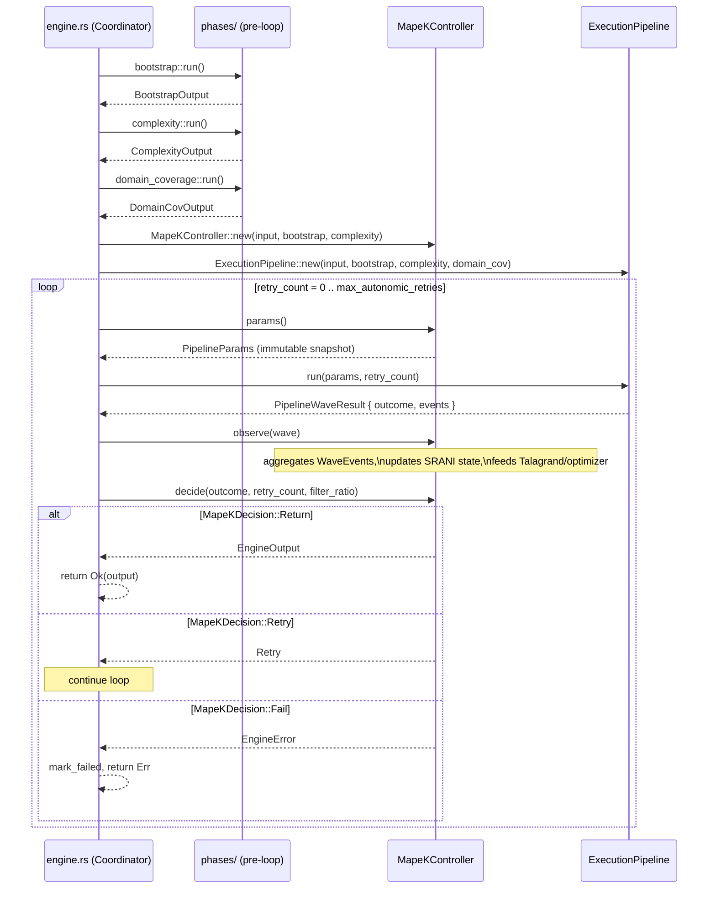

### Calibration and async safety

`EigenCalibration::from_cg_matrix` and `EigenCalibration::from_cosine_matrix` perform symmetric eigendecomposition via nalgebra on an N×N matrix (N = adapter pool size, typically 2–8). Both calls are offloaded to `tokio::task::spawn_blocking` in `h2ai-autonomic/src/calibration.rs` so the async executor thread is never stalled by CPU-bound matrix math.

---

## 3. Task execution lifecycle

### Sequence — full task from submission to resolution

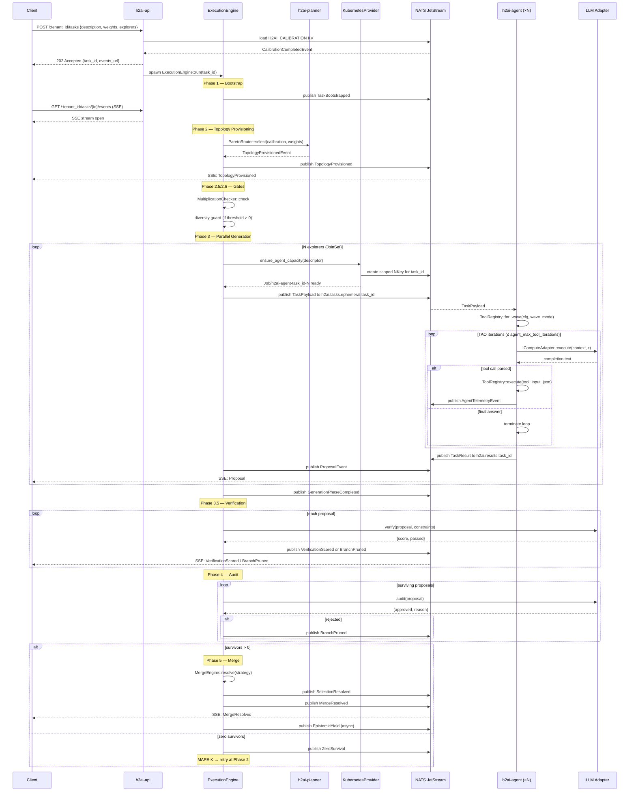

### 3.1 Submission and bootstrapping

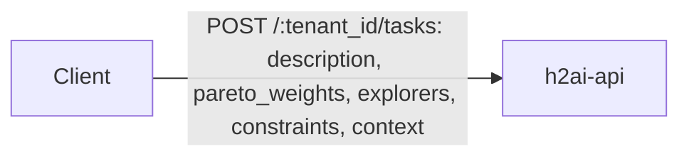

1. **Validation** — weights must sum to 1.0; manifest structure must be valid. `503` if no current calibration in `H2AI_CALIBRATION` KV.
2. **task_id allocation** — a `TaskId` (UUID) is minted. Response is `202 Accepted` with `{"task_id": ..., "events_url": "/{tenant_id}/tasks/{id}/events"}`.
3. **ExecutionEngine::run** — spawned as a Tokio task. Loads `CalibrationCompletedEvent` from `H2AI_CALIBRATION` KV.
4. **Dark Knowledge compilation** — `h2ai-context` assembles the constraint corpus, task description, and prior session memory (from `H2AI_AGENT_MEMORY` KV) into a single immutable `system_context` string.
5. **TaskBootstrapped** published to `h2ai.tasks.{task_id}` on `H2AI_TASKS` stream.

### 3.2 Provisioning and gates

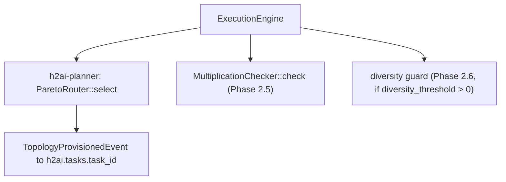

Gate failures write `MultiplicationConditionFailedEvent` and re-enter provisioning (up to `max_autonomic_retries`). On third failure, `TaskFailedEvent` is written and the engine exits.

### 3.3 Agent provisioning and NKey scoping

For each of the N explorers, the provisioner:

1. Calls `AgentProvider::ensure_agent_capacity(descriptor, task_load)` — selects or starts a container matching `descriptor.model`. In Kubernetes this calls `KubernetesProvider`, which creates a `Job/h2ai-agent-{task_id}-{i}` with:
   - Container image chosen from `descriptor.model` (registry-mapped, no hardcoded names in the orchestrator).
   - Volume mounts and security contexts derived from `descriptor.tools`: `Shell` → writable workspace + `SYS_PTRACE`; `CodeExecution` → isolated sandbox volume; `FileSystem` → shared read-only workspace mount; `WebSearch` → egress NetworkPolicy.
2. **NKey minting** — `h2ai-nats` mints a scoped NKey for this `task_id`. The key's `allowed_publish` set is exactly: `h2ai.telemetry.{agent_id}`, `audit.events.{agent_id}`, `h2ai.results.{task_id}`. The key's `allowed_subscribe` set is exactly: `h2ai.tasks.ephemeral.{task_id}`. No other subjects are accessible. The NKey is injected as an environment variable into the container at launch.
3. **TaskPayload publication** — the orchestrator publishes to `h2ai.tasks.ephemeral.{task_id}`:

```rust
pub struct TaskPayload {
    pub task_id:        TaskId,
    pub agent:          AgentDescriptor,   // model + tools
    pub instructions:   String,
    pub context:        ContextPayload,    // Inline(String) | Ref(hash) for offloaded blobs
    pub tau:            TauValue,
    pub max_tokens:     u64,
    pub wave_mode:      WaveMode,          // Normal | Hardened
}
```

When `system_context` exceeds `payload_offload_threshold_bytes` (default 512 KB), it is written to a content-addressed blob store and replaced with `ContextPayload::Ref(hash)`. The agent resolves the hash on receipt. This keeps every NATS message well below the 1 MB JetStream ceiling regardless of corpus size.

### 3.4 Edge agent dispatch loop

The edge agent binary (`h2ai-agent`) runs two concurrent Tokio tasks: `HeartbeatTask` (periodic liveness signal to `h2ai.agent.heartbeat`) and `DispatchLoop` (NATS subscriber on `h2ai.tasks.ephemeral.{task_id}`).

On receiving `TaskPayload`:

1. **ToolRegistry construction** — `ToolRegistry::for_wave(cfg, payload.wave_mode)`. Registers executors according to WaveMode and the `H2AIConfig` sections present. `config_validation::validate_tool_configs` is called at startup so any missing credentials or WASM binaries cause an immediate panic before any task is dispatched.
2. **Tool schema injection** — `registry.all_schemas()` is serialised as a `[TOOLS]` block and prepended to the system context so the LLM knows what tools it may call.
3. **TaoAgent::run** — the local TAO loop (see §4). Runs to completion or iteration cap.
4. **TaskResult publication** — agent publishes to `h2ai.results.{task_id}`:

```rust
pub struct TaskResult {
    pub task_id:          TaskId,
    pub output:           String,
    pub tool_calls:       Vec<ToolCallRecord>,
    pub total_token_cost: u64,
    pub truncated:        bool,
    pub adapter_failed:   bool,
}
```

5. The agent publishes `TaskResult`, then exits. The NKey expires. The Kubernetes Job terminates.

### 3.5 NATS subject namespace

| Subject | Direction | Content |
|---|---|---|
| `h2ai.tasks.{task_id}` | orchestrator → stream | `H2AIEvent` envelopes (phase events, proposals, merge decisions) |
| `h2ai.tasks.ephemeral.{task_id}` | orchestrator → agent | `TaskPayload` per explorer |
| `h2ai.results.{task_id}` | agent → orchestrator | `TaskResult` |
| `h2ai.telemetry.{task_id}` | agent → orchestrator | `AgentTelemetryEvent` (separate `H2AI_TELEMETRY` stream) |
| `h2ai.agent.heartbeat` | agent → orchestrator | liveness ticks |
| `audit.events.{agent_id}` | agent → audit log | structured audit records |

---

## 4. The Edge Agent TAO Loop

### Sequence — TAO agent iteration

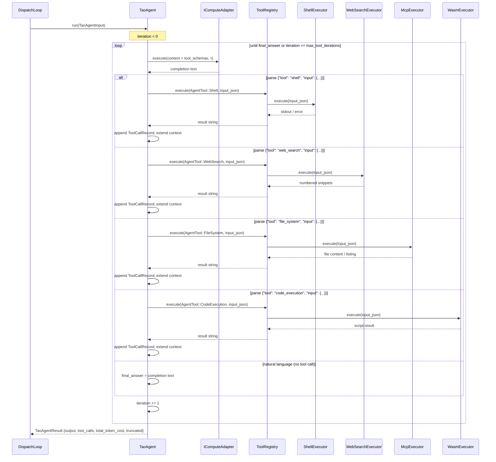

The control plane never runs inference directly. Each Explorer is a stateless edge agent that receives a `TaskPayload` from NATS and runs a local Thought–Action–Observation loop:

```rust
pub struct TaoAgentInput {
    pub instructions:   String,
    pub system_context: String,
    pub tau:            TauValue,
    pub max_tokens:     u64,
}

pub struct TaoAgentResult {
    pub output:           String,
    pub total_token_cost: u64,
    pub tool_calls:       Vec<ToolCallRecord>,
    pub truncated:        bool,
    pub adapter_failed:   bool,
}
```

On each iteration the agent:

1. Builds the running context (instructions + tool observations accumulated so far).
2. Calls `IComputeAdapter::execute()` with the current τ and context.
3. Attempts to extract a tool call from the response via `extract_tool_call()` — a three-strategy pipeline: (a) direct JSON parse, (b) parse after stripping a markdown code fence (` ```json … ``` `), (c) parse of the first balanced `{…}` object found anywhere in the text (handles preamble prose). If extraction succeeds and the tool name is registered, dispatches via `ToolRegistry::execute(AgentTool, input_json)` and records a `ToolCallRecord {tool, input_json, output, iteration}`.
4. If no valid tool call is found, treats the response as the final answer and terminates.
5. Truncates the tool observation to at most `agent_max_observation_chars` (default 8192) bytes before appending to context — oversized shell dumps that would cause `MaxTokensExceeded` on the next iteration are capped with a `…[truncated N → max chars]` suffix. The full untruncated output is preserved in `ToolCallRecord.output` for audit. Stops when the final answer is found or `agent_max_tool_iterations` (default 5) is reached.

### ToolRegistry and WaveMode

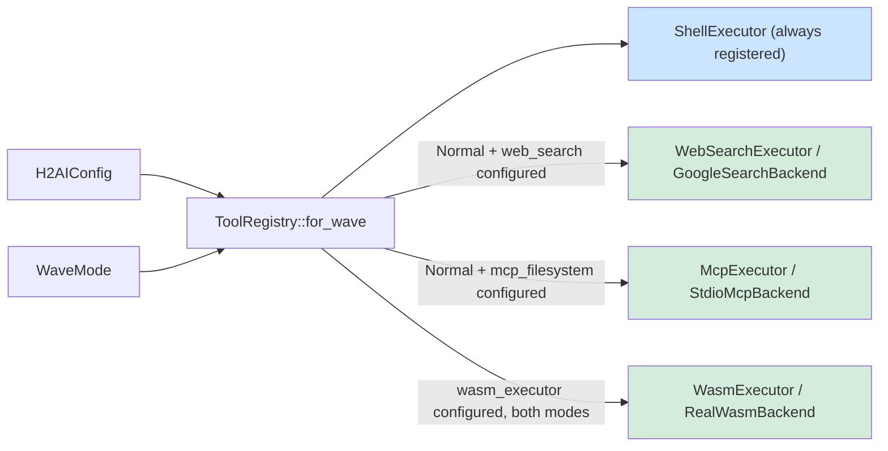

| WaveMode | Shell | WebSearch | FileSystem | CodeExecution |
|---|---|---|---|---|
| `Normal` | yes (`shell_allowlist`) | yes, if configured | yes, if configured | yes, if configured |
| `Hardened` | yes (`shell_hardened_allowlist`) | no | no | yes, if configured |

`Hardened` mode activates automatically on `ConstrainedExploration` and `ModeCollapse` retry waves — restricting agents to local, deterministic tools only during retry so that retrieval nondeterminism and network-side-effects cannot compound an already-failing wave.

### Tool Executors

Each `AgentTool` variant maps to an executor that implements `ToolExecutor`:

```rust
#[async_trait]
pub trait ToolExecutor: Send + Sync {
    fn schema(&self) -> ToolSchema;
    async fn execute(&self, input: &str) -> Result<String, ToolError>;
}
```

Every executor follows the backend injection pattern — a `Box<dyn *Backend>` trait object provides the I/O implementation, making CI and production wiring independent:

#### ShellExecutor (`AgentTool::Shell`)

Input: `{"command": "<cmd>", "args": ["...", ...]}`. No shell interpreter — uses `Command::new(cmd).args(args)` with explicit argument separation. The allowlist is enforced before process spawn. On timeout, sends `SIGKILL` to the entire process group (PGID-scoped kill, PID captured before the timeout block to avoid a race). `ToolError::NotPermitted` is returned for any command absent from the configured allowlist.

#### WebSearchExecutor (`AgentTool::WebSearch`)

Input: `{"query": "<search string>"}`. Backend trait: `WebSearchBackend::search(query, max_results) → String`. Production backend: `GoogleSearchBackend` — calls the Google Custom Search API via `reqwest`, formats results as numbered snippets. `max_results` is capped at 10 (the API hard limit).

#### McpExecutor (`AgentTool::FileSystem`)

Input: `{"op": "read_file"|"list_directory", "path": "<relative path>"}`. Only two operations are permitted (`PERMITTED_OPS`); all others return `ToolError::NotPermitted`. Policy is enforced in the executor, not in the backend. Production backend: `StdioMcpBackend` — spawns a subprocess implementing the Model Context Protocol JSON-RPC 2.0 over stdio, writes a single request line, reads the response, and kills the process group on timeout.

#### WasmExecutor (`AgentTool::CodeExecution`)

Input: `{"language": "javascript", "script": "<code>"}`. Only `language = "javascript"` is permitted. Production backend: `RealWasmBackend` — loads a pre-compiled trusted interpreter WASM binary via `wasmtime`, configures fuel metering (`consume_fuel = true`), and evaluates the script via the `alloc → write → eval → dealloc` memory protocol. No WASI host imports are linked — the sandbox has zero filesystem, network, or OS access. Execution terminates safely when fuel is exhausted.

### Startup Config Validation

`config_validation::validate_tool_configs(&cfg)` is called once at agent startup before the dispatch loop begins. The rule: an absent config section silently omits the executor; a present but broken section (missing env var, missing WASM file) panics immediately.

---

## 5. Compound task execution

### Sequence — compound task DAG execution

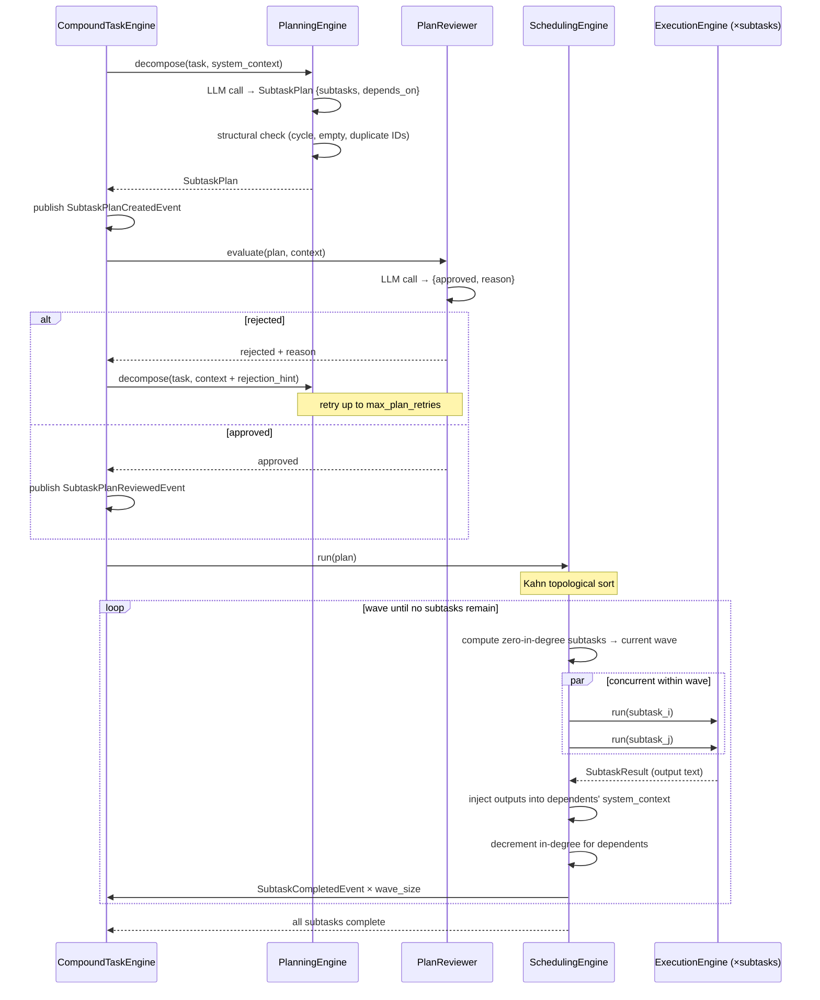

Long or structured tasks can be decomposed into a directed acyclic graph of subtasks by the `CompoundTaskEngine`. Each node in the DAG is a full H2AI wave (all 6 phases), and edges express output-dependency.

### Decomposition — PlanningEngine

`PlanningEngine::decompose(task)` calls the LLM adapter with the task description and the constraint corpus as grounding context. The LLM produces a `SubtaskPlan`:

```rust
pub struct SubtaskPlan {
    pub subtasks: Vec<Subtask>,
}

pub struct Subtask {
    pub id:           SubtaskId,
    pub description:  String,
    pub depends_on:   Vec<SubtaskId>,
}
```

Structural validity is checked in Rust before any LLM review: empty plan, duplicate IDs, and cycles all fail immediately. Emits `SubtaskPlanCreatedEvent`.

### Review — PlanReviewer

`PlanReviewer::evaluate(plan, context)` calls a separate LLM pass to assess whether the decomposition is coherent, complete, and consistent with the constraint corpus. Returns `{approved: bool, reason: String}` (same fail-safe JSON-or-reject contract as the Phase 4 auditor). Emits `SubtaskPlanReviewedEvent`. A rejected plan is returned to the `PlanningEngine` with the rejection reason as a hint; the engine may retry decomposition up to `max_plan_retries` times.

### Execution — SchedulingEngine

`SchedulingEngine::run(plan, context)` uses Kahn's algorithm to execute the DAG in topological waves:

1. Compute in-degree for every subtask. All zero-in-degree subtasks form the first wave.
2. Dispatch every subtask in the current wave as a full H2AI task. Each subtask emits `SubtaskStartedEvent`.
3. Wait for all subtasks in the wave. Each completion emits `SubtaskCompletedEvent` and injects the subtask's output into every dependent's `system_context`.
4. Decrement in-degree for all dependents. Zero-in-degree dependents join the next wave.
5. Repeat until no subtasks remain.

Subtasks within a wave run concurrently. Subtasks across waves are strictly sequential — a wave does not begin until the prior wave is fully resolved. Failed subtasks propagate upward: a subtask whose dependency failed is itself failed with a dependency-chain reason rather than run with incomplete context.

---

## 6. Enterprise architecture

### C4 Level 3 — Kubernetes Deployment

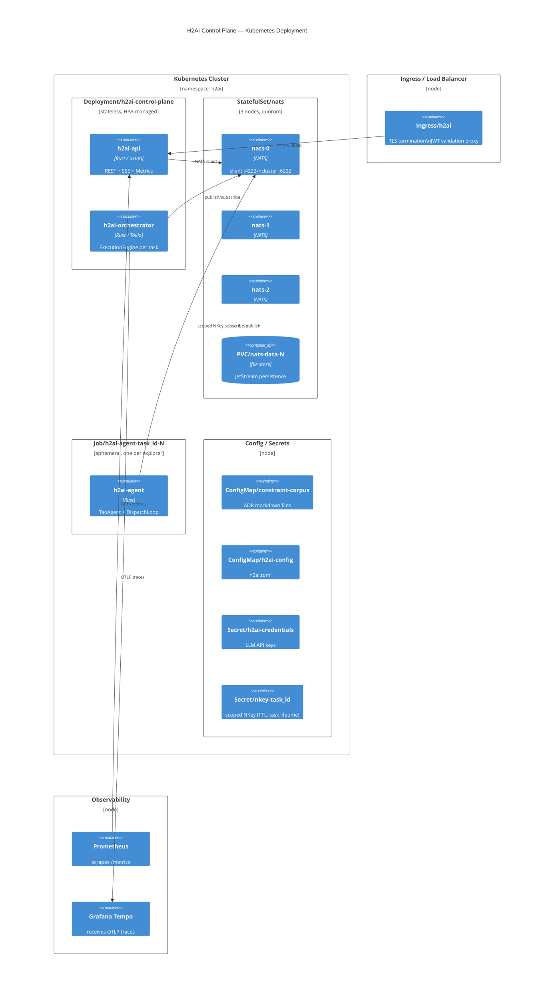

### 6.1 Kubernetes topology

All task state lives in NATS JetStream, not in the control plane Pods. Pod restarts are transparent: the new Pod loads the latest snapshot from `H2AI_SNAPSHOTS` KV and replays events from `sequence > last_sequence`. Horizontal scaling of `Deployment/h2ai-control-plane` is safe because each task's execution engine runs as a Tokio task inside one Pod instance, and JetStream's at-least-once delivery with consumer sequence tracking prevents duplicate processing.

### 6.2 Agent Job lifecycle

Each explorer is a Kubernetes Job, not a long-lived Deployment:

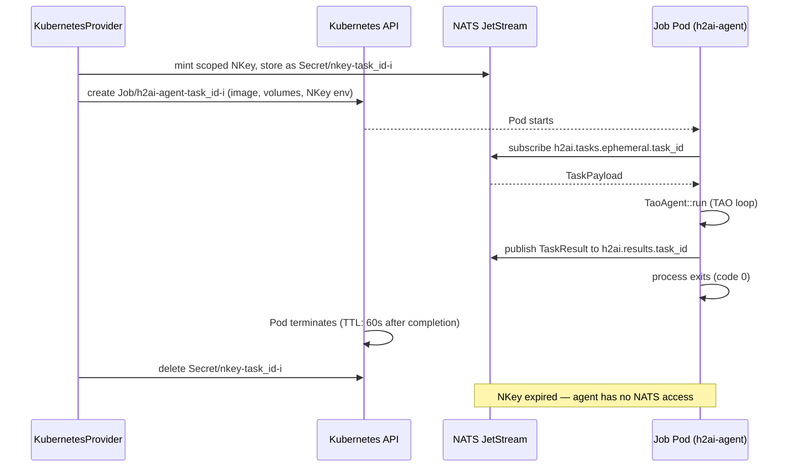

Key Job spec properties:
- `restartPolicy: Never` — a failed agent reports `ProposalFailed` via a separate liveness path; it does not retry silently.
- `activeDeadlineSeconds` = `task_deadline_secs + grace` — the Kubernetes scheduler hard-kills the Job if the NATS timeout is not enforced.
- `resources.limits` — CPU and memory set from `AgentDescriptor.tools`: `CodeExecution` gets a stricter memory cap than a pure-LLM agent.
- `securityContext.readOnlyRootFilesystem: true` — except for the explicitly mounted workspace volume when `Shell` or `FileSystem` tools are present.

### 6.3 Security model

The security boundary is the NATS NKey system. Every agent Job has exactly one credential, minted at dispatch and deleted at Job completion. There are no long-lived shared credentials.

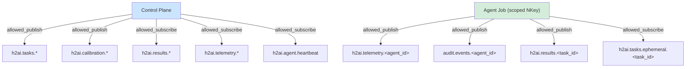

An agent Job cannot read another task's payload, cannot write to the main event bus, and cannot inject events into the task stream it is responding to. These restrictions are enforced at the NATS server level, not by application code.

### 6.4 NATS cluster configuration

The three-node NATS cluster provides JetStream quorum and survives a single node failure:

```
jetstream {
  store_dir:        /data/jetstream
  max_memory_store: 8GB
  max_file_store:   500GB
}
cluster {
  name:   h2ai-cluster
  listen: 0.0.0.0:6222
  routes: [
    nats-route://nats-0.nats.h2ai.svc:6222
    nats-route://nats-1.nats.h2ai.svc:6222
    nats-route://nats-2.nats.h2ai.svc:6222
  ]
}
```

All streams are created with `replicas: 3`. `H2AI_ESTIMATOR` and `H2AI_SNAPSHOTS` use `replicas: 1` (non-critical, rebuilt on recalibration).

### 6.5 Observability

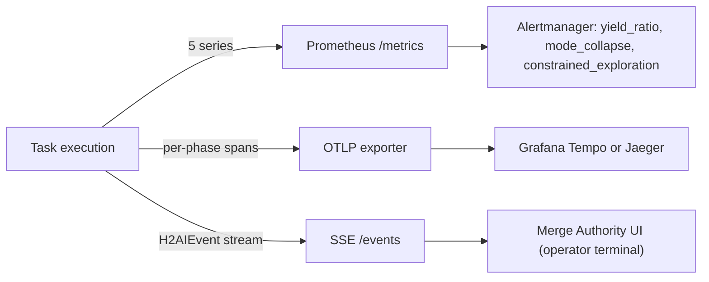

Three observability layers run concurrently and independently of the control path:

**Prometheus** — five series from `/metrics`. Scraped by the `ServiceMonitor`. Primary alerting signals: `yield_ratio < 0.5`, `mode_collapse` rate climbing, `constrained_exploration` rate climbing.

**OpenTelemetry** — `h2ai-telemetry` emits structured spans for every phase transition. Root span: `task.{task_id}`. Child spans per phase: `phase.bootstrap`, `phase.provisioning`, `phase.generation`, `phase.verification`, `phase.audit`, `phase.merge`, `phase.synthesis`. Adapter latency is a sub-span of `phase.generation`. Exported via OTLP.

**SSE event stream** — `GET /:tenant_id/tasks/:task_id/events` exposes the raw `H2AIEvent` sequence as Server-Sent Events. Every event carries its NATS sequence number as the SSE `id` field. Clients reconnect with `Last-Event-ID: <sequence>` to resume without replaying the full log.

### 6.6 Multi-region considerations

H2AI's state is entirely in NATS JetStream. For multi-region deployments:

- Run a NATS cluster per region with JetStream mirroring to a hub cluster.
- Keep control plane Pods co-located with their NATS cluster — cross-region writes increase α measurably.
- Run calibration per region against the local adapter pool. Different network topology means different `β₀`; a single global calibration would produce an inaccurate N_max per region.
- The constraint corpus is read-only and can be replicated as a `ConfigMap` across regions without coordination.

---

## 7. Component map

### C4 Level 3 — Components (orchestrator internals)

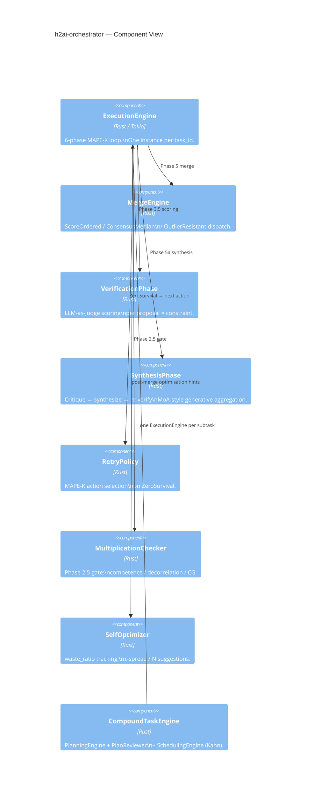

The workspace contains 16 crates, organised by responsibility. Every crate compiles standalone; cross-crate communication is event-typed.

```
h2ai-types          Pure value types + math primitives (USL, EigenCalibration, EnsembleCalibration,
                    MergeStrategy, MultiplicationConditionFailure, EpistemicYieldEvent, FailureMode,
                    H2AIEvent enum, AgentTool, WaveMode, TaskPayload, TaskResult, ToolCallRecord,
                    SubtaskId, SubtaskPlan, SubtaskResult, PlanStatus).
                    TenantId (identity scope), TaskReasoningCheckpoint + ReasoningCheckpointPhase +
                    TaskMetaState + ArchetypeResult (reasoning memory Phase 1 types).

h2ai-config         Layered config loading (reference.toml + env overrides). Single source of truth.
                    Includes WebSearchConfig, McpFilesystemConfig, WasmExecutorConfig.
                    ReasoningMemoryConfig (induction scheduling, retrieval thresholds). StateConfig
                    extended with per-tenant bucket prefixes.

h2ai-adapters       Adapter trait + per-provider implementations (Anthropic, OpenAI, Gemini, Ollama,
                    LlamaCpp, CloudGeneric, A2a, Mock, SequencedMockAdapter for TAO loop testing).
                    Tokio-native via async-trait.

h2ai-context        EmbeddingModel trait, fastembed wrapper, cosine_similarity utilities.
                    ContextPayload offload/resolve for blobs exceeding the NATS message ceiling.

h2ai-constraints    Constraint corpus parser (markdown ADR format), predicate types
                    (VocabularyPresence, AllOf, AnyOf, ...), severity weights.
                    ConstraintSource trait — abstraction over corpus access.
                    FsConstraintSource — wraps load_corpus for backward compat with flat directories.
                    WikiCache — in-memory hot-path index (context_map, metas, revision).
                    ConstraintMeta / ConstraintPayload / PredicateKind for wiki delivery.

h2ai-knowledge      Hierarchical BM25+/PPR knowledge retrieval layer (pure crate, no I/O deps beyond
                    serde_yaml at startup). KnowledgeSource trait (all_items, wiki_nodes, global_node).
                    KnowledgeProvider trait (query, global_summary, is_ready, kind).
                    Bm25WikiProvider — BM25+ scoring (Lv & Zhai δ=1.0, K1=1.5, B=0.75) over a
                    Global→Topic→Leaf tree; dual RAPTOR modes: TreeTraversal (topic cluster routing
                    first) + CollapsedTree (all levels simultaneously). ConstraintGraph — adjacency
                    from constraint `related:` fields; Personalized PageRank (power iteration, α=0.15)
                    for multi-hop expansion. YamlDirSource — loads constraint YAML + optional wiki/
                    subdirectory. PassthroughProvider — delegates to ConstraintResolver (zero-change
                    fallback when [knowledge] not configured). ScoringConfig — 8 tunable parameters,
                    all serde-defaulted. Imported by h2ai-config and h2ai-api.

h2ai-autonomic      Calibration harness, epistemic diagnostics (compute_n_eff_cosine,
                    classify_failure_mode, synthesize_tombstone), ensemble calibration plumbing,
                    Talagrand rank histogram, Thompson Sampling bandit over N.

h2ai-memory         InMemoryCache + NatsKvStore implementations of the SessionMemory trait.

h2ai-nats           NATS JetStream client, stream/KV creation, event publish/subscribe.
                    NKey minting and scoped credential management per task_id.

h2ai-orchestrator   ExecutionEngine — the 6-phase MAPE-K loop. MergeEngine. Verification phase.
                    Synthesis phase. RetryPolicy, MultiplicationChecker, SelfOptimizer.
                    CompoundTaskEngine — PlanningEngine + PlanReviewer + SchedulingEngine (Kahn waves).
                    decomposition — Phase 0 epistemic decomposition: DECOMPOSITION_SYSTEM_PROMPT,
                    parse_decomposition_response, prune_by_orthogonality, compute_role_diversity,
                    corpus_fallback (domain-tag → slot templates), run_decomposition_agent.

h2ai-planner        Pareto-weighted topology selection, role assignment, τ spread, role error costs.

h2ai-provisioner    Static / NATS / Kubernetes agent providers.
                    KubernetesProvider — dynamic Job creation, scoped NKey lifecycle, volume mapping.

h2ai-state          CRDT-friendly TaskState, ProposalSet (LUB by generation, then score),
                    snapshot/replay machinery.
                    NatsClient reasoning memory methods: ensure_tenant_reasoning_buckets,
                    put/get_reasoning_checkpoint, put/get/list_task_meta_states.

h2ai-telemetry      tracing→OTLP plumbing, structured spans for every phase.
                    RedactionMiddleware — scrubs secrets from AgentTelemetryEvent before audit.

h2ai-tools          Tool execution ecosystem for edge agents.
                    ShellExecutor  — JSON-contract, no shell interpreter, PGID process group kill.
                    WebSearchExecutor — Google Custom Search API via GoogleSearchBackend.
                    McpExecutor    — read-only filesystem via StdioMcpBackend (MCP JSON-RPC 2.0).
                    WasmExecutor   — sandboxed JS via RealWasmBackend (wasmtime, fuel metering, no WASI).
                    ToolRegistry::for_wave(cfg, WaveMode) — WaveMode-gated executor set (live backends).
                    ToolRegistry::for_wave_with_mocks(cfg, WaveMode) — identical gating, mock backends.

h2ai-agent          Edge agent binary.
                    TaoAgent — local TAO loop: LLM call → tool dispatch → observation → repeat.
                    DispatchLoop — NATS task subscriber; builds ToolRegistry::for_wave per task.
                    config_validation::validate_tool_configs — fail-fast startup check.
                    HeartbeatTask — liveness signalling to h2ai.agent.heartbeat.

h2ai-api            Axum HTTP server: POST /:tenant_id/tasks, SSE event stream, calibration endpoints,
                    health/ready/metrics, HITL approval gate (POST /:tenant_id/tasks/:id/approve, GET /approval),
                    Merge Authority UI assets.
                    NatsWikiConstraintSource — NATS-backed ConstraintSource (KV + Object Store).
                    AppState::constraint_source() — returns the active source based on config.
                    AppState::load_wiki_cache() — loads WikiCache from NATS KV at startup.
```

### Concrete request flow

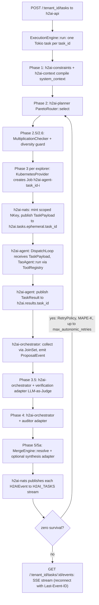

---

## 8. Event sourcing model

Every state transition is an `H2AIEvent` published to `h2ai.tasks.{task_id}`. Crash recovery is replay from the last snapshot offset; SSE clients reconnect with `Last-Event-ID`. Full event enumeration is in [`reference.md`](reference.md#event-vocabulary). Event payload schemas are stable: every field added since the initial release uses `#[serde(default)]` so old serialised events continue to deserialise.

The authoritative log is NATS JetStream stream `H2AI_TASKS` (file-backed, replicated). Calibration data lives in the `H2AI_CALIBRATION` KV store. Snapshots are written to `H2AI_SNAPSHOTS` periodically — recovery loads the latest snapshot and replays only events with `sequence > last_sequence`.

Snapshot writes are triggered by `h2ai-state` every `snapshot_interval_events` events (default 50). Without snapshots, recovery time is linear in the task's event count. The snapshot stores the full `TaskState` — active proposals, pruned proposals, current phase, retry count — so replay only needs to process events since the last write.

---

## 9. Phase-output checkpointing

Crash recovery from the event log alone is insufficient for long-running tasks: replaying every event from scratch re-invokes LLM calls and re-charges token budgets. Phase-output checkpointing gives the engine a richer recovery surface by persisting the *output* of each completed phase, not just the event sequence.

### 9.1 TaskCheckpoint structure

After each phase completes, `ExecutionEngine` writes a `TaskCheckpoint` to the `H2AI_TASK_CHECKPOINTS` NATS KV bucket. The checkpoint carries:

- `task_id` and `phase` name — the identity key used for KV lookup.
- `node_id` and `lease_seq` — used during multi-node recovery to detect stale owners.
- `proposals`, `auditor_survivors`, `resolved_output` — phase-specific output, sufficient to resume from the *next* phase without re-invoking the adapter.
- `manifest_json` — the full task manifest at checkpoint time.
- `object_store_ref` — SHA-256 content address of the payload in the NATS Object Store, set when the checkpoint payload exceeds 800 KB.
- `created_at_ms`, `updated_at_ms` — wall-clock timestamps for orphan detection.

### 9.2 Storage format

Payloads are serialised to JSON and then zstd-compressed at level 3 before writing to the KV bucket. Repetitive LLM-generated text compresses to 10–25% of its original size, keeping checkpoint payloads well below the JetStream 1 MB message ceiling. On read, `get_task_checkpoint` decompresses before deserialisation. When the *uncompressed* payload would exceed 800 KB, the raw bytes are written to the NATS Object Store and only the content-addressed reference is stored in the KV entry.

**Delta encoding (2026-05-14):** Checkpoints use JSON Patch (RFC 6902) delta encoding. `CheckpointKind::Base` stores a full snapshot at seq=0 and every `base_interval` (default 10) sequences; `CheckpointKind::Delta` stores only the RFC 6902 diff against the prior base. Storage is O(N) rather than O(N²). An LRU cache (200 entries, 60s TTL) avoids repeat NATS lookups during reconstruction. All NATS bucket names are now config-driven via `StateConfig` in `[state]`; `NatsClient::connect_with_cfg(url, StateConfig)` replaces the old `connect(url)` call.

### 9.3 Startup recovery

On process start, `recover_in_flight_tasks()` (called by `h2ai-api` before the HTTP server accepts connections) scans `H2AI_TASK_CHECKPOINTS` for entries younger than `checkpoint_recovery_window_ms`. For each in-flight checkpoint it finds:

1. Reads the full `TaskCheckpoint` from the KV bucket (or from the Object Store via `object_store_ref`).
2. **Own-node tasks** (`checkpoint.node_id == local_node_id()`): spawned immediately — the owning node restarted, so there is no split-brain risk.
3. **Foreign-node orphans** (`node_id` belongs to a different node): applies a random jitter delay of 0–1500 ms, then performs a CAS claim via `put_task_checkpoint(..., Some(checkpoint.lease_seq))`. If another pod wins the CAS first (revision changed), the claim returns an error and this node skips the task. This prevents thundering-herd duplicate recovery during rolling restarts.
4. Spawns `ExecutionEngine::run_from_checkpoint(checkpoint)` as a new Tokio task for every successfully claimed checkpoint.

### 9.4 run_from_checkpoint phase routing

`run_from_checkpoint` inspects `checkpoint.phase`:

- **`"Merging"` phase**: `resolved_output` is already present; the engine short-circuits all LLM calls and jumps directly to post-merge event publishing and `SelfOptimizer` hints. No adapters are invoked.
- **Earlier phases** (`"ParallelGeneration"`, `"AuditorGate"`, etc.): the engine calls `run_offline` with the recovered proposals and survivors as seed state, resuming from the phase *following* the checkpoint.

This means a crash in the merge phase costs zero extra LLM tokens on recovery; a crash earlier in the pipeline costs only the phases that had not yet checkpointed.

### 9.5 HITL Approval Gate

After the `Merging` phase completes (Phase 5 or 5a), the engine evaluates approval conditions. The gate is active only when `hitl.enabled = true` (default). When enabled, the engine checks:

- If `oracle_spec.is_none()` — oracle tasks bypass the gate entirely (they always emit `MergeResolved` immediately).
- **AND** either `q_confidence < hitl.confidence_threshold` (default 0.50) or `manifest.require_approval = true`.

When the gate fires, the task is *parked*: instead of emitting `MergeResolved` and completing, the engine:

1. **Checkpoint**: writes the current `TaskCheckpoint` to `H2AI_TASK_CHECKPOINTS` (see §9.1), capturing `resolved_output` and all phase state.
2. **Record approval request**: writes an `ApprovalRecord` to the `H2AI_APPROVALS` NATS KV bucket, keyed by `task_id`, with:
   - `task_id`, `resolved_output`, `q_confidence`, `triggered_by` (`ManifestFlag` | `LowConfidence`)
   - `created_at_ms`, `timeout_at_ms` (now + `hitl.timeout_ms`, default 30 minutes)
3. **Publish event**: emits `PendingApproval` SSE event (with `risk_level`, `triggered_by`, `timeout_at_ms`) to connected clients.
4. **Phase update**: sets local `TaskStore` phase to `AwaitingApproval`.
5. **Thread exit**: the ExecutionEngine's Tokio task terminates. The review window holds zero server resources.

#### Approval endpoint and concurrent-write safety

`POST /{tenant_id}/tasks/{id}/approve` accepts `{approved, reviewer_note, operator_id}`. The handler:

1. Loads the `ApprovalRecord` from `H2AI_APPROVALS` **along with its KV revision**.
2. Returns `410 Gone` if `timeout_at_ms` has passed.
3. Atomically deletes the record via `delete_approval_record_if_revision(task_id, revision)` — a NATS KV CAS write. The first caller wins; subsequent callers (or concurrent nodes racing on the same task) receive a revision-mismatch error and a `409 Conflict`. This prevents double-approval in multi-node clusters.
4. Publishes `ApprovalResolved` to JetStream.
5. If `approved = true`: loads the checkpoint, calls `ExecutionEngine::finalize()`, publishes `MergeResolved` and closes normally.
6. If `approved = false`: calls `mark_failed()`, publishes `TaskFailed`, then calls `delete_task_checkpoint()` (which also cleans up any Object Store blob — see §9.2).

The `ApprovalDecision` (`operator_id`, `reviewer_note`, `decided_at_ms`) is appended to `TaskAttributionEvent` for permanent compliance audit trail.

### 9.6 Reasoning checkpoint (Phase 1)

See §10 for the `TaskReasoningCheckpoint` system, which runs in parallel with `TaskCheckpoint`. The two checkpoints are independent: `TaskCheckpoint` is the recovery source for execution-phase replay; `TaskReasoningCheckpoint` captures reasoning artifacts for the Persistent Reasoning Memory system. Both are written fire-and-forget and neither blocks task completion.

#### Cross-node TaskStore consistency

`TaskStore` is in-memory per node. When the approval endpoint is served by a different node than the one that parked the task, the handling node publishes `ApprovalResolved` and `TaskFailed`/`TaskCompleted` to JetStream. Every node's event consumer loop (already subscribed to `h2ai.tasks.>` for SSE fan-out) handles these events and calls `mark_resolved` or `mark_failed` on its local store. JetStream at-least-once delivery bounds the inconsistency window to cluster delivery latency (typically < 100 ms).

#### Background reaper

A background task running every **60 seconds** in each control plane Pod scans `H2AI_APPROVALS` for expired records:

```rust
for (approval_record, revision) in scanned_records {
    if now_ms > approval_record.timeout_at_ms {
        // CAS delete: only one node in the cluster succeeds.
        // Others receive a revision-mismatch error and skip silently.
        match delete_approval_record_if_revision(task_id, revision) {
            Ok(()) => auto_reject(task_id, operator_id = "system:timeout"),
            Err(_) => {} // another node claimed this expiry — skip
        }
    }
}
```

`auto_reject` follows the same rejection path as a human denial (publishes `TaskFailed`, calls `delete_task_checkpoint`). The `operator_id = "system:timeout"` field in `TaskAttributionEvent` distinguishes automatic expiry from explicit operator rejection.

#### ResumeSignal — JetStream HITL (live 2026-05-19)

The KV-polling design above has been replaced by a typed, JetStream-delivered signal protocol. The old `H2AI_APPROVALS` KV bucket and `approval_reaper.rs` background reaper are removed.

**Signal delivery topology**

- A single `H2AI_SIGNALS` JetStream stream covers subject pattern `h2ai.signals.>`.
- Subject per task: `h2ai.signals.{tenant_bucket_safe}.{task_id}`.
- A durable push consumer `SIGNAL-{task_id_no_dashes}` is created before the phase loop starts and deleted at task resolution or failure.

**Engine behaviour at the HITL gate (Merging phase)**

1. Engine emits `PendingApproval` event.
2. Engine parks in a `tokio::select!` branch waiting for either a JetStream signal delivery or timeout expiry.
3. **On signal received** (`Approve`): publishes `ApprovalResolved` (before `MergeResolved`), resets `hitl_timeouts_fired` to 0, proceeds to `MergeResolved` and task close.
4. **On timeout**: auto-promotes with `operator_id = "system:timeout"`, increments `hitl_timeouts_fired` in `TaskReasoningCheckpoint`, proceeds to `MergeResolved`.

**Signal types** (adjacently-tagged `SignalPayload`):

| Kind | Purpose |
|---|---|
| `Approve` | Resolves the HITL gate. Fields: `approved: bool`, `operator_id: String`, `reviewer_note: Option<String>`. |
| `WaveContinue` | Injects grounding text or mandate override at a `WaveCompleted` boundary. Only processed when `signal_wave_window_ms > 0`. |
| `Unknown` | Catch-all for forward-compatible deserialization; ignored by the engine without error. |

**Adaptive timeout decay**

Consecutive non-responses shrink the review window exponentially:

```
effective_ms = timeout_ms × decay ^ hitl_timeouts_fired
effective_ms = max(effective_ms, timeout_floor_ms)
```

`hitl_timeouts_fired` is persisted in `TaskReasoningCheckpoint` and survives crash-recovery. Config fields: `timeout_decay` (default 0.5), `timeout_floor_ms` (default 300 000 ms).

**Endpoints**

- `POST /{tenant_id}/tasks/{task_id}/signal` — 202 accepted immediately; payload published to JetStream.
- `POST /{tenant_id}/tasks/{task_id}/approve` — **deprecated**, returns 301 redirect to `/signal` (one-release shim).
- `GET /{tenant_id}/tasks/{task_id}/approval` — **removed**, returns 410 Gone.

---

## 10. Persistent Reasoning Memory — Phase 1

### Overview

H2AI previously discarded all per-task reasoning artifacts on resolution. Phase 1 introduces a four-layer **Persistent Reasoning Memory** system. Only Layers 1a and 1b are live; Layers 2–4 are planned.

| Layer | Status | Responsibility |
|---|---|---|
| 1a. TaskReasoningCheckpoint | ✅ Phase 1 | Progressive checkpoint at each engine phase gate |
| 1b. TaskMetaState | ✅ Phase 1 | Immutable projection at resolution; feeds induction |
| 2. InductionScheduler | Planned | Batch distillation of TaskMetaStates into TenantMemoryStore |
| 3. Thinking loop integration | Planned | Warm priors at task start from TenantMemoryStore |
| 4. Hybrid retrieval | Planned | Tag-gate + embedding rerank at scale |

### Tenant model

`TenantId` (a newtype wrapping `String`) is the scope boundary for all reasoning memory storage. Each tenant's data lives in its own NATS KV buckets — isolation is enforced by construction, not by query filter. `TaskManifest.tenant_id` defaults to `TenantId::default_tenant()` for backward compatibility with single-tenant deployments.

### TaskReasoningCheckpoint vs. TaskCheckpoint

Two distinct checkpoint types coexist:

| Type | Location | Purpose | Storage |
|---|---|---|---|
| `TaskCheckpoint` | `H2AI_TASK_CHECKPOINTS` | Execution-phase recovery (proposals, auditor survivors, resolved output) | zstd + delta encoding |
| `TaskReasoningCheckpoint` | `H2AI_CHECKPOINT_{tenant_id}` | Reasoning artifact capture (thinking loop, archetype selection, retry context) + warm-start recovery | zstd, 7-day TTL |

`TaskReasoningCheckpoint.phase` uses `ReasoningCheckpointPhase` (Created → ThinkingDone → WaveCompleted(k) → MergeDone → Resolved), enabling future phase-level skip logic on crash recovery.

### TaskMetaState

At `MapeKDecision::Return` (task resolution), `TaskReasoningCheckpoint::into_meta_state()` projects the checkpoint into a `TaskMetaState` — wave-level detail stripped, reasoning artifacts kept:

- `shared_understanding`, `tensions`, `archetype_results` — from the thinking loop
- `retry_count`, `retry_context_that_resolved`, `tried_topologies`, `tau_values_that_converged` — retry history
- `system_context_with_rubric_hash`, `constraint_corpus_fingerprint` — rubric fingerprints for retrieval

`TaskMetaState` is written to `H2AI_META_{tenant_id}` (no TTL) and will be consumed by the `InductionScheduler` in Phase 2.

### Configuration

```toml
[reasoning_memory]
enabled                     = false   # all checkpoint writes skipped when false
induction_batch_size        = 10
induction_max_interval_secs = 86400
induction_max_tasks_per_run = 50
tag_gate_threshold          = 0.2
max_archetype_boost         = 0.15
max_archetype_penalty       = 0.20

[state]
reasoning_checkpoint_bucket_prefix = "H2AI_CHECKPOINT"
task_meta_state_bucket_prefix      = "H2AI_META"
```

### Fire-and-forget writes

All reasoning checkpoint writes are fire-and-forget: a write failure logs a warning at `h2ai.engine` level but never blocks task resolution. The control path is never affected by NATS unavailability for reasoning memory.

---

## 11. A2A Explorer Adapter

### 11.1 Diversity axis

H2AI's existing diversity signals measure differences *within* the LLM world: Hamming CG captures constraint-profile independence, cosine N_eff captures semantic independence. Both are bounded by the homogeneity of the LLM model family. Cross-framework diversity — running a planning agent built with LangChain, a reasoning agent built with AutoGen, and an H2AI ensemble as explorer peers — is a new N_eff axis that existing adapters cannot provide.

The `A2aExplorerAdapter` (`crates/h2ai-adapters/src/a2a.rs`) implements the `IComputeAdapter` trait and makes any [Agent2Agent (A2A)](https://a2aprotocol.ai) compatible remote agent a first-class ensemble participant. No changes to the orchestrator, planner, or calibration harness are required — the adapter is just another element in the `explorer_adapters` vector.

### 11.2 Agent Card discovery and caching

On first use (and after `agent_card_cache_ttl_s` seconds), the adapter fetches the remote agent's capability manifest:

```
GET https://{endpoint}/.well-known/agent.json
```

The parsed `AgentCard` is held in a `tokio::sync::RwLock<Option<CachedCard>>`. On a cache miss, the adapter upgrades to a write lock, performs a **double-checked lock** (re-checks whether another concurrent task already populated the cache), fetches if still empty, then releases back to a read lock. This prevents stampede fetches when multiple explorers share the same A2A endpoint.

Cache invalidation: any `failed` or `rejected` poll response resets the cached entry to `None`, forcing a fresh fetch before the next attempt.

### 11.3 Task delegation and polling

The adapter delegates via JSON-RPC 2.0 over HTTPS:

1. `POST /` with `method: "message/send"` — submits the task prompt, receives a remote `task_id`.
2. `POST /` with `method: "tasks/get"` — polls for completion. Each poll request has a 15-second per-request timeout, strictly separate from the overall task deadline.
3. The entire polling loop is wrapped in `tokio::time::timeout(timeout_minutes × 60s)` — the adapter returns `AdapterError::Timeout` if the deadline is reached regardless of task state.

**Exponential backoff with ±20% jitter** prevents synchronised polls from concurrent adapters creating a thundering herd against external rate-limited gateways. Initial interval: `poll_interval_ms`; each poll multiplies by 1.5, capped at `max_poll_interval_ms`.

Terminal state mapping:

| A2A state | AdapterError |
|---|---|
| `completed` | — (proceed to extraction) |
| `failed` | `Remote(reason)` |
| `canceled` | `Cancelled` |
| `rejected` | `Unavailable` (excluded from ensemble) |
| `input_required` | `Timeout` (H2AI cannot provide interactive input) |
| Agent Card unreachable | `Unavailable` |
| Empty extraction | `EmptyOutput` |

### 11.4 Artifact extraction pipeline

External agents produce inconsistent artifact formatting. Raw text from a markdown-fenced output would corrupt the Condorcet synthesis if passed directly into the merge phase. The adapter runs a 4-stage pipeline, stopping at the first successful extraction:

1. **Direct JSON**: if the expected format is JSON and the raw text parses, use it as-is.
2. **Fence stripping**: extract text from ` ``` ` blocks. For JSON output, all blocks are collected and iterated **last-to-first** — LLMs typically emit the final, complete answer in the last block, with preamble or partial plans in earlier ones.
3. **Preamble strip**: remove leading lines matching common preamble patterns (`"Here is the solution:"`, `"Based on the requirements:"`, etc.).
4. **Raw fallback**: return trimmed raw text and let the verifier and auditor assess it.

`token_cost: 0` is reported — A2A agents do not expose token cost.

### 11.5 Authentication

`auth_scheme` is `"bearer"`, `"api_key"`, or `"none"`. The `auth_token_env` env var is resolved **at adapter construction time** (fail-fast at server startup, not at first request). This follows the same startup-panic contract as `validate_tool_configs` for other tool executors.

### 11.6 Configuration

```toml
[[adapter_profiles]]
name = "specialist-planner"
[adapter_profiles.kind.A2a]
endpoint             = "https://my-specialist-agent.example.com"
auth_scheme          = "bearer"
auth_token_env       = "A2A_TOKEN"
timeout_minutes      = 10
poll_interval_ms     = 2000
max_poll_interval_ms = 30000
agent_card_cache_ttl_s = 3600
```

`AdapterFactory::build(&AdapterKind::A2a { .. })` produces an `Arc<dyn IComputeAdapter>`. The factory arm for `A2a` follows the same pattern as all built-in providers.

---

## 12. Multi-tenancy

H2AI supports multiple isolated tenants within a single control plane deployment. Tenant identity is a first-class routing primitive, carried as a URL path segment.

### 12.1 HTTP routing

All task-level routes include `:tenant_id` as a path segment. The path value is authoritative — any `tenant_id` field in the request body is overridden by it.

```
POST   /:tenant_id/tasks
GET    /:tenant_id/tasks/:task_id/events
GET    /:tenant_id/tasks/:task_id
POST   /:tenant_id/tasks/:task_id/merge
POST   /:tenant_id/tasks/:task_id/approve
GET    /:tenant_id/tasks/:task_id/approval
POST   /:tenant_id/tasks/:task_id/clarify
GET    /:tenant_id/tasks/:task_id/recover
```

Global endpoints (`/calibrate`, `/health`, `/ready`, `/metrics`) are not tenant-scoped. Single-tenant deployments use `default` as the tenant ID.

### 12.2 Tenant isolation model

Each tenant has isolated runtime state created lazily on first request:

**`TenantState`** — created by `TenantRegistry::get_or_create` on first use, holds six `Arc<RwLock<…>>` fields:

| Field | Type | Scope |
|---|---|---|
| `calibration` | `Option<CalibrationCompletedEvent>` | seeded from default tenant on first task |
| `tao_multiplier_estimator` | `TaoMultiplierEstimator` | learns per-tenant TAO timing |
| `tau_spread_estimator` | `TauSpreadEstimator` | per-tenant τ adaptation |
| `bandit_state` | `BanditState` | per-tenant Thompson bandit for adapter selection |
| `srani_state` | `(ema_cfi, count)` | per-tenant SRANI adaptive EMA |
| `rho_ema` | `RhoEmaState` | per-tenant coherence EMA |

**NATS KV isolation** — all per-tenant KV keys are prefixed with `{tenant_id.bucket_safe()}/` (hyphens replaced with underscores):

```
default/tao        default/bandit        default/srani
acme_corp/tao      acme_corp/bandit      acme_corp/srani
acme_corp/{task_id}   ← approval records
```

**Task ownership** — `TaskStore::get_for_tenant(task_id, tenant_id)` returns `None` for cross-tenant access. An HTTP handler querying another tenant's task ID receives `404 Not Found` regardless of whether the task exists.

**Approval records** — `ApprovalRecord.tenant_id` is written at creation time from the URL path tenant. The approval reaper uses the embedded tenant ID when publishing events — it never reconstructs the tenant from context.

### 12.3 Calibration: global-by-design

Calibration measures the adapter pool, not individual tenant workloads. A single global `CalibrationCompletedEvent` lives in `H2AI_CALIBRATION` KV (no tenant prefix). On first task submission for a non-default tenant, `AppState::seed_calibration_from_default_if_needed` copies the default tenant's calibration into the new tenant's `TenantState`. This gives new tenants an immediate N_max budget without requiring a dedicated calibration run.

### GAP-H2: Calibration Drift Detection (closed 2026-05-26)

LLM API providers silently update model weights and RLHF profiles. Without detection, `EnsembleCalibration` stays stale indefinitely. The three-layer `DriftMonitor` (`crates/h2ai-autonomic/src/drift.rs`) detects distribution shifts online:

**Layer 1 — DDM fast layer** (`DdmDetector`, O(1)): sliding window of `consensus_agreement_rate` (fraction of tasks where all verification calls agree). Fires `CalibrationDriftWarning` when `|mean_recent − mean_reference| > drift_ddm_k × std_reference` (default window=20, k=2.5).

**Layer 2 — BOCPD** (`BocpdDetector`, O(t)): Bayesian Online Changepoint Detection (Adams & MacKay 2007) with Normal-Inverse-Gamma conjugate prior updated per observation. Posterior probability P(run_length ≤ 4) > `drift_bocpd_changepoint_threshold` (default 0.90) fires `CalibrationChangepoint`. A guard prevents false positives until ≥5 observations accumulate.

**Layer 3 — ORCA conformal margin**: when a changepoint is active and `drift_staleness_ttl_secs` has not expired, `DriftMonitor::active_conformal_margin()` returns `drift_conformal_margin`. `run_offline` in `engine.rs` subtracts this value from `verification_config.threshold` at task start, widening the gate to preserve coverage during drift. The margin is removed once TTL expires or recalibration occurs.

**Data flow**: `tasks.rs` reads `active_conformal_margin()` → passed as `EngineInput.conformal_margin` → engine applies margin → engine computes `consensus_agreement_rate_from_events(output.verification_events)` → `tasks.rs` calls `drift_monitor.observe(rate)`. On `CalibrationDriftWarning` or `CalibrationChangepoint`, a `tracing::warn!` event is emitted.

`DriftMonitor` is stored in `AppState` as `Arc<tokio::sync::Mutex<DriftMonitor>>`, initialised from config via `DriftMonitor::from_config(&cfg)`. Config fields: `drift_ddm_window`, `drift_ddm_k`, `drift_bocpd_hazard_rate`, `drift_bocpd_changepoint_threshold`, `auto_recalibrate_on_drift = false` (operator opt-in), `drift_staleness_ttl_secs`, `drift_conformal_margin`.

### 12.4 Adding a tenant

No administrative step is required. Any previously unused tenant ID in the URL path creates a tenant on first request:

```bash
curl -X POST http://localhost:8080/v1/acme/tasks \
  -H "Content-Type: application/json" \
  -d '{"description": "...", "pareto_weights": {...}, "explorers": {...}}'
```

---

## 13. What H2AI does *not* do better

The control plane is honest about its boundaries. The system does *not* compete with:

- **Single-shot inference latency.** A direct call to one model endpoint will always be cheaper and faster. H2AI buys reliability, not speed.
- **Generic agentic frameworks.** Frameworks that compose tools and memory solve a different problem; H2AI orchestrates an adversarial committee with calibrated physics. The two are complementary, not competing.
- **Specialised serving stacks** (vLLM, TGI). Those optimise per-request throughput. H2AI delegates to them via adapters.
- **Tasks where ground truth is hidden from verification.** The auditor and verifier need to observe the constraint surface. Tasks with hidden oracles get no benefit from the adversarial committee — at best, the system reduces to its single best adapter.
- **Workloads with a single dominant adapter.** When `n_eff_cosine_prior → 1.0`, the multiplication condition fails and the system correctly refuses to run. Buying more capacity from one model family does not produce a committee.

The reliability gain is real only when the calibrated adapter pool is genuinely diverse — both in constraint behaviour (Hamming CG) and in semantic embedding (cosine N_eff). When the pool is monoculture, no amount of orchestration recovers the missing independence.
