# H2AI Architecture

H2AI Control Plane is a Rust runtime that coordinates pools of LLM adapters as an *adversarial committee*: independent generators, an independent verifier, and an independent auditor produce a resolved output that is more reliable than any single adapter. The runtime treats this committee as a physical system — an ensemble whose throughput, diversity, and quality are computable, calibrated, and bounded.

This document is the system-level map: phases, components, wire protocol, and enterprise deployment. The math is in [`math.md`](math.md). The HTTP/event/config surface is in [`reference.md`](reference.md). Operational details are in [`operations.md`](operations.md). Open questions are in [`research-state.md`](research-state.md).

---

## The Epistemological Architecture

H2AI is an **epistemic control plane**. Its job is not to run LLM inference — it is to coordinate the acquisition, validation, and grounding of knowledge about a problem. The output of a successful task is not a string; it is a belief that has survived four nested epistemological tests.

Every task maps to a **knowledge graph**: nodes are beliefs (claims about the problem domain), edges are relationships (support, contradiction, derivation, grounding). The system's goal is to bring this graph to coherent, grounded closure. The four nested loops each test a different property of closure:

| Loop | Scope | Mechanism | Stops when |
|------|-------|-----------|-----------|
| **TAO** (Thought–Action–Observation) | Within one agent | Iterative tool-call reasoning | Agent exhausts productive reasoning paths — last iteration issues no tool call |
| **MAPE-K** (Monitor–Analyse–Plan–Execute) | Across the committee | ZeroSurvival → topology repair → retry | Knowledge graph reaches coherent closure — all proposals pass audit |
| **Calibration** | Across tasks | USL fitting, CG measurement, confidence intervals | Meta-beliefs about agent quality are stable — `(α, β, CG)` confidence widths drop below precision threshold |
| **Oracle / Grounding** | Across reality | Human approval gate or automated oracle | Load-bearing claims have been verified against external truth |

**Why four loops, not one?** Each loop operates at a different time-scale and tests a different epistemic property:

- The TAO loop tests **completeness** within a single reasoning chain: has the agent gathered all evidence its tools can provide?
- The MAPE-K loop tests **coherence** across the committee: do the surviving beliefs form a consistent set, compatible with the constraint corpus?
- The calibration loop tests **meta-accuracy**: are the system's beliefs about its own agents correct? A committee sized by wrong priors produces wrong N_max.
- The oracle loop tests **grounding**: does the coherent belief set correspond to something true in the world?

A system that only has the first two loops is a sophisticated coherence engine. It can produce internally consistent, constraint-compliant outputs that are confidently wrong. The calibration and oracle loops are what prevent this: calibration corrects the system's self-model over time; the oracle gates outputs on external truth verification.

The stopping criteria are epistemic, not mechanical. The system does not stop because it reached a retry limit — it stops because it has acquired enough knowledge. This is the architectural difference between H2AI and a pipeline with retries.

---

## Problem-Solution Map

Each row is an independently-observable failure mode in naive LLM orchestration, paired with the H2AI mechanism that addresses it.

| Problem | Standard Approach | H2AI Mechanism |
|---|---|---|
| Hallucination amplification | Hope the model self-corrects | Auditor node (τ→0) mathematically blocks propagation |
| Judge self-preference bias | Same model judges itself | `JudgePanel` — cross-family verification panel; supermajority aggregation (≥2 families) or unanimous persona-diversity rule; `ConstraintAmbiguityEvent` on ambiguous rubric |
| State lives in the model | LLM context window (lossy) | Orchestrator owns state; models are stateless `f(ctx, τ) → text`; CRDTs track constraint-satisfaction fingerprints (metadata), never LLM text |
| Safety is probabilistic | "Don't do X" in the prompt | Topological interlocks — invalid output cannot reach the human by graph construction |
| More agents = worse results | Keep adding until it breaks | MAPE-K loop computes N_max, shifts topology before retrograde |
| Retry loop repeats same failed approach | Hope next attempt differs | Epistemic Leader — Krum-elected leader generates Socratic diagnostic question per failed wave; credibility-weighted rotation on stagnation |
| Retry discards all prior work | Retry with stronger hint and hope | CSPR-v2 + Progressive Verifier Feedback — `ConstraintConflictGraph` detects structurally-incompatible constraint pairs; `RetryWithTargets` anchors on best prior proposal; `build_repair_context()` three-slot sandwich with breadth escalation; FALCON Bounded-Locality Theorem guarantees quality loss `∝ v(x̂)` not unconstrained as in full regeneration |
| Constraint dispersion — proposals pass different checks, verified=0 | Retry more; hope a future wave holds all checks | Constraint-Informed Synthesis — `ConstraintDoc.binary_checks` injected as compliance checklist; `select_orthogonal_partials` greedy set-cover picks maximally-diverse partial-pass proposals; terminal synthesis wave with Coherence Mandate |
| AIMD slow-start collapses N_max to 1–2 | Cap retries | N_max Quorum Floor — `n_max_ci()` hard-floors both CI bounds at 3.0; `QuorumDegradedBelowMinimum` fails fast before burning API tokens |
| Correlated oracle services double-count a single root cause | Run one oracle per task | Multi-Oracle FUSE — `fuse_reduce_by_family` groups by `OracleFamily`, takes `min(score)` within family, then `mean` across independent families |
| Score-blind synthesis merges failing proposals with passing ones | Hope the synthesiser discards bad inputs | Optimal Synthesis Policy (OSP) — `OspRegime` classifies proposals into `ZeroSurvival` / `SingleSurvivor` / `ClearLeader` / `TightCluster` before merge dispatch |
| O(n³)+ tasks cannot be solved by deeper retrying | Increase max_retries | Complexity Ceiling — `ComplexityProbe` rates task 1–5; tasks ≥ `decompose_threshold` route to H1 decomposition; intra-retry ceiling detector catches probe misclassifications; AgentDropout N-reduction; BEYOND_BUDGET verifier addendum; over-decomposition graft guards |
| Orthogonal constraint-satisfaction — no single proposal satisfies all constraints | Retry with full generation | Sequential Constraint Grafting — iterative grafting loop with highest-scoring partial as base; `missing_constraint_ids()` identifies constraint clusters; Monotonicity Invariant; Sequential Edge arXiv 2503.12345 (+46.7% constraint satisfaction) |
| MUS oscillation — sequential repair loops cycle without convergence; each wave that repairs constraint A re-violates constraint B | Accept oscillatory plateau and exhaust retries | DPPM-MetaRefine Wave — two triggers: (1) isolation evidence: ≥2 partials whose passed-check union covers all binary checks but no single partial covers all; (2) plateau: compliance mean unchanged for 2 consecutive waves at `retry_count ≥ 2`. Either trigger fires `ComplexityOverflow { graft_first: true }` immediately. DPPM wave: BFS cluster the constraint corpus; `find_oscillation_pairs + divergence_events_from_pruned` build a MetaObserver balancing instruction; parallel per-cluster LLM solvers seeded from the best matching partial and all accumulated gap_i1 domain knowledge corrections (`controller.all_domain_syntheses()` → `RepairInput.domain_syntheses`); integration wave merges cluster outputs with explicit conflict-resolution brief (`INTEGRATION_WAVE_PROMPT` in `repair.rs`). Literature: DPPM arXiv:2506.02683; DeCRIM arXiv:2410.06458; Branch-Solve-Merge arXiv:2310.15123. |
| LLM provider silently updates model weights — calibration goes stale | Re-run calibration on a schedule | Calibration Drift Detection — DDM O(1) fast-lane + BOCPD (Adams & MacKay 2007) + ORCA conformal margin widen during active drift |
| Verifier rejects proposals on knowledge-intensive checks — missing domain facts | Retry with stronger hint | Knowledge Gap Detection — `detect_cold_checks()` + `build_gap_queries()` + `run_gap_researcher()` + corpus `pass_hint` fallback (`gap_hint_or_query` in `grounding_chain.rs` prefers corpus `pass_criteria` text over web-derived `correct_pattern`) + `[DOMAIN KNOWLEDGE]` slot injection |
| LLM holistic verifier score contradicts its own check verdicts — holistic float corrupts Krum input | Trust LLM float as authoritative | Binary-Verdict Scoring — `score_from_verdicts` in `verification.rs` derives `present_checks / n_checks` deterministically from parsed `check_verdicts`; `tau` overridden to `0.0` for binary-check constraints; removes verbosity and holistic-judgment drift from the Krum input distribution |
| Single-family model pool — Krum selects majority-hallucination winner with high confidence | Retry the same pool | BFT Lever 1 (family diversity gate) — `model_lineage_key()` on `AdapterKind` tags each adapter's model lineage; `min_explorer_families` in `SafetyConfig` warns when < 2 lineages present in the calibration pool. BFT Lever 2 (oracle post-selection hard-gate) — `run_post_selection` in `oracle.rs` blocks the Krum-selected winner after merge if the oracle rejects it; `OraclePostSelectionBlocked` routes to `handle_exit_reason` in `mape_k.rs`: emits `CorrelatedEnsembleWarning`, increments `adapter_rotation_offset`, sets `retry_context`, retries — a regime shift without waiting for the hallucination-detector path |
| Repair prompts for coupled constraints give no hint about the other constraint | Attempt repair with single-constraint context | Coupled Constraint Hints — `mape_k.rs` builds `coupled_hints` from `conflict_graph.conflicts_for()`, filtering to exclude the currently-failing constraints; `coupled_constraint_hints: &[(String, Option<String>)]` field on `RepairInput` injects passing-constraint context into `build_repair_context()` |
| DDL / migration / Lua constraints produce no artifact scaffold guidance | Explorer guesses output format | Artifact Scaffold — `artifact_scaffold(doc: &ConstraintDoc) -> Option<String>` in `compiler.rs` keyword-scans `binary_checks` for DDL/migration/Lua patterns and injects a `REQUIRED OUTPUT ARTIFACT` block into the system context, directing explorers to produce the mandatory structured output |
| Ambiguous constraint text causes random LlmJudge verdicts | Accept that some constraints are untestable | Constraint Coherence — `CoherenceProbe` N=5 consistency check; `SpecRepairAdvisor` generates rewrite candidates; CAS-write via `NatsVersionedSource`; engine reload and restart |
| Repair prompts lead with prohibition-forward language — LLMs absorb false training patterns | Retry with stronger negative warnings | Positive Assertion Framing (Mayne et al. arXiv 2605.13829) — Slot A emits `TARGET BEHAVIOR:\n<criteria.pass>`; remediation_hint rewritten to lead with positive outcomes |
| Tacit knowledge is invisible | Agents guess team constraints | Dark Knowledge Compiler — typed `ConstraintDoc` predicates (Hard/Soft/Advisory) become hard Auditor gates |
| Constraint corpus is static and fragile | Bulk file reload loses history | Constraint Wiki (`H2AI_CONSTRAINT_WIKI` KV) — hot-reload via NATS KV watch; `ConstraintSnapshot` in every checkpoint |
| Flat constraint retrieval | Inject entire corpus or keyword-match | Hierarchical Knowledge Provider — BM25+/PPR, dual RAPTOR modes, PPR multi-hop, role-stratified `KnowledgeProfile`, cross-task `InductionStore` |
| Each task starts with no knowledge of prior failures | Accept repeated failures on same domain | Cross-task skill extraction — `skill_from_output` mines topology retries, uncovered domains, and low verification scores into `KnowledgeNode` entries after resolution; `SkillProvider` holds them live; `CompositeProvider([wiki, skill])` surfaces domain-matched failure signals to every subsequent thinking loop iteration; persisted to `H2AI_SKILLS` NATS KV bucket across restarts |
| NATS-dependent code requires live infrastructure to unit-test | Skip or mock ad-hoc per test | NATS Backend Abstraction — `NatsBackend` supertrait + `TaskDispatchBackend` trait; `MockNatsBackend` + `MockTaskDispatchBackend` in `h2ai-test-utils`; all production NATS fields are `Arc<dyn NatsBackend>` / `Arc<dyn TaskDispatchBackend>` |
| Human babysits every step | Constant correction loop | Merge Authority — human resolves a structured CRDT diff once, at the end |
| Low-confidence outputs reach callers silently | Every output looks the same | HITL Approval Gate — `q_confidence < threshold` parks the task; engine blocks on a JetStream `H2AI_SIGNALS` push consumer awaiting `Approve` signal; adaptive timeout decay auto-resolves on non-response |
| Proposals converge on fabricated or ungrounded content — hallucinated patterns pass constraint checks | Accept or manually filter | Universal Grounding — `GroundingChecker` (implements `GapChecker`) runs a `GroundingJudge` against the merged output and spec; `LlmGroundingJudge` (primary) classifies entities/claims by confidence; `HeuristicGroundingJudge` (fallback) uses heuristic arch-noun extraction; `CompositeGroundingJudge` fans out and deduplicates by text key; results feed `GapKind::UngroundedContent` gaps into the epistemic quality stage; severity bands: confidence ≥ 0.9 → High, ≥ 0.7 → Medium, else → Low |
| Single-pass generation misses cross-domain tensions | One-shot prompt | Thinking Loop — multi-archetype iterative brainstorm converges at `coverage_score ≥ threshold`; tension-targeted injection for unresolved gaps |
| Minority constraints get zero dedicated archetype — aggregate coverage score near 1.0 but individual constraint has no specialist, causing ZeroSurvival | Retry after ZeroSurvival | Per-constraint archetype coverage guarantee — `ArchetypeSpec.focus_constraints: Vec<String>` (`#[serde(default)]`) self-reported by LLM via `**Focus Constraints:**` field in archetype markdown prompt; `find_uncovered_constraints` detects constraint IDs with no dedicated archetype; `synthesize_coverage_archetype` creates a specialist from corpus description (falls back to generic text when absent); both wired into `select_archetypes()` — every constraint gets at least one dedicated archetype before exploration begins |
| MAPE-K repair waves regress passing constraints — repair context guides what to fix but provides no anchor for what must not change; proposals shift to satisfy repair targets and lose prior passing checks | Accept oscillatory plateau; exhaust retries | Repair oscillation anchoring — `phases::verify::run()` captures per-constraint `ComplianceResult.verifier_reason` from the best-scoring passing proposal into `Output.best_passing_constraint_reasons: HashMap<String, String>` (non-empty only; strict `>` score comparison so first-seen wins on ties); threaded through `WaveEvents.best_passing_constraint_reasons` to `MapeKController.global_best_constraint_reasons` (updated in `observe()` only when new map is non-empty); `build_best_passing_pin_hint(constraint_id, dynamic_reasons, corpus_hint)` pure fn prefers dynamic verifier reasoning over static corpus hints; both `coupled_hints` and `passing_pins` in `apply_retry_action`'s `RetryWithTargets` arm use `build_best_passing_pin_hint` |
| Archetype selection fails when model treats embedded fill-in headers as already-provided context | Widen regex / retry | Chained Markdown Adapter (two-layer fix) — Layer 1: system prompt changed to `THINKING_ARCHETYPE_SYSTEM_MD` (markdown, not JSON). Layer 2: `THINKING_ARCHETYPE_MD_ITER1/N` changed from fill-in format (with `## Archetype 1:` as USER-message markers the 122B model treats as pre-filled) to instruction format ("begin a new section with ONLY `## Archetype N: kebab-name`"); `parse_archetypes_from_markdown` splits on `"## Archetype"` and is format-drift-proof |
| Sequential synthesis merge is an O(n) serialised bottleneck | Accept latency; increase timeout | Tournament Merge — `tournament_merge` in `h2ai-adapters/src/chain.rs` runs a pairwise bracket via `join_all`; each round halves the proposal count with full parallelism; Krum winner sorted first in `proposals[0]` for attention primacy; `THINKING_SYNTHESIS_MD_PAIRWISE` template extracts shared understanding + tensions + score from each merge |
| Retry loop re-runs even when first wave easily passes acceptance bar | Tune max_retries by hand | Tiered Early Exit — N escalates linearly wave-to-wave from `min_n` to `max_n`; wave exits immediately when `k_accepted ≥ ceil(n × quorum_fraction)` proposals score ≥ `acceptance_score` with all binary checks passing; `TieredExitEvent` signals fast-path resolution |
| Generation budget depletes silently across retries; semantically-converged proposals keep triggering new waves | Add a retry cap | Cost Guard + Convergence Gate — `CostGuardConfig` tracks cumulative tokens, warns at `budget_warning_fraction`, aborts at `budget_abort_fraction`, and injects a remaining-token hint into the generation context in the [50 %, 85 %) window; `ConvergenceGateConfig` fires early acceptance when surviving proposals exceed `theta_converge` (0.87) mean pairwise cosine and `score_floor`, guarded by `budget_floor_fraction` to prevent mode-collapse false positives |
| Task failures carry no structured diagnostic — impossible to triage which constraints or exit modes cause the most failures | Parse log text offline | `TerminalCause` diagnostic enrichment — 7-variant `TerminalCause` enum with `severity_rank()`; four `#[serde(default)]` fields on `TaskFailedEvent`: `primary_cause`, `contributing_causes`, `top_violated_constraints` (top-5 by frequency), `last_selection_valid_count`; engine accumulates `violation_freq` per constraint across all wave `BranchPrunedEvent`s and populates fields at every terminal exit path |
| Each task starts cold — no memory of which hint texts resolved similar failures on prior tasks | Accept repeated failures on same constraint class | `NatsInductionScheduler` cross-task priming — `RetryHintPattern { trigger_tags, exit_reason_kind, hint_text, success_count, attempt_count }` persisted in tag-sharded `H2AI_MEMORY` KV (`{tenant_id}.tag.{tag}` → `TagPatternBucket`); two-round SAD retrieval with vocabulary bridge at task start (`load_priming_hints`); ZeroSurvival trigger spawns `run_retroactive` into `pending_induction` and injects matched hints into `retry_context`; `record_success` increments `success_count` at resolution; `format_retry_hint_priors` prepends top-5 priors to archetype selection system prompt; corpus-seeded `n_archetypes` |

---

## How It Works

Six phases run in sequence. Each is event-sourced to NATS JetStream — every state transition is replayable and every retry decision is auditable.

### 1. Calibration — measure the physics, then spawn

Before any agent runs, the calibration harness measures three parameters from the adapter pool:

- **α** — serial bottleneck fraction: time in planning, context compilation, and synthesis. Measured as the fraction of total wall time that scales with N=1 behavior.
- **β₀** — pairwise reconciliation cost: how expensive it is to integrate each pair of agents' outputs. Resolved via three-tier cascade: epistemic formula (when embedding model configured + N_cal ≥ 3) → conflict-count override from rolling `ConflictRateAccumulator` → latency-based fallback.
- **CG(i,j)** — Common Ground between every Explorer pair: mean pairwise Hamming distance on binary constraint-satisfaction fingerprints. High CG = compatible constraints; low CG = costly reconciliation.

These yield `N_max = sqrt((1−α) / β_eff)` where `β_eff = β₀ × (1 − CG_mean)`. Past N_max, every additional agent makes results worse. Calibration is not optional and not a one-time setup.

### 2. Bootstrap — dark knowledge compiled into explicit gates

The task manifest arrives. The **Dark Knowledge Compiler** assembles an immutable `system_context` from your constraint corpus. Every `ConstraintDoc` becomes either a hard gate (fail = reject the proposal) or a weighted compliance score (`constraint_error_cost = 1 − compliance`). Every agent receives exactly this context — tacit knowledge made explicit and enforceable.

When `thinking_loop.enabled`, a structured multi-archetype brainstorm runs first — iterating until `coverage_score ≥ coverage_threshold`, with tension-targeted injection for unresolved gaps.

### 3. Provisioning — topology selected by physics, not gut feel

The MAPE-K controller reads `{α, β_eff, ParetoWeights}` and selects one of three topologies: **Ensemble + CRDT** (N ≤ N_max, peer agents), **Hierarchical Tree** (N > N_max, coordinator + sub-groups, O(N) coordination), or **Team-Swarm Hybrid** (role-differentiated Explorers with declared review gates). The **Multiplication Condition Gate** enforces Proposition 3 (competence > 0.5, ρ < 0.9, `CG_mean ≥ θ_coord`) before spawning a single inference token.

### 4. Generation — parallel, isolated edge agents

N Explorers run in a `tokio::task::JoinSet`. No Explorer reads another's output — coordination cost during generation is structurally zero. Each Explorer is an ephemeral stateless agent (`AgentDescriptor { model, tools }`) dispatched via NATS with a scoped NKey that expires when the task closes. Inside each, `TaoAgent` runs Thought→Action→Observation up to `agent_max_tool_iterations` turns.

### 5. MAPE-K gate — every wave reviewed, every retry typed

The Auditor validates proposals as they arrive. Zero survivors → `ZeroSurvivalEvent`. The three-layer MAPE-K engine runs 13 per-wave phase modules, maps the wave's `ExitReason` to a `MapeKDecision`, and adjusts `{N, τ, topology}` for the next retry. The MAPE-K retry loop gains cross-wave guidance from an elected Epistemic Leader that generates Socratic diagnostics to prevent repeated failure modes.

### 6. Merge — two layers, O(1) human decision

**Layer 1 — Metadata consensus (CRDT semilattice, deterministic):** The control plane aggregates binary constraint-satisfaction fingerprints. BFT threshold applied to fingerprint agreement rate — not raw text similarity.

**Layer 2 — Semantic reconciliation (synthesis LLM):** Before synthesis, the OSP regime classifies surviving proposals (`ClearLeader` selects directly; `TightCluster` runs two-pass critique+synthesis). The diversity gate rejects mono-culture ensembles. One human decision closes the task via `POST /{tenant_id}/tasks/{id}/approve` when the HITL gate fires.

---

## 1. What the system is

### C4 Level 1 — System Context

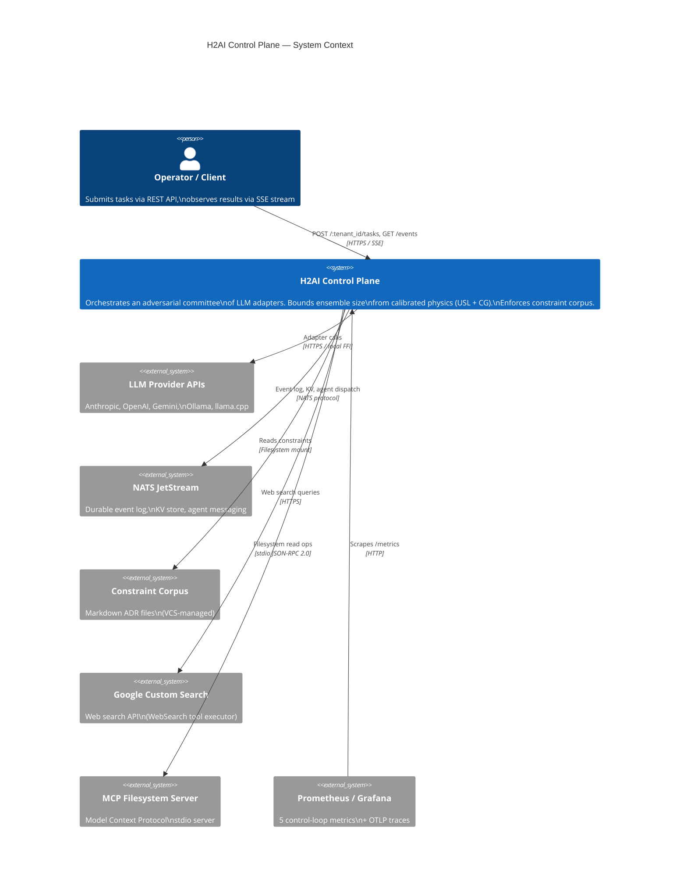

The control plane orchestrates a single task as a 6-phase pipeline. Each phase is event-sourced to NATS JetStream — every state transition is replayable, and every retry decision is auditable. Two independent diversity signals govern execution:

- **Hamming Common Ground (CG)**: pairwise constraint-satisfaction agreement across the adapter pool, measured during calibration. Drives `β_eff = β₀ × (1 − CG_mean)` and the USL ceiling `N_max = round(√((1 − α) / β_eff))`.
- **Cosine N_eff**: participation-ratio diversity from the eigendecomposition of the embedding cosine kernel. A pool-level `n_eff_cosine_prior` is the Bayesian prior at calibration; a task-level `n_eff_cosine_actual` is computed from the wave's raw proposal outputs at every MAPE-K decision point (see math.md §3 for the `from_cosine_matrix` formula).

The two signals are not redundant. Hamming CG measures *behavioural* agreement on the constraint corpus. Cosine N_eff measures *semantic* independence at generation time. Both flow through the planner, the multiplication-condition gate, and the MAPE-K retry loop.

---

## 2. Execution phases

### C4 Level 2 — Containers

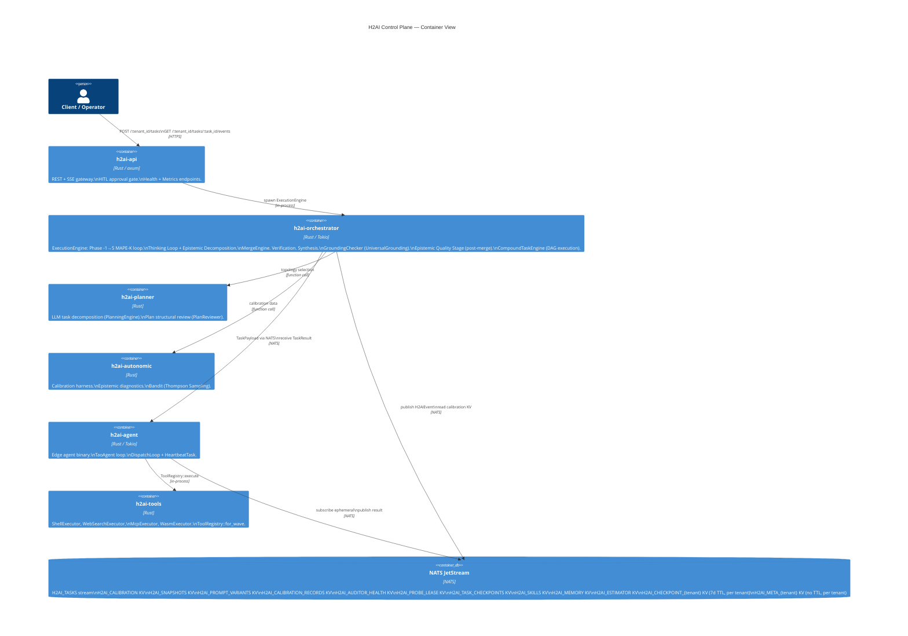

A task moves through Phase −1 (Thinking Loop, optional) → Phase 0 (Epistemic Decomposition) → Phases 1–5 (Bootstrap, Provisioning, Generation, Verification/Audit, Merge) → post-merge Epistemic Quality Stage. Each phase emits one or more events, and every MAPE-K retry restarts at Phase 2.

### Phase −1 — Thinking Loop (optional pre-execution)

When `thinking_loop.enabled = true`, a coverage-convergence brainstorm runs before Phase 0. A sequence of cognitive archetypes are selected via LLM, each brainstorming the task description independently. The loop iterates until `coverage_score ≥ coverage_threshold` (default 0.75) or `max_iterations` is reached.

**Adaptive archetype count:** On iteration 0, all `max_archetypes` are instantiated. On subsequent iterations, the count contracts to `max(2, ceil(max_archetypes × (1 − coverage_score)))` — proportional to how much coverage remains. A quality floor gate prevents contraction if fewer than `expansion_quality_floor` (default 0.30) of archetypes pass the selection filter.

**Temperature scheduling:** `scheduled_tau` decays linearly from `tau_max` (0.85, broad exploration) to `tau_min` (0.20, exploitation) across iterations.

**Tension injection:** When the previous iteration's `ThinkingReport.tensions` is non-empty, the archetype selection prompt receives an explicit instruction to address the named open tensions.

**Per-constraint archetype coverage guarantee:** After `select_archetypes()` returns the LLM-selected archetypes, `find_uncovered_constraints(archetypes, constraint_ids)` identifies any constraint IDs with no dedicated archetype (i.e., no archetype has that ID in its `focus_constraints`; empty `focus_constraints` covers nothing). For each uncovered constraint, `synthesize_coverage_archetype(constraint_id, corpus)` constructs a specialist archetype from the corpus description, ensuring every active constraint has at least one dedicated archetype before brainstorming begins. The LLM self-reports which constraints its archetype targets via the `**Focus Constraints:**` field in the archetype markdown prompt (`THINKING_ARCHETYPE_MD_ITER1`); "all" maps to empty (no specific focus declared). This prevents minority constraints from being collectively "covered" in aggregate score while receiving zero specialist attention.

The loop produces a `ThinkingReport { shared_understanding, tensions, coverage_score, iteration, prev_similarity, retrieved_node_ids, skill_nodes_used, archetypes }` (`crates/h2ai-types/src/thinking.rs`). `archetypes` carries the names of the archetypes selected in the final iteration and is surfaced in `ThinkingLoopCompletedEvent.archetypes` for observability. `retrieved_node_ids` holds all KnowledgeNode IDs retrieved across all iterations (deduplicated). The `shared_understanding` string is injected as `{thinking_context}` into the Phase 0 decomposition prompt. The final `coverage_score` is used as the `thinking_coverage_score` for the `j_eff_min` dynamic threshold.

**Plan-Awareness Probe:** When `awareness_probe.enabled = true`, a batched LLM judge call runs after the initial thinking loop completes. The judge evaluates `shared_understanding` against every constraint in the corpus (verdicts: `Acknowledged` / `NotAddressed` / `Contradicted`; ~100 tokens/constraint, `judge_max_tokens = 1024` default). In `Active` mode, Hard non-gated `Contradicted` outcomes produce an `awareness_hints` re-iteration prompt that is injected into a second thinking loop pass. In `Shadow` mode (default), verdicts are emitted as `AwarenessProbeCompletedEvent` without blocking the pipeline. Ambiguity-gated constraints are probed but can never trigger re-iteration. Degraded probes (call failure or partial parse) never block.

### Phase 0 — Epistemic Decomposition

Before `EngineInput` is constructed, `run_decomposition_agent()` derives a motivated committee from the task description and constraint corpus. **This phase always runs.** Operator-supplied `slot_configs` are appended to the result as additive context, not as a bypass.

**Path C (production, always):** A pre-dispatch LLM call to the auditor adapter (most capable, τ=0.3) asks: *"What are the N most cognitively distinct expert perspectives needed to solve this problem?"* The structured JSON response is parsed into `Vec<ExplorerSlotConfig>` — each slot has a motivated `role_frame`, `cot_style`, `focus_mandate` (what constraint domains this slot owns), `rejection_criteria` (the specific failure mode to look for), `constraint_domains: Vec<String>` (domain tags owned by this slot — used by the C3 domain coverage guard), and `search_enabled: bool` (when `true`, the researcher adapter is called before Phase 3 generation to provide grounding context). The count of slots is the motivated N. Returns `Result<Vec<ExplorerSlotConfig>, DecompositionError>` — **failure causes `TaskFailed`; there is no silent fallback.**

**Operator context (additive):** If the manifest carries `slot_configs`, they are appended to the Path C result after the LLM response is parsed, then the combined set is re-pruned by orthogonality. They do not bypass decomposition.

**Orthogonality pruning:** If the produced N exceeds the USL cost ceiling `N_max`, `prune_by_orthogonality()` drops the slot with the highest mean cosine similarity to all retained peers — the least independent perspective — until `len ≤ N_max`. Never pads to fill the budget. `N_max` is the **cost ceiling** (from USL calibration), not the quality target — see math.md §2 and §5.1. The quality target is `n_it_optimal` (information-theoretic, `EnsembleCalibration::n_it_optimal()`); the planner uses `min(n_it_optimal, N_max)` as the quality-bounded cost ceiling before applying eigen-cap and quadrant overrides. **Implemented 2026-05-26 (INNOVATION-4).**

**Context injection:** The engine prepends `[MANDATE]: {focus_mandate}` and `[FIND]: {rejection_criteria}` before each agent's system context when those fields are non-empty.

**Adversarial verifier selection:** After slot configs are fixed, `tasks.rs` checks whether any slot has non-empty `rejection_criteria`. If true, `VerificationConfig` is set to use `ADVERSARIAL_EVALUATOR_SYSTEM_PROMPT` (hostile-reviewer framing) instead of the standard rubric-compliance prompt. Since Path C always populates `rejection_criteria`, the adversarial verifier is the default in production.

`n_eff_cosine_roles` is logged per task as a trace event.

### Phase 1 — Bootstrap

The orchestrator compiles the task description and the active constraint corpus into an immutable `system_context`. The `J_eff` gate enforces a minimum context-fill fraction; tasks below the threshold are rejected with `ContextUnderflow` rather than run with insufficient grounding. Emits `TaskBootstrapped`. For the constraint corpus markdown format, predicate kinds, severity levels, and ConstraintSource abstraction, see reference.md §7.

**Knowledge Provider — role-stratified enrichment:** When `[knowledge]` is configured in `H2AIConfig`, `AppState.knowledge_provider` holds a `Bm25WikiProvider` built at startup from the constraint YAML corpus plus any `wiki/` topic nodes. During generation Phase B1, each explorer slot issues a parallel `provider.query()` call. The slot's `ExplorerSlotConfig.agent_role` (Coordinator / Executor / Evaluator / Synthesizer — defaults to `Executor`) maps via `profile_for_role()` (in `h2ai-types::knowledge`) to a `KnowledgeProfile` that selects:
- **RAPTOR mode** — `CollapsedTree` (holistic, all levels simultaneously) for Coordinator and Synthesizer; `TreeTraversal` (cluster-then-leaf, procedural depth) for Executor and Evaluator
- **PPR hops** — `expand_hops=2` for Executor (multi-hop constraint traversal, HippoRAG arXiv 2405.14831), `expand_hops=1` for Synthesizer (cross-domain tension surfacing), `expand_hops=0` for Coordinator and Evaluator
- **domain_tag_boost** — Executor and Evaluator get `topic_knowledge` filtered to domain-matching nodes; Coordinator and Synthesizer get the global view only

Results populate `ContextAssemblerInput.{global_knowledge, topic_knowledge, constraint_tensions}`. Synthesizer slots additionally receive cross-domain `SurfacedTension` entries as `SectionTag::ConstraintTension` (importance=0.85, preserve=false) — cross-domain tension surfacing. The optional `InductionStore` (backed by a named NATS KV bucket, bucket name supplied at startup) records `KnowledgeNodePattern` after accepted merges and boosts `explicit_ids` on subsequent matching tasks (cold start = pure BM25+). Any failure (provider error, store unavailable) degrades silently to `(None, None, None)` — task execution never blocks on knowledge enrichment. When `[knowledge]` is absent, a `PassthroughProvider` delegates to `ConstraintResolver` with no behaviour change.

### Phase 2 — Topology Provisioning

The planner selects topology, explorer roles, and merge strategy from the calibration result and the task's Pareto weights:

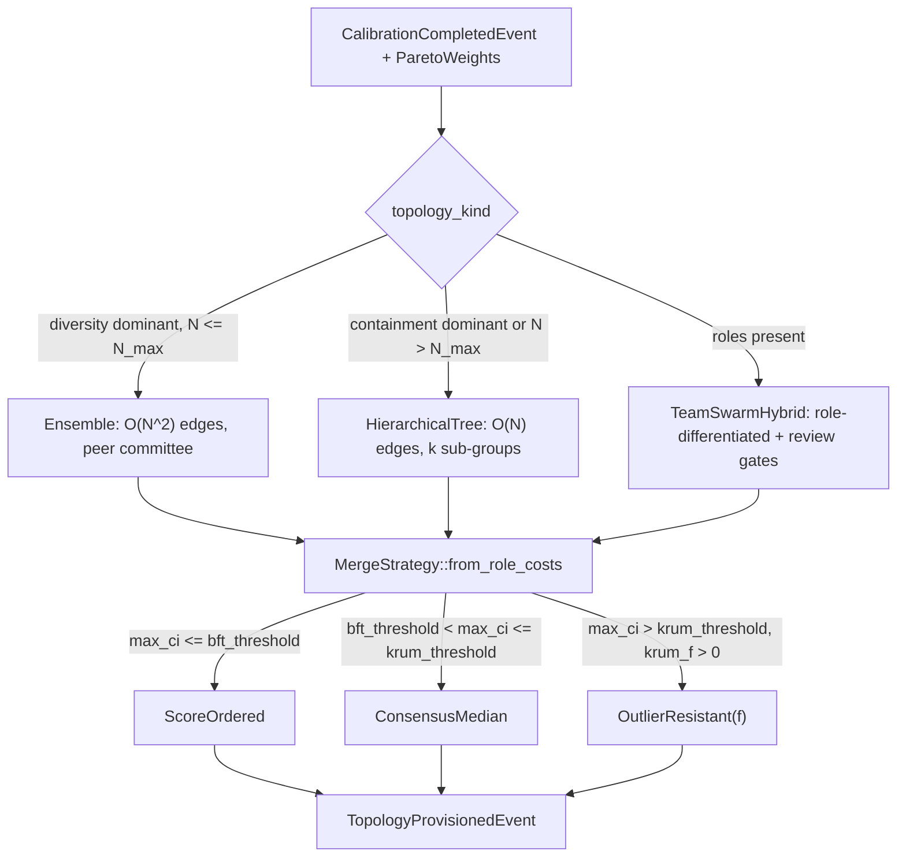

Outputs: `topology_kind`, N explorer configs with τ values, one auditor config, `merge_strategy`, `n_max`, `interface_n_max`, `beta_eff` snapshots, and a `constraint_tombstone` field (populated only when retrying after `ConstrainedExploration`).

### Phase 2.5 — Multiplication Condition Gate

Three conditions must hold before the system commits compute. All three are evaluated against the calibrated `EnsembleCalibration`:

1. `p_mean > min_competence` — adapters are above chance.
2. `rho_mean < max_correlation` — error correlation is below the saturation point.
3. `cg_mean ≥ θ_coord` — the Common Ground floor.

Failure produces `MultiplicationConditionFailed` with one of `InsufficientCompetence`, `InsufficientDecorrelation`, or `CommonGroundBelowFloor`. The retry policy then selects the next topology or fails the task.

A fifth condition — **`QuorumDegradedBelowMinimum`** — is checked at Phase 2.6 by `phases/complexity.rs`. When the unclamped `N_max < 3.0` (AIMD degradation), `n_max_degraded()` returns `true`. Outside shadow mode, this fails fast before generating any proposals. In shadow mode, a `WARN` trace with `unclamped_n_max` is emitted and execution continues — the type-system floor in `n_max_ci()` ensures N≥3 is used regardless. See math.md §2.7 and §4 for the quorum floor derivation.

### Phase 2.6 — Pool Diversity Guard

A separate gate, evaluated only when `cfg.diversity_threshold > 0`. Compares the calibration's `n_eff_cosine_prior` against `1.0 + diversity_threshold`. When the pool's effective independent-adapter count is below the floor, the engine emits a synthetic `ZeroSurvival` with `failure_mode = ModeCollapse` and routes through `RetryPolicy`. This is the fourth multiplication condition: `InsufficientPoolDiversity`. It exists because Hamming CG can mark constraint-profile agreement as "high coordination" while the pool remains semantically near-degenerate (correlated hallucination risk).

**Loud degradation:** When `embedding_model` is `None` (fastembed unconfigured) and `diversity_threshold > 0`, `DiversityGuardDegradedEvent` is emitted to NATS rather than silently falling back to the closed-form `n_eff_cosine_prior`. A startup warning fires when this configuration is detected. When `cfg.require_bivariate_cg = true`, the task fails with `InsufficientPoolDiversity` rather than proceeding in degraded mode.

**Domain coverage guard (C3 pre-loop):** Before the MAPE-K wave loop starts, the engine checks whether the union of `constraint_domains` across all `ExplorerSlotConfig`s covers the corpus domain tag set. Coverage fraction = `|covered| / |corpus_domains|`. Below `cfg.domain_coverage_threshold` (default 0.40), `DiversityGuardDegradedEvent` is emitted. With `require_bivariate_cg = true`, the task fails immediately.

### Phase 3 — Parallel Generation (TAO)

N explorers run their TAO (Thought–Action–Observation) loops in parallel through the Tokio executor. Each explorer independently:

- Receives the immutable `system_context`.
- Iterates up to `cfg.agent_max_tool_iterations` times, emitting `TaoIteration` per turn.
- On each turn: calls the LLM adapter, parses the output for a structured `{"tool": ..., "input": {...}}` JSON tool call, executes the tool locally via its `ToolRegistry`, appends the observation to the running message history, and continues until the output contains no tool call or the iteration cap is reached.
- Produces a `Proposal` event with raw output and token cost — or a `ProposalFailed` event on timeout, OOM, or adapter error.

**Timeout retry:** When `tao_config.retry_on_timeout = true` (default) and the adapter call times out on turn 1 or on the bypass path (reasoning models), the engine retries exactly once with `max_tokens = tao_config.timeout_retry_max_tokens` (default 512). The reduced token budget forces a concise response and recovers proposals that would otherwise fail on verbose slow models. Turns 2+ always propagate timeouts immediately without retry, to prevent double-timeout penalty in multi-turn loops. If the retry call also times out, the error propagates as normal.

`GenerationPhaseCompleted` summarises success/failure counts. Adapter rotation offset (set by `ModeCollapse` retries) is applied at adapter selection time so a retry sees a rotated subset of the pool.

**Generation phase timeout:** `GenerationPhaseConfig.timeout_secs` (default 300 s) caps the entire `join_all` across all explorers via `tokio::time::timeout`. On timeout, each timed-out explorer emits `ProposalFailedEvent { reason: ProposalFailureReason::Timeout }`. The `generation_outcome(completed, timed_out_count)` pure function (in `phases/generation.rs`) classifies the result: `Full` (all completed), `Partial` (some timed out), or `AllTimedOut`. `AllTimedOut` forces `ZeroSurvival` and routes to the existing `complexity_overflow_graft_signal` path — no new terminal state.

**Compliance checklist injection:** Before dispatching explorers, `phases/generation.rs` collects all `ConstraintDoc.binary_checks` from the corpus into a numbered string and passes it as `ContextAssemblerInput::compliance_checklist` (`SectionTag::ComplianceChecklist`, `preserve=true`, `importance=1.0`). Every explorer sees the full binary compliance checklist from wave 0, grounding the LLM in specific binary requirements before any failure. This is complementary to the B1 retry-≥1 injection — B1 fires on repair waves, the checklist fires on every generation wave including the first.

### Phase 3.1 — Correlated Hallucination Detection (C1)

After all explorer proposals arrive and before verification, the engine runs the correlated hallucination check when `cfg.correlated_hallucination_cv_threshold > 0.0` and at least 2 proposals are available (hardcoded minimum in `hallucination.rs`).

`compute_cv(proposals)` (`crates/h2ai-orchestrator/src/correlated_hallucination.rs`) computes all `N×(N−1)/2` pairwise token-Jaccard distances and returns the coefficient of variation. Low CV = proposals cluster semantically = correlated-regime signal. The N = 2 edge case is handled: a single pairwise distance is a one-point distribution (CV = 0 always); `compute_cv` returns `None` for diverse N = 2 (statistically meaningless) and `Some(cv = 0.0)` only for identical N = 2 proposals (definite signal).

When `cv < correlated_hallucination_cv_threshold` **AND** `mean_jaccard_distance < correlated_hallucination_min_jaccard_floor` (default 0.50): (1) `CorrelatedEnsembleWarning` is appended to the output; (2) the **reactive grounding path** invokes `GapResearchChain::resolve` — a three-tier escalating chain: `SpecAnchorGrounder` (always, injects spec entities), then `LlmResearcherGrounder` (tier 0, fetches contradiction evidence via the researcher adapter), then `WebSearchGrounder` (tier 1, live web search distilled by LLM); (3) the MAPE-K retry loop `continue`s to the next generation wave. The joint AND condition prevents spurious retries on high-quality diverse ensembles where all pairwise distances are high (CV=0 but not correlated).

**Proactive researcher path** (separate from C1): slots with `search_enabled: true` (set by decomposition STEP3) trigger a researcher pre-pass *before* Phase 3 generation — the researcher fetches domain-specific grounding context that is injected into the slot's system context before any LLM call. This decouples grounding from hallucination detection.

`CorrelatedEnsembleWarning` and `ResearcherGrounding` events are published to NATS via `tasks.rs` after the shadow audit events block.

### Phase 3.2 — Universal Grounding (GroundingChecker)

After the token-Jaccard CV check (Phase 3.1), the engine applies the universal grounding checker when `cfg.grounding.enabled = true`.

**Architecture.** `GroundingChecker` implements `GapChecker` and wraps a composable `GroundingJudge` trait:

```rust
#[async_trait]
trait GroundingJudge: Send + Sync {
    async fn judge(&self, output: &str, spec: &str) -> Vec<GroundingFinding>;
}

struct GroundingFinding { text: String, kind: FindingKind, reason: String, confidence: f64 }
enum FindingKind { Entity, Claim }
```

Three implementations are composable:

- **`HeuristicGroundingJudge`** — pure extraction: `extract_arch_nouns(output) \ extract_arch_nouns(spec)` → `GroundingFinding { kind: Entity, confidence: 0.8 }`. No LLM call. Used as fallback when no researcher adapter is configured.
- **`LlmGroundingJudge`** — calls the researcher adapter with `GROUNDING_JUDGE_SYSTEM` + `GROUNDING_JUDGE_TASK` prompts (budget: `grounding.max_tokens`, τ: `grounding.tau`); parses JSON response `{"findings": [{ text, kind, reason, confidence }, ...]}`. Findings with `confidence < 0.5` are discarded at parse time. Confidence represents the judge's certainty that the entity/claim is absent from the spec boundary.
- **`CompositeGroundingJudge`** — fans out to all judges via `futures::join_all`; deduplicates by `text` key (first-seen wins).

**Spec boundary.** The `effective_spec` passed to `GroundingChecker::new()` is built from two sources (engine.rs, `run_epistemic_stage`):
```
effective_spec = manifest.description + "\n" + join("\n", [ "{c.id}: {c.description}" for c in constraint_corpus ])
```
`manifest.context` is **not** included in `effective_spec` — it is consumed separately by `TaskContextSeeder::seed_uncertainty_gaps()` to detect uncertainty keywords. `ConstraintDoc.binary_checks` and `pass_criteria` are also not included — only `ConstraintDoc.id` and `ConstraintDoc.description` contribute. Technologies or entities present in the description or any constraint description are considered grounded.

**Gap production.** `GroundingChecker::check()` calls `judge.judge(output, spec)`, filters findings by `confidence ≥ min_confidence` (`grounding.min_confidence`, default 0.7), and emits one `Gap` per finding:

- `kind`: `GapKind::UngroundedContent`
- `source`: `GapSource::GroundingCheck`
- `id`: `grounding:{text_lowercased_underscored}`
- `description`: `[entity|claim] text: reason`
- `severity`: confidence ≥ 0.9 → `High`; ≥ 0.7 → `Medium`; else → `Low`

**Call sites in `engine.rs`.** GroundingChecker is invoked only within `run_epistemic_stage`, which runs **after** `MergeResolved` (never before the MAPE-K wave loop):
1. **Pre-feedback-loop:** called on `out.resolved_output` (the merged output) before the epistemic feedback loop starts. The resulting `UngroundedContent` gaps become part of `static_gaps` passed to the feedback loop.
2. **Post-feedback-loop:** called on `final_output` (the patched output) only when `closed_ids` is non-empty — i.e., when `MicroExplorerResolver` closed at least one gap. Catches new ungrounded entities introduced by recovery patches.

Optionally `ResearcherGroundingEvent { source: GroundingSource, slot: Option<String>, ... }` is emitted when external grounding is fetched during C1 detection or a proactive slot research pass.

### Phase 3.5 — Verification

> **Phase numbering:** Fractional phase numbers (2.5, 2.6, 3.5, 4.5) denote sub-phases introduced after the initial integer numbering was fixed. They fit between the surrounding integer phases in execution order and are used consistently in the event vocabulary (see reference.md §2 variant index).

A multi-variant **judge panel** (`JudgePanel`) scores every proposal against the constraint corpus. Each scoring emits `VerificationScored {score, reason, passed}`. Proposals that fail verification become `BranchPruned` with their `violated_constraints` recorded.

**Panel construction:** The panel is built from the verification adapter plus any explorer adapters from distinct families. If ≥2 distinct adapter families are available the panel uses `PanelDiversityKind::CrossFamily` (one variant per family, cap 3) with supermajority vote (`quorum_fraction` default 0.67) per constraint → `ConstraintVerdict::Pass / Fail / Uncertain`. If only one family is available, `PanelDiversityKind::PersonaOnly` runs 3 variants (Literal, Contextual, Skeptical personas) requiring unanimous agreement — any dissent produces `Uncertain`. Proposals with uncertain-only constraint failures pass with a score penalty (`uncertainty_weight` default 0.7); hard `Fail` verdicts prune. When ≥`ambiguity_threshold` proposals in a wave produce uncertain votes on the same constraint, `ConstraintAmbiguityEvent` is logged as a corpus quality signal. For the full `[judge_panel]` configuration table (`quorum_fraction`, `uncertainty_weight`, `persona_temperatures`, `ambiguity_threshold`), see reference.md §4.

**Rubric independence:** The explorer's `system_context` is compiled with `include_rubric=false` (the production default in `compiler::compile`). `LlmJudge` constraint rubrics and their IDs are **withheld** from the explorer — the verifier retains them via `ConstraintPredicate::LlmJudge` and uses them for scoring, but the explorer must reason from the task description and domain expertise alone. This prevents the verifier from simply confirming that the explorer followed instructions it was already given.

**Adversarial verifier:** When any explorer slot carries non-empty `rejection_criteria`, verification uses `ADVERSARIAL_EVALUATOR_SYSTEM_PROMPT` — a hostile-reviewer framing that asks the verifier to find the single most likely silent failure rather than checking rubric compliance. Since Path C always populates `rejection_criteria`, this is the default in production.

**Per-check reasoning capture:** `verification.rs` parses `check_reasons` from the `ScoreResponse` JSON (private to `h2ai-constraints`) and propagates the value to `ConstraintViolation.check_reasons: Option<Vec<String>>`. The field carries per-check evidence the judge cited (e.g., `"Check 2: WATCH/MULTI/EXEC retry loop violates no-distributed-lock constraint"`). When present, `check_reasons` flows through the pipeline alongside `verifier_reason` and is consumed by `extract_incorrect_concept_from` in `mape_k.rs` for targeted per-check repair hint construction. The `CHECK_EVIDENCE_FORMAT_INSTRUCTION` prompt constant in `crates/h2ai-config/src/prompts.rs` instructs the verifier to emit a `CHECK VERDICTS:` block header in the **visible** final response (not inside any `<think>` section), followed by one `CHECK N: <evidence> → PRESENT or MISSING` line per check. The `has_check_markers` guard in `verification.rs` requires the string `"CHECK "` to appear in the visible `verifier_reason` before binary-check parsing runs; without the section header, thinking models (llama_cpp, Qwen3, R1) that emit check reasoning only in hidden `<think>` tokens would produce `total_checks = 0` even when correct reasoning exists. The `VerificationScoredEvent` exposes `total_checks`, `passed_checks`, `score_lower`/`score_upper` (95% Wilson CI), and `per_check_verdicts`; `total_checks = 0` signals the header was absent.

### Phase 4 — Auditor Gate

A separate auditor adapter (typically a stronger reasoning model than the verifier) is the final non-negotiable gate. Its output is expected to be JSON `{approved, reason}`. Rejected proposals become additional `BranchPruned` events.

**Non-JSON handling:** Proposals reaching this gate have already passed the verifier — a non-JSON auditor response is an LLM response issue, not a constraint judgment. Behaviour on parse failure is governed by `[audit_gate] fail_open_on_parse_error` (default `true`): when `true`, non-JSON responses are treated as approved with an empty reason (fail-open, a warning is logged); when `false`, non-JSON is treated as rejection (legacy fail-safe). Setting `false` is appropriate in production environments where auditor reliability is independently verified.

**Shadow auditor strict mode:** When `safety.shadow_auditor.enabled = true`, a second concurrent auditor call produces a shadow vote alongside the primary. The AND-vote (both must approve) is only binding by default for task domains that appear in the `promoted_domains` set — domains accumulate there after a configurable number of disagreements. When `safety.shadow_auditor.strict = true` (set automatically for `SafetyProfile::Production` and `SafetyProfile::Strict`), the AND-vote is binding on every proposal regardless of promotion history. This ensures the shadow auditor acts as a hard gate from the first task, which is essential in benchmark and production deployments where there is no prior disagreement history to warm the promotion set. The `strict` flag has no effect when `shadow_auditor.enabled = false`; a startup warning is emitted if both are set inconsistently.

### Phase 4.5 — Oracle Gate (optional)

When `oracle_gate.enabled = true`, a NATS `request()` call is made to `cfg.oracle_gate.subject` with a timeout of `oracle_gate.timeout_secs`. The oracle receives a JSON payload listing the surviving proposals and their scores. The oracle responds with `OracleGateResultEvent { gate_passed, confidence, summary, checked_proposals, passed_proposals }`.

**On pass** (`gate_passed = true`): the result is attached to the merge output as `oracle_gate_passed = Some(true)`. If the thinking loop produced a candidate solution that the oracle approved, `oracle_confidence_bonus` is added to the synthesis weight.

**On fail** (`gate_passed = false, confidence < min_confidence`): if a matching `ClarificationTemplate` pattern fires, a `PendingClarificationEvent` is published and the engine suspends via `clarification_waiters`. `POST /{tenant_id}/tasks/{id}/clarify` resumes it with an operator-supplied answer.

**On timeout**: behaviour is controlled by `on_timeout`: `pass` (treat as approved) or `fail` / `clarify` (treat as rejected). Any value other than `"pass"` results in rejection.

### Adaptive Prompt Harness (OPRO)

When `opro.enabled = true`, the control plane tracks a per-adapter j_eff EMA across tasks. When `j_eff_ema < opro.trigger_j_eff_threshold` and `n_tasks_total ≥ opro.min_tasks_before_trigger`, an OPRO (Optimization by PROmpting, arXiv 2309.03409) cycle is triggered: the auditor LLM is asked to rewrite the current prompt template to improve output quality, the candidate is validated (all template variables must survive), and stored as a new `PromptVariant` in `H2AI_PROMPT_VARIANTS`. A Thompson-sampling bandit (`alpha`, `beta` per variant) selects the active variant each task. After `graduation_tasks` total tasks, the variant with the highest mean reward (by `promotion_margin`) is promoted as the new default and a `PromptVariantPromotedEvent` is emitted.

Bootstrap priors are seeded at startup from `AdapterProfile.tier`: Capable=0.78, Standard=0.62, Fast=0.45 j_eff median priors. This eliminates the cold-start problem by providing principled Bayesian priors before any tasks have run — no empirical data required.

### Phase 5 — Merge

Surviving proposals enter `MergeEngine::resolve` with the strategy chosen at Phase 2:

- **ScoreOrdered**: pick the highest verification score.
- **ConsensusMedian**: pick the proposal with highest mean Jaccard similarity to the rest. *Not Byzantine-resistant — vulnerable to coordinated proposals at f ≥ n/2.*
- **OutlierResistant{f}**: smallest sum of distances to its `n − f − 2` nearest neighbours in Jaccard-distance space (Krum-style, from federated learning Byzantine-robust aggregation — Blanchard et al. 2017). Requires `n ≥ 2f + 3`.
- **MultiOutlierResistant{f, m}**: iteratively select m survivors via OutlierResistant, then take the highest verification score.

**OSP regime layer.** When `[osp]` is configured, `MergeEngine::resolve` handles `MergeOutcome::ZeroSurvival` (N_v=0) as an early exit before strategy dispatch, then classifies the remaining surviving proposals into one of three `OspRegime` variants:
- `SingleSurvivor` (N_v=1): return directly.
- `ClearLeader` (score gap Δ ≥ 2·T_v and P(correct) ≥ 0.92): select leader, skip ConsensusMedian.
- `TightCluster` (Δ < 2·T_v): run ConsensusMedian over passing proposals only.

`SemilatticeResult` carries `valid_proposal_scores: Vec<f64>` (parallel to `valid_proposals`) so scores flow from Phase 3.5 into the regime classifier. `AuditChannelBuilder` constructs Zone 3 audit findings from structured `ConstraintViolation` IR (never raw proposal text) and injects them as `zone3_hints` on `MergeResolvedEvent` for next-retry guidance. `RetryAccumulator` (local variable, task-scoped, never persisted) tracks per-constraint violation rates with λ=0.7 decay across retries.

**The two-layer cost model.** The `HierarchicalTree` orchestration topology reduces *orchestration* coordination to O(N) (α). The synthesis step is a separate, unavoidable O(N²) cost: computing `CG_mean` requires `N×(N−1)/2` pairwise Hamming comparisons, and the synthesis LLM must hold all N proposals in context and resolve their pairwise constraint conflicts. The β coefficient is fitted from merge-phase timing and captures this synthesis cost directly. DAG topology reduces α, not β — the two costs are independent.

Emits `SelectionResolved` and either `MergeResolved` (success) or `ZeroSurvival` (zero-survival → MAPE-K retry).

> The CRDT semilattice resolves to a single winning proposal by selection (LUB over `(generation, score)` tuples); content synthesis, if enabled, is a separate Phase 5a operation.

### Phase 5a — Synthesis (optional)

When `synthesis_enabled` and at least `synthesis_min_proposals` have survived audit, the synthesis adapter performs a critique→synthesis→re-verify pass over the candidate set. The re-verified score is compared against `max(individual_scores)`; the difference is recorded as `synthesis_gain` on `HarnessAttribution`. If synthesis improves the maximum, its output replaces the merge result.

### Constraint-Informed Synthesis Wave (terminal)

When the MAPE-K retry loop exhausts — either by reaching `max_autonomic_retries` or by early-break via `ComplexityOverflow { graft_first: true }` — the engine fires one terminal synthesis wave before returning `MaxRetriesExhausted`. This path is guarded by `synthesis_wave_enabled` (default `true`) and also unconditionally runs when `complexity_overflow_graft_signal` is set.

**Three-mechanism approach (pre-synthesis, always active):**

- **B1 — Compliance checklist injection** (`repair.rs`, `F1_COMPLIANCE_CHECKLIST` prompt template): at retry ≥ 1, `ConstraintDoc.binary_checks` (preserved through YAML compilation) are injected verbatim as a numbered checklist into the generation system prompt. The LLM sees each binary requirement as a distinct enumerated item.

- **B2 — Orthogonal partial-pass examples** (`repair.rs`, `select_orthogonal_partials`): pruned proposals carrying `BranchPrunedEvent.violated_constraints` are scored as `PartialPass` structs (passed-check bitmask + score + text, 1500-char line-safe truncation). Greedy set-cover selects the max_k=2 most diverse partials (maximises newly-covered constraint indices per selection step; index 0 = widest coverage, exploits primacy bias). Each partial is labelled with per-check PASS ✓ / FAIL ✗ markers in the repair context.

- **A — Terminal synthesis wave** (`engine.rs` post-retry block): `select_orthogonal_partials(controller.all_pruned(), &all_checks, 3)` builds the synthesis context. Three execution paths, evaluated in priority order:

**Path 1 — DPPM-MetaRefine (when `dppm.enabled = true` AND `complexity_overflow_graft_signal` is set):**

The primary path when isolation evidence or plateau detection fires. Implements the Decompose-Plan-Program-Merge pattern (arXiv:2506.02683):

1. **CLUSTER** — `build_clusters(&constraint_corpus)` BFS-partitions constraints into semantically-coherent groups by shared check-index adjacency (in `h2ai-constraints/src/clustering.rs`). Each cluster owns a disjoint subset of binary check indices.

2. **META OBSERVE** — `find_oscillation_pairs(all_pruned, check_offsets)` finds constraint pairs that appear in disjoint passed-check sets across proposals (the MUS signature). `divergence_events_from_pruned(all_pruned)` quantifies per-check convergence. Together they feed `build_balancing_instruction(oscillation_pairs, divergence_events)` which produces an explicit conflict-resolution brief for the integration LLM (in `h2ai-autonomic/src/meta_observer.rs`).

3. **PARALLEL SOLVE** — One adapter call per cluster, in parallel via `join_all`. `seed_for_cluster(cluster_check_indices, sorted_partials)` picks the highest-scoring partial whose passed checks best overlap the cluster's check indices, providing seeding text. `build_repair_context(...)` constructs the per-cluster repair prompt with the seed as prior proposal. The `max_parallel_solvers` config cap limits concurrency (default 4).

4. **MERGE (Integration Wave)** — `build_integration_wave_context(system_ctx, balancing, solver_outputs, n_constraints, constraint_checks)` constructs a prompt that receives all cluster solutions alongside the balancing instruction ("The following proposals each satisfy different constraint subsets independently. Identify and resolve architectural conflicts before producing ONE unified proposal."). The `constraint_checks: &[(ConstraintId, Vec<String>)]` parameter embeds the exact binary check texts for each cluster's constraints as a numbered list inside the cluster section header — so the integration LLM cannot regress on atomicity primitives (e.g. GET+SETEX instead of SETNX) between cluster boundaries. One LLM call to the synthesis adapter; retried up to `merge_max_retries` times on adapter error (not on verification score — the merge retry is an LLM error guard only). The `INTEGRATION_WAVE_PROMPT` constant in `repair.rs` is structurally distinct from the single-graft `H1_GRAFT_CONTEXT`.

The synthesis output passes terminal verification: `consensus_passes = 1`, 4 verifiers run concurrently (one per constraint). Success condition: `verif_out.passed` non-empty (proposal passes all constraint checks). Failure → `MaxRetriesExhausted { best_partial_text }`.

**First live run (2026-06-16, i5-tier2-multi-constraint-billing, DPPM enabled):** Isolation evidence triggered at wave 0 — explorers `a738e0e8` (0.5, passed {TAU-1, CONSTRAINT-005}) and `ef4d5f3f` (0.75, passed {TAU-1, CONSTRAINT-004, CONSTRAINT-008}) had disjoint coverage of the 004/005 MUS pair; union covered all 4 constraints. DPPM synthesis ran 11.5 min; 4 verifiers scored output 0.67 / 1.0 / 0.0 / 1.0 across the 4 constraints. CONSTRAINT-005 (WAL fallback) correctly integrated from partial `a738e0e8`; CONSTRAINT-004 regressed — synthesizer emitted GET+SETEX instead of SETNX/SET NX. Task failed (synthesis did not pass all checks). Root cause: integration wave prompt did not enforce sufficient specificity about Redis atomicity primitives.

**Path 2 — Sequential Constraint Grafting (when `sequential_grafting_enabled = true` and ≥2 sorted partials, DPPM disabled or not triggered):**

Iterative grafting loop — seed `base` from highest-scoring partial; each round: `missing_constraint_ids(base, candidate, offsets)` identifies constraint clusters covered by the candidate but not yet in the base; `build_graft_context` builds a focused prompt (base + candidate text for those clusters only); one LLM call; intermediate `VerificationPhase::run` checks `new_score ≥ base_score` (Monotonicity Invariant — rollback if regression). Loop terminates after at most `sequential_grafting_max_rounds` iterations. Guards: `graft_is_redundant` (shared ratio > 0.6), `grafted_ids_cycle_detected` (all missing IDs already grafted), `graft_token_projection_exceeds` (projected tokens > 130% base). Eliminates "Lost in the Middle" attention diffusion — each call sees at most O(|base| + |candidate|) tokens. Literature: Sequential Edge (Xie et al. 2025) — 46.7% improvement in constraint satisfaction vs. parallel merge.

**Path 3 — Single-shot synthesis (default fallback):** `build_synthesis_context` (system context + B1 checklist + ≤3 partial examples + Coherence Mandate). One LLM call (synthesis adapter or first explorer adapter).

All paths re-verify: `verif_out.passed` non-empty → `Ok(EngineOutput)` via `controller.finalize()`; empty → `MaxRetriesExhausted { best_partial_text: Some(global_best) }` where `global_best` is the highest-scored partial across **all** pruned events, surfaced for HITL via `tasks.rs` log.

### Coherence State (per-wave)

After each verification round (`all_pruned.extend()`), the engine computes `wave_coherence: CoherenceState` with two closure dimensions:

- **`uncovered_domains`:** constraint domains where any pruned proposal had violations. Derived from `BranchPrunedEvent.violated_constraints` mapped through the constraint corpus domain tags.
- **`active_contradictions`:** pairs of surviving proposals that score on opposite sides of the 0.5 threshold on any constraint in the same domain. Derived from the Phase 4.5 static-constraint satisfaction matrix.

`is_closed()` returns `true` only when both fields are empty. `wave_coherence` is reused at all exit paths (synthesis bypass, `MergeOutcome::Resolved`) without recomputation. It is traced per-wave at `h2ai.coherence` level.

At task close (in `tasks.rs`), if `!output.coherence_state.is_closed()`, a `CoherenceIncomplete` event is published to NATS before `MergeResolved`, carrying the `uncovered_domains` list and retry count.

### MAPE-K loop on zero survival

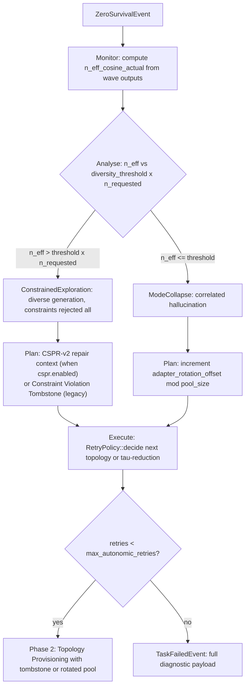

Both interventions are bookkept as Prometheus counters with a `failure_mode` label (`mode_collapse` and `constrained_exploration`).

### Post-merge async event

After `MergeResolved`, the engine spawns an async task that publishes `EpistemicYield {n_eff_cosine_actual, n_eff_prior, yield_ratio, adapters}`. `yield_ratio = n_eff_actual / N_requested` — the "financial yield": you paid for N adapters, you received `n_eff_actual` independent perspectives. This event never blocks task close.

---

## 2.1 Orchestrator implementation — three-layer decomposition

The `h2ai-orchestrator` crate implements the MAPE-K loop as three distinct layers. This decomposition separates concerns that are orthogonal but were previously entangled in a single `run_offline` function:

| Layer | File | Responsibility |
|-------|------|----------------|
| **Phase modules** | `src/phases/` (16 modules) | Pure data transformations. Each module exposes an `Input` struct, an `Output` struct, and a `run()` function returning `StepResult<Output>`. No retry state; no cross-wave memory. |
| **ExecutionPipeline** | `src/pipeline.rs` | Sequences the 16 phase modules for one wave. Stateless — receives `PipelineParams` each wave, returns `PipelineWaveResult`. Can be tested in isolation without a running controller. |
| **MapeKController** | `src/mape_k.rs` | Owns all retry state. Implements `observe(wave)` (aggregates events across waves — also updates `global_best_proposal: Option<(f64, String)>` cross-wave accumulator and `global_best_constraint_reasons: HashMap<String, String>` dynamic passing-constraint verifier reasons from the global-best passing proposal — updated only when `wave.best_passing_constraint_reasons` is non-empty), `params()` (projects current state into `PipelineParams` for the next wave), and `decide(outcome)` (maps `PipelineOutcome` to `MapeKDecision`). Carries `conflict_graph: ConstraintConflictGraph` (built once at task start) and `binary_checks: Vec<String>` (flat list of all `ConstraintDoc.binary_checks` across the corpus — used by B1 and B2 injection). Exposes `all_pruned() -> &[BranchPrunedEvent]` and `system_context_with_rubric() -> &str` for the terminal synthesis wave. When `cspr.enabled = true`, `apply_retry_action` handles `RetryWithTargets { topology, targets: Vec<RepairTarget> }` from `RetryPolicy::decide()`: calls `build_repair_context(RepairInput { targets, conflict_graph, checks, partial_passes, prior_best_score, … })`. Each `RepairTarget.verifier_reasons: Vec<(f64, String)>` carries scored, Jaccard-deduped reasons selected by `top_k_unique_reasons(k=tried_topologies.len()+1, dedup_j=0.7)` — wave 1 → top-1, wave 2 → top-2, wave 3+ → all unique. Slot A emits a `TARGET BEHAVIOR` block when `RepairTarget.criteria_pass` is non-empty (sourced from `ConstraintDoc.rubric.pass`, propagated `ComplianceResult → ConstraintViolation → RepairTarget`), then "VERIFIER INTERPRETATION (best attempt: N% compliance)" with secondary reasons as "ALTERNATIVE DIAGNOSIS"; when `criteria_pass` is None the YOUR TASK text reads "satisfies the constraint requirement" (positive framing, not prohibition-forward — see Mayne et al. arXiv 2605.13829). Slot B falls back to "GUIDANCE" (remediation_hint); Slot C uses constraint description only. `prior_best_score` emits a global compliance header. Adds `[COMPETING CONSTRAINTS DETECTED]` MetaRepair block when two violated constraints are in the conflict graph. `coupled_hints` and `passing_pins` both call `build_best_passing_pin_hint(id, &self.global_best_constraint_reasons, self.corpus_pass_hint_for(id))` — the public free fn prefers the dynamic verifier reason for a passing constraint over the static corpus hint, falling back when the dynamic entry is absent or empty. This anchors the repair LLM on what the verifier actually accepted, not just on generic corpus requirements. B1 checklist and B2 partial-pass examples appended when `checks` is non-empty and `retry_count >= 1`. In `observe()`: pushes wave mean scores to `per_constraint_wave_scores`, pushes verifier reason to `verifier_reason_history` (bounded at `verifier_freeze.reason_window_size`), and calls `assess_gap_quality(synthesis, cfg)` for every injected `DomainSynthesis` entry — evicting entries where `GapQualityVerdict::Ineffective` (post-injection pass rate failed to improve by `gap_quality.min_improvement_to_retain` across `min_post_injection_waves` waves). `DomainSynthesis` carries three new fields: `injected_at_wave`, `pre_injection_pass_rate`, `post_injection_pass_rates` (see `crates/h2ai-types/src/gap_i1.rs`). The `extract_incorrect_concept_from` helper requires non-empty `check_verdicts` before attributing a verifier reason to a specific check index — empty verdicts (when the verifier omitted per-check breakdown) are excluded to prevent cross-contamination between unrelated constraint failures. |
| **Coordinator** | `src/engine.rs` | Creates controller and pipeline, runs the `loop { pipeline.run → controller.observe → controller.decide }` cycle, routes `MapeKDecision` to return/continue/error. |

### Phase execution sequence

Phases split into two groups with different retry semantics:

**Pre-loop (run once per task, before the retry loop — `engine.rs`):**

| Order | Module | What it does | Returns on failure |
|-------|--------|-------------|-------------------|
| 0 (opt-in) | `thinking_loop` | When `thinking_loop.enabled = true`: iterative multi-archetype brainstorm converging on `coverage_score ≥ coverage_threshold`; per-constraint archetype coverage guarantee; tournament merge synthesis; emits `ThinkingLoopCompleted { archetypes, coverage_score, iterations_run }` and optionally `AwarenessProbeCompleted` | Failure → task continues with empty `shared_understanding`; never fails the task |
| 0a | `decomposition` | `run_decomposition_agent()`: one LLM call to derive `Vec<ExplorerSlotConfig>` — each slot has `role_frame`, `cot_style`, `focus_mandate`, `rejection_criteria`, `constraint_domains`, `search_enabled`; `prune_by_orthogonality()` caps N to N_max | `Err(EngineError)` — task fails immediately |
| 1 | `bootstrap` | Compiles system context (with and without rubric) via `compiler::compile`, applies compaction, checks family conflict gate (`RequireDiverse` / `SingleFamilyOk`) | `Err(EngineError)` — task fails immediately |
| 2 | `complexity` | Calls `assess_task_complexity()`, assigns `TaskQuadrant`, guards against `Degenerate` in non-shadow mode, derives `cg_mean` and `n_max_ceiling` from calibration | `Err(EngineError)` — task fails immediately |
| 3 | `domain_coverage` | Computes corpus domain tag coverage across slot configs; emits `DiversityGuardDegradedEvent` (non-blocking unless `require_bivariate_cg = true`) | `Err(EngineError)` — task fails immediately |
| 4 (opt-in) | `complexity_probe` | When `complexity_routing.enabled = true`: one cheap LLM call via `ComplexityProbe::run()` rates the task on a 1–5 scale; emits `ComplexityProbeEvent`; stores `ComplexityProbeResult` on the controller via `set_probe_result()` for use in `MapeKDecision::ComplexityOverflow` routing | Probe failure or timeout → conservative default (`complexity = 2`); never fails the task |

> **Two distinct diversity events.** `DiversityGuardDegradedEvent` (pre-loop module 3, Phase 2.6 domain coverage) and `MultiplicationConditionFailed { InsufficientPoolDiversity }` (per-wave module 3, Phase 2.6 semantic pool guard) are different events. The first fires when the task's constraint domain tags do not cover the corpus — it is a corpus alignment warning. The second fires when the cosine N_eff of the adapter pool is below floor — it is a pool composition block. A task can trigger both independently.

**Per-wave (run inside the retry loop — `pipeline.rs`, `ExecutionPipeline::run()`):**

| Order | Module | What it does | `EarlyExit` reason |
|-------|--------|-------------|-------------------|
| 1 | `topology` | `TopologyPlanner::provision()`: selects topology, assigns explorer roles with τ-spread/reduction from `PipelineParams`, checks OutlierResistant quorum (`n ≥ 2f+3`) | `Fatal(InsufficientQuorum)` |
| 2 | `multiply` | `MultiplicationChecker::check()` against `p_mean`, `ρ_mean`, CG threshold from calibration (Phase 2.5) | `MultiplicationFailed { tau_values }` |
| 3 | `diversity` | `n_eff_cosine_prior < 1.0 + diversity_threshold` check (Phase 2.6) | `MultiplicationConditionFailed { InsufficientPoolDiversity { n_eff, threshold } }` |
| 4 | `generation` | Parallel TAO agent dispatch — one `TaoAgent::run()` per explorer; collects `ProposalEvent`s | — (never `EarlyExit`) |
| 5 | `hallucination` | CV + Jaccard correlated hallucination detection; triggers `GapResearchChain` reactive grounding when both thresholds fire | `HallucinationDetected { retry_context_hint }` |
| 6 | (removed) | correlated-fabrication phase removed; universal grounding now runs via `GroundingChecker` in pre-loop and post-loop positions in `engine.rs` | — |
| 7 | `verify` | `LlmJudgeVerifier` batch verification in parallel; scores each proposal against the constraint corpus | — |
| 8 | `audit` | `AuditorAdapter` gate; selects auditor-survivor proposals; emits `ShadowAuditorResultEvent` | — |
| 9 | `frontier` | Static constraint satisfaction matrix (proposal × static-constraint); computes `pareto_coverage` | — (returns `None` when no static constraints) |
| 10 | `llm_coverage` | Computes `covered_domains` from Hard LlmJudge constraints when survivors exist and no Hard constraints are bypassed; result passed to `CoherenceState::subtract_covered_domains()` to prevent false-positive `CoherenceIncomplete` on tasks where Hard-constraint domains are genuinely addressed by the surviving proposals | — (enrichment only, never `EarlyExit`) |
| 11 | `oracle` | NATS request/reply oracle gate with `timeout_secs`; `on_timeout = "pass"` → `Some(true)` | `OracleBlocked` |
| 12 | `synthesis` | Filters proposals to auditor survivors; builds merge candidate set; derives `coherence_state` | `ZeroSurvival { filter_ratio }` when no survivors |
| 13 | `merge` | `MergeEngine` dispatch: Krum / OutlierResistant / Hierarchical / Plurality depending on topology | `ZeroSurvival` on merge failure |

### Wave result flow

Every phase function returns a `StepResult` — a uniform envelope that lets `ExecutionPipeline` handle failures without pattern-matching on each phase's specific error type:

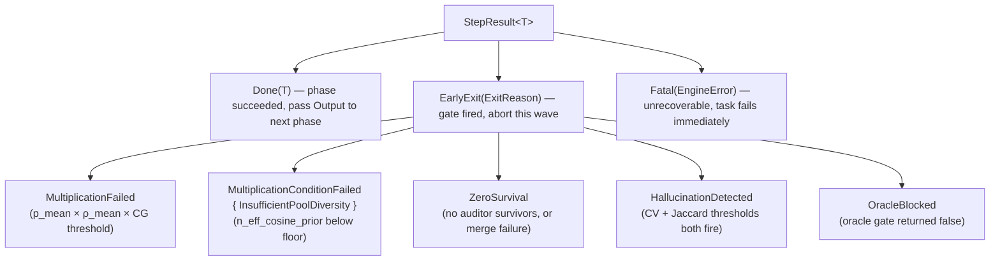

`MapeKController::decide()` maps every `ExitReason` to one of four controller decisions:

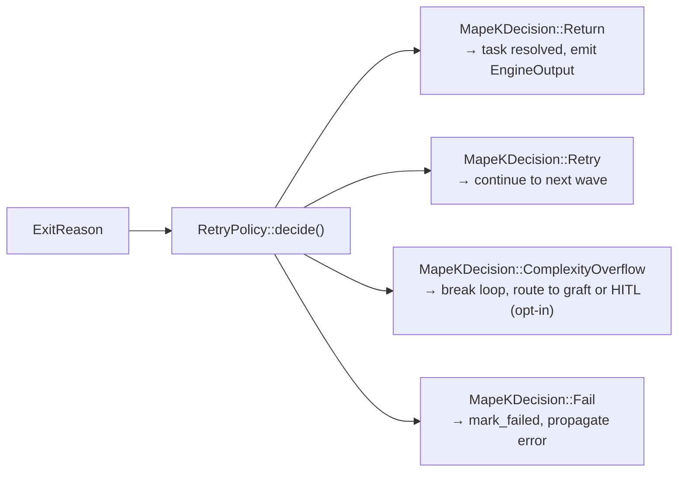

Phase modules only classify failures — they never call `RetryPolicy`. The controller owns all cross-wave state mutation: topology overrides, τ-reduction, retry context injection, self-optimizer updates, Talagrand τ-spread feedback.

**— `ComplexityOverflow` routing (opt-in, 2026-05-29, extended 2026-06-16).** When `complexity_routing.enabled = true`, `MapeKController::handle_exit_reason()` checks three short-circuit conditions before the standard retry-policy path:

1. **Pre-dispatch probe result** (`probe_result: Option<ComplexityProbeResult>` populated by `ComplexityProbe` in `h2ai-autonomic` before the first wave): if `complexity >= hitl_threshold` (default 5) the controller returns `ComplexityOverflow { graft_first: false }` — engine surfaces to HITL via `MaxRetriesExhausted` without burning any retry. If `complexity >= decompose_threshold` (default 4), `retry_count >= min_retries_before_graft` (default 2), and the corpus has at least one `binary_checks` entry (`corpus_synthesis_viable`), returns `ComplexityOverflow { graft_first: true }` — engine routes to DPPM-MetaRefine synthesis wave. Without a viable corpus the guard degrades to normal retry (WARN log emitted once at controller construction; `error!` backstop in synthesis wave guards against future Layer-2 bypass).
2. **Intra-retry ceiling detector** (inside `ExitReason::ZeroSurvival`, gated by `complexity_routing.intra_retry.enabled`): pure-function signals in `crates/h2ai-orchestrator/src/ceiling_detector.rs` — `failure_signature_entropy(last_wave_pruned)`, `retry_slope(quality_history)`, and `n_eff × CG_mean` product — fire `ComplexityOverflow` when ≥2 of the 3 signals cross threshold after `min_retry_count_for_detection`. This catches probe misclassifications and tasks that hit the ceiling dynamically.
3. **Integration wave triggers** (in `has_isolation_evidence` and `is_compliance_plateau`, `mape_k.rs`): **Isolation evidence** — after each wave, checks whether ≥2 pruned partials have disjoint passed-check sets whose union covers all binary checks but no single partial covers all (the MUS signature). **Plateau detection** — checks whether the last 2 consecutive wave compliance means differ by < `plateau_threshold` (default 0.02) and `retry_count ≥ 2`. Either condition fires `ComplexityOverflow { graft_first: true }` unconditionally at any retry count, bypassing the probe-score and `min_retries_before_graft` guards. This is the primary trigger for DPPM-MetaRefine on multi-constraint tasks where holistic repair has converged to a local optimum. `signals_fired` on `ComplexityCeilingDetectedEvent` counts how many of the 3 signals activated simultaneously.

4. **Frozen verifier detection + bypass** (in `decide()`, every wave after `min_waves_to_detect`): `detect_frozen_verifier(constraint_id, wave_scores, reason_history, other_constraint_trends, cfg)` in `crates/h2ai-autonomic/src/epistemic.rs` fires when ALL five conditions hold: (a) `wave_scores.len() >= min_waves_to_detect`, (b) `variance(wave_scores) < score_variance_threshold` (score not moving), (c) at least one other constraint shows monotonically increasing trend and mean > `other_constraint_success_threshold` (proves proposals genuinely improve — guards against model-ceiling false positives), (d) mean pairwise Jaccard of `reason_history` > `reason_jaccard_threshold` (verifier produces near-identical rejections regardless of proposal evolution), and (e) `other_constraint_trends` is non-empty (single-constraint sessions never trigger). When `bypass_hard_gate_on_freeze = true` and `Some(FrozenVerifierSignal)` is returned: the constraint ID enters `bypassed_verifier_constraints`; proposals failing ONLY bypassed constraints pass pruning tagged with `bypass_reason: Some("VerifierFrozen")`; `VerifierFrozenEvent` is emitted; `EngineOutput.bypassed_constraint_ids` carries the bypass set for operator visibility. Bypass is per-constraint: proposals failing a bypassed constraint AND any non-bypassed Hard constraint are still pruned. The `MapeKController` carries three new fields: `per_constraint_wave_scores: HashMap<String, Vec<f64>>` (per-constraint, per-wave mean scores — the foundational observable shared with gap quality assessment and Talagrand τ-adjustment), `verifier_reason_history: HashMap<String, VecDeque<String>>` (rolling window bounded at `reason_window_size` to prevent unbounded growth), and `bypassed_verifier_constraints: HashSet<String>`.

Events: `ComplexityProbeEvent` (probe complete) and `ComplexityCeilingDetectedEvent` (detector fired) are emitted to NATS. The `beyond_budget_count: u32` field on `VerifierReasonContradictionEvent` (`#[serde(default)]`) carries sub-claim "verifier could not compute" verdicts; when `verifier_decomposition_enabled = true` and `probe.complexity ≥ decompose_threshold`, `BEYOND_BUDGET_VERIFIER_ADDENDUM` is appended to `verification_config.evaluator_system_prompt` in the pre-loop phase, instructing the verifier to decompose evaluation into sub-claims and report each as VERIFIED / UNVERIFIED / BEYOND_BUDGET. AgentDropout N-reduction fires on retry ≥ 2 when `N_eff < n_eff_dropout_threshold`. The iterative grafting loop is guarded by three over-decomposition checks: `graft_is_redundant` (shared/union ratio > 0.6), `grafted_ids_cycle_detected` (all missing IDs already grafted), and `graft_token_projection_exceeds` ((base + candidate) / 4 > base_tokens × 1.3). The dedicated E2E scenario `tests/e2e/scenarios/complexity-routing/h2ai.toml` exercises the full stack end-to-end.

### PipelineParams — controller state projected into each wave

`MapeKController::params()` produces an immutable snapshot before each wave. The pipeline consumes it without holding a reference back to the controller, keeping the two layers fully decoupled:

| Field | Purpose |
|-------|---------|
| `optimizer` | Agent count and merge thresholds from the self-optimizer |
| `force_topology` | Topology override set by `RetryPolicy` on previous wave failure |
| `tau_reduction_factor` | Accumulated τ-reduction multiplier across retries |
| `tau_spread_factor` | τ-spread expansion factor driven by Talagrand feedback |
| `adapter_rotation_offset` | Round-robin offset to rotate adapter assignment across waves |
| `retry_context` | Injected constraint-feedback hint text from `RetryPolicy` |
| `tao_config` | Per-turn TAO configuration (may be relaxed on retry) |
| `verification_config` | Verification gate thresholds |
| `pending_tombstone` | Constraint tombstone injected at the topology phase on retry |
| `leader_context` | `Option<LeaderContextSnapshot>` — Krum-elected leader's prior proposal text, Socratic question, and per-slot constraint aspect assignment; `None` when `leader_enabled = false` or first wave |

### WaveEvents — cross-wave aggregation

`ExecutionPipeline::run()` returns a `PipelineWaveResult` carrying both the outcome and a `WaveEvents` bundle. `MapeKController::observe()` merges each wave's events into a running aggregate so the final `EngineOutput` reflects the full multi-wave history:

| Category | Events carried |
|----------|---------------|
| **Verification** | `VerificationScoredEvent` per proposal, `ProposalFailedEvent` for non-survivors |
| **Audit** | `ShadowAuditorResultEvent` per wave |
| **Hallucination / Grounding** | `CorrelatedEnsembleWarning`, `ResearcherGroundingEvent` |
| **Optimizer signals** | `QualityMeasurement` (self-optimizer), `TalagrandFeedback` (τ-spread), `TaoEstimatorUpdate` (bandit) |
| **Topology** | `TopologyProvisionedEvent` (on retry waves), `BranchPrunedEvent` (synthesis/merge pruning) |
| **Constraint frontier** | `ConstraintFrontierEvent` (static constraint satisfaction matrix) |
| **Gate ratio** | `filter_ratio` (survivors ÷ proposals) — consumed by `RetryPolicy::decide()` |
| **Proposal texts** | `wave_proposal_texts: Vec<(SlotId, String)>` — raw proposal text per slot, carried forward so `prepare_leader_election()` can build the leader's prior-proposal prefix for the next wave |
| **Passing-constraint reasons** | `best_passing_constraint_reasons: HashMap<String, String>` — per-constraint verifier reasons from the highest-scoring passing proposal this wave (non-empty reasons only); merged into `MapeKController.global_best_constraint_reasons` in `observe()` when a new global-best is found; consumed by `build_best_passing_pin_hint` as dynamic passing-constraint pin hints |

### Epistemic Leader — cross-wave guidance

The Epistemic Leader is an optional cross-wave guidance layer that runs between `observe()` and the next call to `params()` in `engine.rs`. Its purpose is to prevent the retry loop from repeating the same failed approach by injecting a Socratic diagnostic question and targeted constraint-aspect context into the next wave's generation prompts.

**Election.** After each failed wave, `prepare_leader_election()` selects the leader by argmax over verification scores from the most recent `VerificationScoredEvent` set — the slot with the highest score becomes leader; the second-highest becomes the runner-up and is stored for rotation. This is a lightweight Krum-consistent selection: it uses the same verified score used by the merge engine, so no additional LLM call is needed for election.

**Socratic diagnosis.** The leader's slot config and failed proposal text are passed to a short LLM re-prompt that generates `leader_eig_candidates` candidate questions. Questions are ranked by an EIG (Expected Information Gain) proxy — the question whose semantic embedding is most orthogonal to previously asked questions scores highest. A belief buffer (per-task `Vec<BeliefRecord>`) deduplicates via FNV-1a hash: any candidate whose hash matches a prior record is skipped before EIG ranking. The surviving top question is stored as `LeaderState.current_question` and emitted as `SocraticDiagnosisEvent`.

**Context injection.** `LeaderContextSnapshot` is attached to `PipelineParams.leader_context` before the next wave. The `generation` phase reads it and applies per-slot prompt prefixes: the leader slot receives its own prior proposal text plus the Socratic question; each follower slot receives the question plus an assigned constraint aspect (round-robin over the task's constraint corpus domains). This splits the search space so leader and followers explore different facets of the same diagnostic hypothesis. Injection is a pure string prefix — it does not alter TAO tool configuration or τ values.

**Credibility and rotation.** The leader carries a `credibility: f32` score initialised at `1.0`. On each wave where the best verification score does not improve by more than `leader_stagnation_threshold`, credibility decays by `leader_credibility_decay_rate`. When credibility falls below `leader_credibility_warn_threshold`, a warning is logged. After `leader_stagnation_waves` consecutive stagnant waves, `apply_leader_result()` rotates leadership to the stored runner-up and resets credibility. A wave that improves the best score by at least `leader_stagnation_threshold` partially recovers credibility (`+= decay_rate * (1.0 - credibility)`). The `LeaderElectedEvent` is emitted on both initial election and rotation.

**Config knobs (`reference.toml`):**

| Field | Default | Description |
|-------|---------|-------------|
| `leader_enabled` | `false` | Enable the Epistemic Leader subsystem |
| `leader_stagnation_threshold` | `0.02` | Minimum score improvement to count a wave as non-stagnant |
| `leader_stagnation_waves` | `1` | Consecutive stagnant waves before leadership rotates to runner-up |
| `leader_diagnosis_max_tokens` | `128` | Token budget for the Socratic question LLM call |
| `leader_diagnosis_tau` | `0.3` | Temperature for the diagnosis LLM call (low for focused output) |
| `leader_eig_candidates` | `3` | Number of candidate questions generated before EIG ranking |
| `leader_credibility_decay_rate` | `0.2` | Credibility decrease per stagnant wave |
| `leader_credibility_warn_threshold` | `0.4` | Credibility level below which a warning event is logged |

**Events emitted:**

- `LeaderElectedEvent` — fired by `prepare_leader_election()` on initial election and on runner-up rotation; carries `leader_slot_id`, `credibility`, and `wave_index`.
- `SocraticDiagnosisEvent` — fired after EIG ranking; carries the elected question text, its EIG score, and the count of belief-buffer entries that were skipped as duplicates.

**Implementation files:** `crates/h2ai-orchestrator/src/leader.rs` (`LeaderState`, `LeaderContextSnapshot`, `LeaderElectionPlan`, `BeliefRecord`); `crates/h2ai-orchestrator/src/mape_k.rs` (`MapeKController.leader`, `prepare_leader_election()`, `apply_leader_result()`); `crates/h2ai-orchestrator/src/engine.rs` (async election block between `observe()` and `decide()`); `crates/h2ai-orchestrator/src/phases/generation.rs` (per-slot prefix injection).

### Coordinator sequence

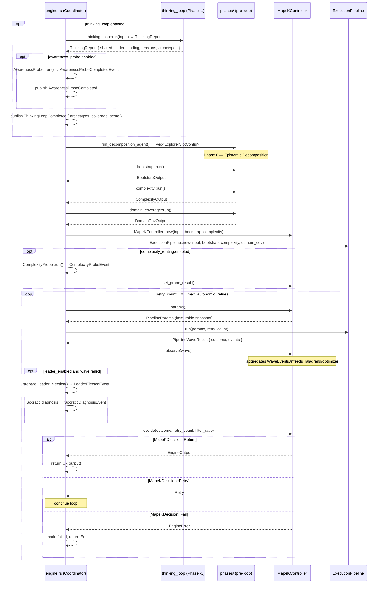

### Calibration and async safety

`EigenCalibration::from_cg_matrix` and `EigenCalibration::from_cosine_matrix` perform symmetric eigendecomposition via nalgebra on an N×N matrix (N = adapter pool size, typically 2–8). Both calls are offloaded to `tokio::task::spawn_blocking` in `h2ai-autonomic/src/calibration.rs` so the async executor thread is never stalled by CPU-bound matrix math.

---

## 3. Task execution lifecycle

### Sequence — full task from submission to resolution

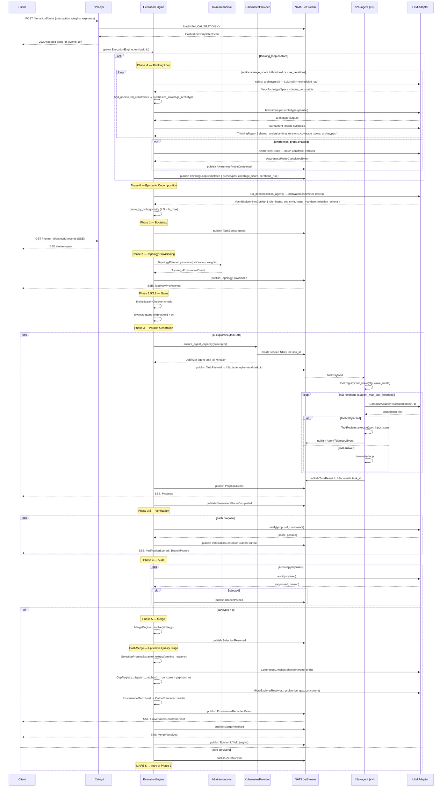

### 3.1 Submission and bootstrapping

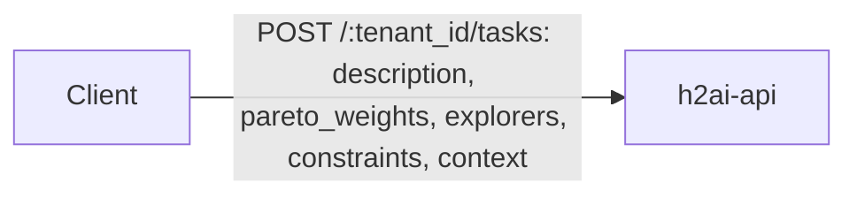

1. **Validation** — weights must sum to 1.0; manifest structure must be valid. `503` if no current calibration in `H2AI_CALIBRATION` KV.
2. **task_id allocation** — a `TaskId` (UUID) is minted. Response is `202 Accepted` with `{"task_id": ..., "events_url": "/{tenant_id}/tasks/{id}/events"}`.
3. **ExecutionEngine::run** — spawned as a Tokio task. Loads `CalibrationCompletedEvent` from `H2AI_CALIBRATION` KV.
4. **Dark Knowledge compilation** — `h2ai-context` assembles the constraint corpus, task description, and knowledge enrichment into a single immutable `system_context` string.
5. **TaskBootstrapped** published to `h2ai.tasks.{task_id}` on `H2AI_TASKS` stream.

### 3.2 Provisioning and gates

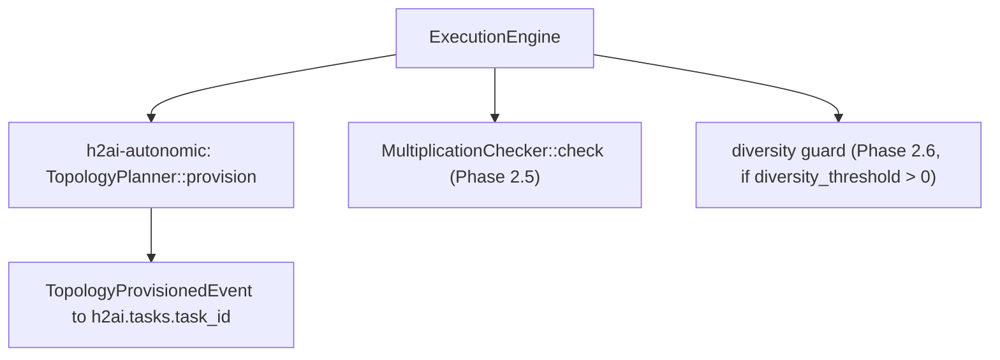

Gate failures write `MultiplicationConditionFailedEvent` and re-enter provisioning (up to `max_autonomic_retries`). On third failure, `TaskFailedEvent` is written and the engine exits.

### 3.3 Agent provisioning and NKey scoping

For each of the N explorers, the provisioner:

1. Calls `AgentProvider::ensure_agent_capacity(descriptor, task_load)` — selects or starts a container matching `descriptor.model`. In Kubernetes this calls `KubernetesProvider`, which creates a `Job/h2ai-agent-{task_id}-{i}` with:
   - Container image chosen from `descriptor.model` (registry-mapped, no hardcoded names in the orchestrator).
   - Volume mounts and security contexts derived from `descriptor.tools`: `Shell` → writable workspace + `SYS_PTRACE`; `CodeExecution` → isolated sandbox volume; `FileSystem` → shared read-only workspace mount; `WebSearch` → egress NetworkPolicy.
2. **NKey minting** — `h2ai-nats` mints a scoped NKey for this `task_id`. The key's `allowed_publish` set is exactly: `h2ai.telemetry.{agent_id}`, `audit.events.{agent_id}`, `h2ai.results.{task_id}`. The key's `allowed_subscribe` set is exactly: `h2ai.tasks.ephemeral.{task_id}`. No other subjects are accessible. The NKey is injected as an environment variable into the container at launch.
3. **TaskPayload publication** — the orchestrator publishes to `h2ai.tasks.ephemeral.{task_id}`:

```rust
pub struct TaskPayload {
    pub task_id:        TaskId,
    pub agent:          AgentDescriptor,   // model + tools
    pub instructions:   String,
    pub context:        ContextPayload,    // Inline(String) | Ref(hash) for offloaded blobs
    pub tau:            TauValue,
    pub max_tokens:     u64,
    pub wave_mode:      WaveMode,          // Normal | Hardened
}
```

When `system_context` exceeds `payload_offload_threshold_bytes` (default 512 KB), it is written to a content-addressed blob store and replaced with `ContextPayload::Ref(hash)`. The agent resolves the hash on receipt. This keeps every NATS message well below the 1 MB JetStream ceiling regardless of corpus size.

### 3.4 Edge agent dispatch loop

The edge agent binary (`h2ai-agent`) runs two concurrent Tokio tasks: `HeartbeatTask` (periodic liveness signal to `h2ai.agent.heartbeat`) and `DispatchLoop` (NATS subscriber on `h2ai.tasks.ephemeral.{task_id}`).

On receiving `TaskPayload`:

1. **ToolRegistry construction** — `ToolRegistry::for_wave(cfg, payload.wave_mode)`. Registers executors according to WaveMode and the `H2AIConfig` sections present. `config_validation::validate_tool_configs` is called at startup so any missing credentials or WASM binaries cause an immediate panic before any task is dispatched.
2. **Tool schema injection** — `registry.all_schemas()` is serialised as a `[TOOLS]` block and prepended to the system context so the LLM knows what tools it may call.
3. **TaoAgent::run** — the local TAO loop (see §4). Runs to completion or iteration cap.
4. **TaskResult publication** — agent publishes to `h2ai.results.{task_id}`:

```rust
pub struct TaskResult {
    pub task_id:          TaskId,
    pub output:           String,
    pub tool_calls:       Vec<ToolCallRecord>,
    pub total_token_cost: u64,
    pub truncated:        bool,
    pub adapter_failed:   bool,
}
```

5. The agent publishes `TaskResult`, then exits. The NKey expires. The Kubernetes Job terminates.

### 3.5 NATS subject namespace

| Subject | Direction | Content |
|---|---|---|
| `h2ai.tasks.{task_id}` | orchestrator → stream | `H2AIEvent` envelopes (phase events, proposals, merge decisions) |
| `h2ai.tasks.ephemeral.{task_id}` | orchestrator → agent | `TaskPayload` per explorer |
| `h2ai.results.{task_id}` | agent → orchestrator | `TaskResult` |
| `h2ai.telemetry.{task_id}` | agent → orchestrator | `AgentTelemetryEvent` (separate `H2AI_TELEMETRY` stream) |
| `h2ai.agent.heartbeat` | agent → orchestrator | liveness ticks |
| `audit.events.{agent_id}` | agent → audit log | structured audit records |

---

## 4. The Edge Agent TAO Loop

### Sequence — TAO agent iteration

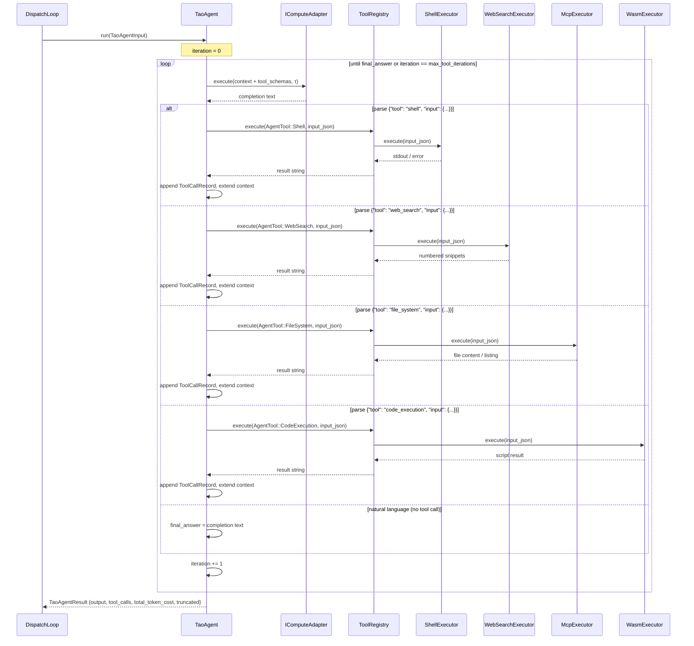

The control plane never runs inference directly. Each Explorer is a stateless edge agent that receives a `TaskPayload` from NATS and runs a local Thought–Action–Observation loop:

```rust
pub struct TaoAgentInput {
    pub instructions:   String,
    pub system_context: String,
    pub tau:            TauValue,
    pub max_tokens:     u64,
}

pub struct TaoAgentResult {
    pub output:           String,
    pub total_token_cost: u64,
    pub tool_calls:       Vec<ToolCallRecord>,
    pub truncated:        bool,
    pub adapter_failed:   bool,
}
```

On each iteration the agent:

1. Builds the running context (instructions + tool observations accumulated so far).
2. Calls `IComputeAdapter::execute()` with the current τ and context.
3. Attempts to extract a tool call from the response via `extract_tool_call()` — a three-strategy pipeline: (a) direct JSON parse, (b) parse after stripping a markdown code fence (` ```json … ``` `), (c) parse of the first balanced `{…}` object found anywhere in the text (handles preamble prose). If extraction succeeds and the tool name is registered, dispatches via `ToolRegistry::execute(AgentTool, input_json)` and records a `ToolCallRecord {tool, input_json, output, iteration}`.
4. If no valid tool call is found, treats the response as the final answer and terminates.
5. Truncates the tool observation to at most `agent_max_observation_chars` (default 8192) bytes before appending to context — oversized shell dumps that would cause `MaxTokensExceeded` on the next iteration are capped with a `…[truncated N → max chars]` suffix. The full untruncated output is preserved in `ToolCallRecord.output` for audit. Stops when the final answer is found or `agent_max_tool_iterations` (default 5) is reached.

### ToolRegistry and WaveMode

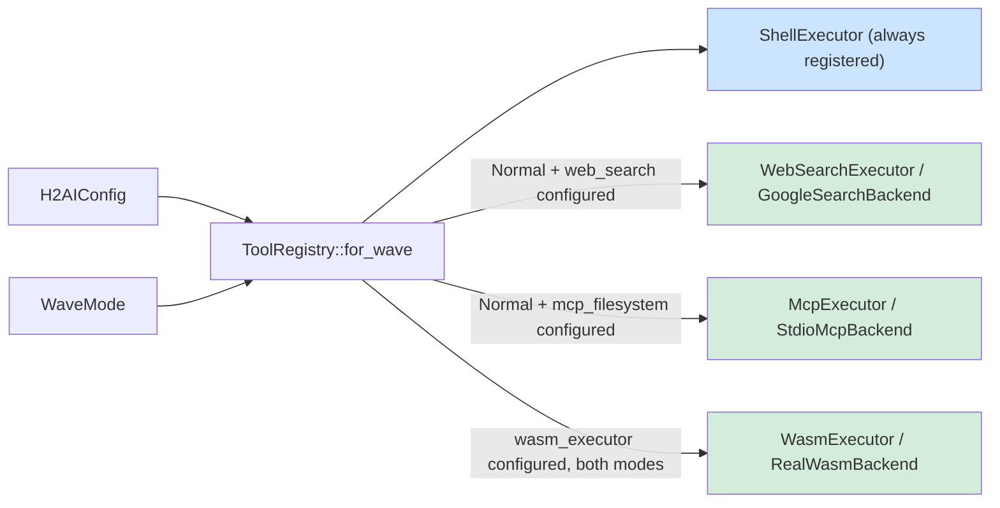

| WaveMode | Shell | WebSearch | FileSystem | CodeExecution |
|---|---|---|---|---|
| `Normal` | yes (`shell_allowlist`) | yes, if configured | yes, if configured | yes, if configured |
| `Hardened` | yes (`shell_hardened_allowlist`) | no | no | yes, if configured |

`Hardened` mode activates automatically on `ConstrainedExploration` and `ModeCollapse` retry waves — restricting agents to local, deterministic tools only during retry so that retrieval nondeterminism and network-side-effects cannot compound an already-failing wave.

### Tool Executors

Each `AgentTool` variant maps to an executor that implements `ToolExecutor`:

```rust
#[async_trait]
pub trait ToolExecutor: Send + Sync {
    fn schema(&self) -> ToolSchema;
    async fn execute(&self, input: &str) -> Result<String, ToolError>;
}
```

Every executor follows the backend injection pattern — a `Box<dyn *Backend>` trait object provides the I/O implementation, making CI and production wiring independent:

#### ShellExecutor (`AgentTool::Shell`)

Input: `{"command": "<cmd>", "args": ["...", ...]}`. No shell interpreter — uses `Command::new(cmd).args(args)` with explicit argument separation. The allowlist is enforced before process spawn. On timeout, sends `SIGKILL` to the entire process group (PGID-scoped kill, PID captured before the timeout block to avoid a race). `ToolError::NotPermitted` is returned for any command absent from the configured allowlist.

#### WebSearchExecutor (`AgentTool::WebSearch`)

Input: `{"query": "<search string>"}`. Backend trait: `WebSearchBackend::search(query, max_results) → String`. Production backend: `GoogleSearchBackend` — calls the Google Custom Search API via `reqwest`, formats results as numbered snippets. `max_results` is capped at 10 (the API hard limit).

#### McpExecutor (`AgentTool::FileSystem`)

Input: `{"op": "read_file"|"list_directory", "path": "<relative path>"}`. Only two operations are permitted (`PERMITTED_OPS`); all others return `ToolError::NotPermitted`. Policy is enforced in the executor, not in the backend. Production backend: `StdioMcpBackend` — spawns a subprocess implementing the Model Context Protocol JSON-RPC 2.0 over stdio, writes a single request line, reads the response, and kills the process group on timeout.

#### WasmExecutor (`AgentTool::CodeExecution`)

Input: `{"language": "javascript", "script": "<code>"}`. Only `language = "javascript"` is permitted. Production backend: `RealWasmBackend` — loads a pre-compiled trusted interpreter WASM binary via `wasmtime`, configures fuel metering (`consume_fuel = true`), and evaluates the script via the `alloc → write → eval → dealloc` memory protocol. No WASI host imports are linked — the sandbox has zero filesystem, network, or OS access. Execution terminates safely when fuel is exhausted.

### Startup Config Validation

`config_validation::validate_tool_configs(&cfg)` is called once at agent startup before the dispatch loop begins. The rule: an absent config section silently omits the executor; a present but broken section (missing env var, missing WASM file) panics immediately.

---

## 5. Compound task execution

### Sequence — compound task DAG execution

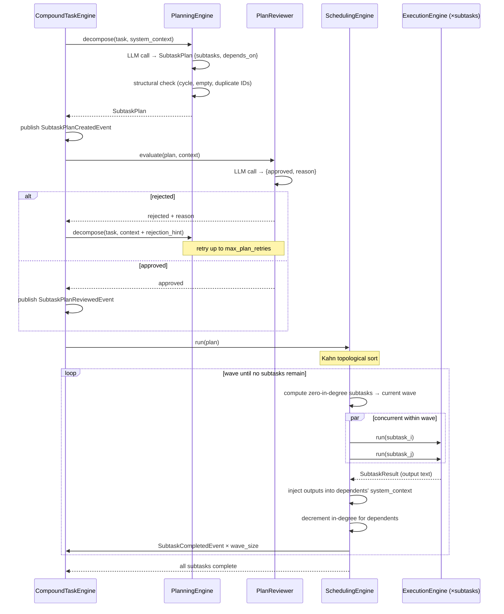

Long or structured tasks can be decomposed into a directed acyclic graph of subtasks by the `CompoundTaskEngine`. Each node in the DAG is a full H2AI task execution (Phase -1 through Phase 5 plus the post-merge epistemic quality stage), and edges express output-dependency.

### Decomposition — PlanningEngine

`PlanningEngine::decompose(task)` calls the LLM adapter with the task description and the constraint corpus as grounding context. The LLM produces a `SubtaskPlan`:

```rust
pub struct SubtaskPlan {
    pub subtasks: Vec<Subtask>,
}

pub struct Subtask {
    pub id:           SubtaskId,
    pub description:  String,
    pub depends_on:   Vec<SubtaskId>,
}
```

Structural validity is checked in Rust before any LLM review: empty plan, duplicate IDs, and cycles all fail immediately. Emits `SubtaskPlanCreatedEvent`.

### Review — PlanReviewer

`PlanReviewer::evaluate(plan, context)` calls a separate LLM pass to assess whether the decomposition is coherent, complete, and consistent with the constraint corpus. Returns `{approved: bool, reason: String}` (same fail-safe JSON-or-reject contract as the Phase 4 auditor). Emits `SubtaskPlanReviewedEvent`. A rejected plan is returned to the `PlanningEngine` with the rejection reason as a hint; the engine may retry decomposition up to `max_plan_retries` times.

### Execution — SchedulingEngine

`SchedulingEngine::run(plan, context)` uses Kahn's algorithm to execute the DAG in topological waves:

1. Compute in-degree for every subtask. All zero-in-degree subtasks form the first wave.
2. Dispatch every subtask in the current wave as a full H2AI task. Each subtask emits `SubtaskStartedEvent`.
3. Wait for all subtasks in the wave. Each completion emits `SubtaskCompletedEvent` and injects the subtask's output into every dependent's `system_context`.
4. Decrement in-degree for all dependents. Zero-in-degree dependents join the next wave.
5. Repeat until no subtasks remain.

Subtasks within a wave run concurrently. Subtasks across waves are strictly sequential — a wave does not begin until the prior wave is fully resolved. Failed subtasks propagate upward: a subtask whose dependency failed is itself failed with a dependency-chain reason rather than run with incomplete context.

---

## 6. Enterprise architecture

### C4 Level 3 — Kubernetes Deployment

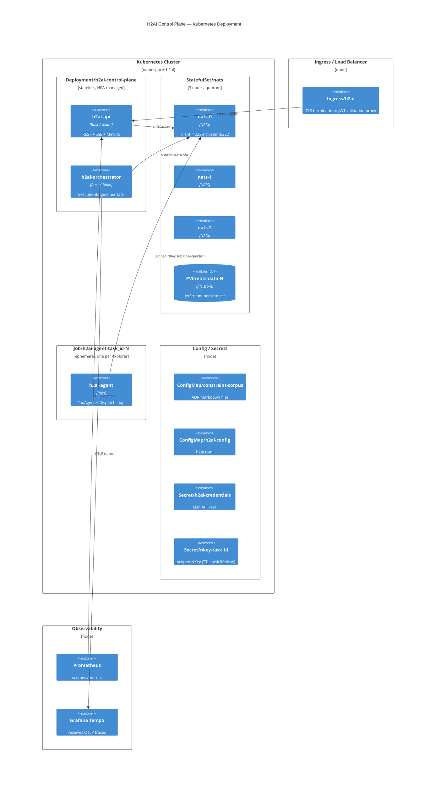

### 6.1 Kubernetes topology

All task state lives in NATS JetStream, not in the control plane Pods. Pod restarts are transparent: the new Pod loads the latest snapshot from `H2AI_SNAPSHOTS` KV and replays events from `sequence > last_sequence`. Horizontal scaling of `Deployment/h2ai-control-plane` is safe because each task's execution engine runs as a Tokio task inside one Pod instance, and JetStream's at-least-once delivery with consumer sequence tracking prevents duplicate processing.

### 6.2 Agent Job lifecycle

Each explorer is a Kubernetes Job, not a long-lived Deployment:

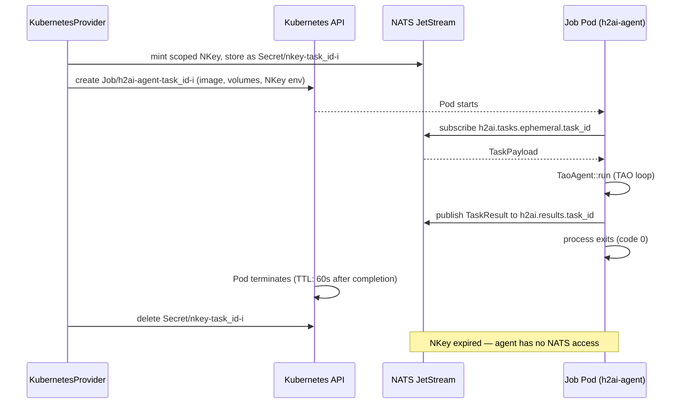

Key Job spec properties:
- `restartPolicy: Never` — a failed agent reports `ProposalFailed` via a separate liveness path; it does not retry silently.
- `activeDeadlineSeconds` = `task_deadline_secs + grace` — the Kubernetes scheduler hard-kills the Job if the NATS timeout is not enforced.
- `resources.limits` — CPU and memory set from `AgentDescriptor.tools`: `CodeExecution` gets a stricter memory cap than a pure-LLM agent.
- `securityContext.readOnlyRootFilesystem: true` — except for the explicitly mounted workspace volume when `Shell` or `FileSystem` tools are present.

### 6.3 Security model

The security boundary is the NATS NKey system. Every agent Job has exactly one credential, minted at dispatch and deleted at Job completion. There are no long-lived shared credentials.

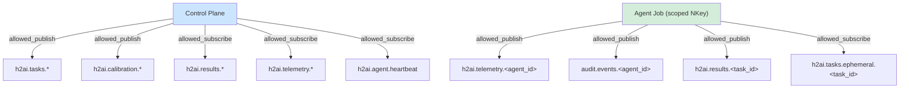

An agent Job cannot read another task's payload, cannot write to the main event bus, and cannot inject events into the task stream it is responding to. These restrictions are enforced at the NATS server level, not by application code.

### 6.4 NATS cluster configuration

The three-node NATS cluster provides JetStream quorum and survives a single node failure:

```
jetstream {
  store_dir:        /data/jetstream
  max_memory_store: 8GB
  max_file_store:   500GB
}
cluster {
  name:   h2ai-cluster
  listen: 0.0.0.0:6222
  routes: [
    nats-route://nats-0.nats.h2ai.svc:6222
    nats-route://nats-1.nats.h2ai.svc:6222
    nats-route://nats-2.nats.h2ai.svc:6222
  ]
}
```

All streams are created with `replicas: 3`. `H2AI_ESTIMATOR` and `H2AI_SNAPSHOTS` use `replicas: 1` (non-critical, rebuilt on recalibration).

### 6.5 Observability

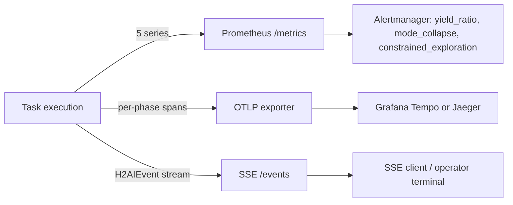

Three observability layers run concurrently and independently of the control path:

**Prometheus** — five series from `/metrics`. Scraped by the `ServiceMonitor`. Primary alerting signals: `yield_ratio < 0.5`, `mode_collapse` rate climbing, `constrained_exploration` rate climbing.

**OpenTelemetry** — `h2ai-telemetry` emits structured spans for every phase transition. Root span: `task.{task_id}`. Child spans per phase: `phase.bootstrap`, `phase.provisioning`, `phase.generation`, `phase.verification`, `phase.audit`, `phase.merge`, `phase.synthesis`. Adapter latency is a sub-span of `phase.generation`. Exported via OTLP.

**SSE event stream** — `GET /:tenant_id/tasks/:task_id/events` exposes the raw `H2AIEvent` sequence as Server-Sent Events. Every event carries its NATS sequence number as the SSE `id` field. Clients reconnect with `Last-Event-ID: <sequence>` to resume without replaying the full log.

### 6.6 Multi-region considerations

H2AI's state is entirely in NATS JetStream. For multi-region deployments:

- Run a NATS cluster per region with JetStream mirroring to a hub cluster.
- Keep control plane Pods co-located with their NATS cluster — cross-region writes increase α measurably.
- Run calibration per region against the local adapter pool. Different network topology means different `β₀`; a single global calibration would produce an inaccurate N_max per region.
- The constraint corpus is read-only and can be replicated as a `ConfigMap` across regions without coordination.

---

## 7. Component map

### C4 Level 3 — Components (orchestrator internals)

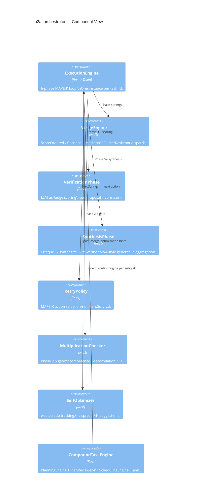

The workspace contains 16 crates, organised by responsibility. Every crate compiles standalone; cross-crate communication is event-typed.

```
h2ai-types          Pure value types + math primitives (USL, EigenCalibration, EnsembleCalibration,
                    MergeStrategy, MultiplicationConditionFailure, EpistemicYieldEvent, FailureMode,
                    H2AIEvent enum, AgentTool, WaveMode, TaskPayload, TaskResult, ToolCallRecord,
                    SubtaskId, SubtaskPlan, SubtaskResult, PlanStatus).
                    TenantId (identity scope), TaskReasoningCheckpoint + ReasoningCheckpointPhase +
                    TaskMetaState + ArchetypeResult (reasoning memory Phase 1 types).
                    Epistemic quality types: CheckVerdict, CheckVerdictKind (per-check
                    PRESENT/MISSING verdicts on VerificationScoredEvent); ProvenanceRecordedEvent
                    (document_confidence, provision_count, open_gap_count).

h2ai-config         Layered config loading (reference.toml + env overrides). Single source of truth.
                    Includes WebSearchConfig, McpFilesystemConfig, WasmExecutorConfig.
                    ReasoningMemoryConfig (induction scheduling, retrieval thresholds). StateConfig
                    extended with per-tenant bucket prefixes.
                    EpistemicQualityConfig: enabled, coherence_check_enabled, coherence_min_severity,
                    recovery_enabled, recovery_max_passes, recovery_tau, zero_valid_proposals_policy
                    ("fail" | "deliver_unverified"), output_mode ("passthrough" | "clean" | "audit").

h2ai-adapters       Adapter trait + per-provider implementations (Anthropic, OpenAI, Gemini, Ollama,
                    LlamaCpp, CloudGeneric, A2a, Mock, SequencedMockAdapter for TAO loop testing).
                    Tokio-native via async-trait.

h2ai-context        Dark Knowledge Compiler: compile(manifest, corpus, include_rubric) assembles an
                    immutable system_context from constraint corpus + task manifest + knowledge nodes.
                    ContextChunk (Ebbinghaus decay weight per memory tier), context compaction
                    (head+tail window, keyword re-injection), Reciprocal Rank Fusion (rrf_fuse) +
                    BM25 via Tantivy (bm25_search), ONNX embedding wrapper (EmbeddingModel trait,
                    FastEmbedModel, cosine_similarity).
                    ContextPayload offload/resolve for blobs exceeding the NATS message ceiling.

h2ai-constraints    Constraint corpus parser (markdown ADR format), predicate types
                    (VocabularyPresence, AllOf, AnyOf, ...), severity weights.
                    ConstraintSource trait — abstraction over corpus access.
                    FsConstraintStore / FsConstraintIndex — type aliases for RuntimeConstraintStore /
                    RuntimeConstraintIndex; filesystem-backed constraint loading at startup.
                    WikiCache — in-memory hot-path index (context_map, metas, revision).
                    ConstraintMeta / ConstraintPayload / PredicateKind for wiki delivery.
                    ambiguity — AmbiguityEvidence (6 variants + Display), AmbiguityScorecard,
                    PatchMode, AmbiguityDetectionConfig; pure functions scan_constraint(),
                    score_evidence(), most_divergent_pair(), jaccard(); seed_scorecards() — static seeding of per-constraint ambiguity scorecards at corpus load time.

h2ai-knowledge      Hierarchical BM25+/PPR knowledge retrieval layer (pure crate, no I/O deps beyond
                    serde_yaml at startup). KnowledgeSource trait (all_items, wiki_nodes, global_node).
                    KnowledgeProvider trait (query, global_summary, is_ready, kind).
                    Bm25WikiProvider — BM25+ scoring (Lv & Zhai δ=1.0, K1=1.5, B=0.75) over a
                    Global→Topic→Leaf tree; dual RAPTOR modes: TreeTraversal (topic cluster routing
                    first) + CollapsedTree (all levels simultaneously). ConstraintGraph — adjacency
                    from constraint `related:` fields; Personalized PageRank (power iteration, α=0.15)
                    for multi-hop expansion. YamlDirSource — loads constraint YAML + optional wiki/
                    subdirectory. PassthroughProvider — delegates to ConstraintResolver (zero-change
                    fallback when [knowledge] not configured). ScoringConfig — 8 tunable parameters,
                    all serde-defaulted.
                    skill_provider — SkillProvider: queries the per-task cross-task skill graph
                    (Global→Topic→Leaf) built from resolved task knowledge nodes. CompositeProvider:
                    wraps SkillProvider + BM25 wiki provider; tracks violation_map, records domain
                    violations via record_violations, penalises repeatedly violated domains with
                    penalised_score. scope_by_domains: filters any KnowledgeProvider's results to
                    nodes matching a set of domain tags (with unfiltered fallback when the filtered
                    set would be empty). Imported by h2ai-config and h2ai-api.

h2ai-autonomic      Calibration harness (CalibrationHarness), epistemic diagnostics
                    (compute_n_eff_cosine, classify_failure_mode, ConstraintRepairPlan),
                    drift detection (DriftMonitor: DDM + BOCPD), spec repair (SpecRepairAdvisor),
                    coherence probe, complexity probe, MAPE-K planner (TopologyPlanner) and merger
                    (MergeEngine), retry policy (RetryPolicy), audit channel, retry accumulator.

h2ai-memory         InMemoryCache + NatsKvStore implementations of the MemoryProvider trait.

h2ai-nats           NATS JetStream client, stream/KV creation, event publish/subscribe.
                    NKey minting and scoped credential management per task_id.

h2ai-orchestrator   ExecutionEngine — the 6-phase MAPE-K loop. MergeEngine. Verification phase.
                    Synthesis phase. RetryPolicy, MultiplicationChecker, SelfOptimizer.
                    CompoundTaskEngine — PlanningEngine + PlanReviewer + SchedulingEngine (Kahn waves).
                    decomposition — Phase 0 epistemic decomposition: DECOMPOSITION_SYSTEM_PROMPT,
                    parse_decomposition_response, prune_by_orthogonality, compute_role_diversity,
                    corpus_fallback (domain-tag → slot templates), run_decomposition_agent.
                    skill_extractor — skill_from_output pure fn (builds SkillNodes from EngineOutput
                    by inspecting retry events, coherence state, constraint tombstones, and
                    correlated ensemble warnings); skill_from_retry_events (topology-retry path).
                    SessionJournal — persists cross-task SkillNodes to the SkillStore backend at task
                    resolution; reads back nodes for warm-start knowledge injection.
                    Epistemic quality stage (post-merge, run_epistemic_stage in engine.rs,
                    wired from task_pipeline.rs):
                      gap_checkers/selection_pruning.rs — SelectionPruningExtractor: pure fn
                        extract_gaps_from_pruned; MissingProvision gaps from pruned proposals.
                      gap_checkers/task_context_seeder.rs — TaskContextSeeder: pure fn
                        seed_uncertainty_gaps; UncertainDomain gaps from manifest.context keywords
                        ["unsettled", "best-effort basis", "rapidly evolving"]; never resolvable.
                      gap_checkers/grounding.rs — GroundingChecker: UngroundedContent gaps for
                        entities absent from effective_spec; two calls in run_epistemic_stage:
                        pre-feedback-loop on merged output (static gaps), post-feedback-loop on
                        patched output when recovery closed gaps; HeuristicGroundingJudge (no LLM)
                        when grounding.enabled=false, LlmGroundingJudge when enabled.
                      gap_checkers/coherence.rs — CoherenceChecker: one LLM call per feedback-loop
                        pass on current output; detects inter-provision interaction risks;
                        InterProvisionConflict gaps; disabled by default (coherence_check_enabled=false).
                      gap_resolvers/micro_explorer.rs — MicroExplorerResolver: one LLM call per gap;
                        handles MissingProvision and IncompleteProvision only; full constraint matrix
                        injected; implements GapResolver trait; disabled by default (recovery_enabled=false).
                      gap_registry.rs — GapRegistry: collects gaps from all checkers;
                        dispatch_batches() builds Kahn's DAG of independent gap batches for
                        concurrent MicroExplorerResolver calls.
                      provenance.rs — ProvenanceMap: worst-wins document confidence;
                        ProvisionConfidence order Verified < AutoCorrected < ReviewRecommended
                        < RequiresReview < Unverified; DocumentConfidence: Unverified worst →
                        Unverified; RequiresReview → RequiresReview; ReviewRecommended →
                        ReviewRecommended; else → High; per-provision ProvisionProvenance
                        with confidence, verdicts, gap_ids.
                      output_renderer.rs — OutputRenderer: render_output(text, map, mode)
                        → annotated String; passthrough=unchanged, clean=header, audit=header
                        + per-provision annotations + footer. ProvenanceRecordedEvent published
                        from task_pipeline.rs (not output_renderer) after run_epistemic_stage.

h2ai-planner        LLM-driven task decomposition (PlanningEngine::decompose) and plan structural
                    review (PlanReviewer::evaluate + detect_cycle). Used by CompoundTaskEngine for
                    DAG task execution. Topology selection is in h2ai-autonomic (TopologyPlanner).

h2ai-provisioner    Static / NATS / Kubernetes agent providers.
                    KubernetesProvider — dynamic Job creation, scoped NKey lifecycle, volume mapping.

h2ai-state          CRDT-friendly TaskState, ProposalSet (LUB by generation, then score),
                    snapshot/replay machinery.
                    SkillStore trait — abstraction over cross-task skill node persistence
                    (put_skill_nodes, get_skill_nodes); implemented by InMemoryStateBackend and
                    NatsSkillStore (NATS KV-backed).
                    NatsClient reasoning memory methods: ensure_tenant_reasoning_buckets,
                    put/get_reasoning_checkpoint, put/get/list_task_meta_states.

h2ai-telemetry      tracing→OTLP plumbing, structured spans for every phase.
                    RedactionMiddleware — scrubs secrets from AgentTelemetryEvent before audit.

h2ai-tools          Tool execution ecosystem for edge agents.
                    ShellExecutor  — JSON-contract, no shell interpreter, PGID process group kill.
                    WebSearchExecutor — Google Custom Search API via GoogleSearchBackend.
                    McpExecutor    — read-only filesystem via StdioMcpBackend (MCP JSON-RPC 2.0).
                    WasmExecutor   — sandboxed JS via RealWasmBackend (wasmtime, fuel metering, no WASI).
                    ToolRegistry::for_wave(cfg, WaveMode) — WaveMode-gated executor set (live backends).
                    ToolRegistry::for_wave_with_mocks(cfg, WaveMode) — identical gating, mock backends.

h2ai-agent          Edge agent binary.
                    TaoAgent — local TAO loop: LLM call → tool dispatch → observation → repeat.
                    DispatchLoop — NATS task subscriber; builds ToolRegistry::for_wave per task.
                    config_validation::validate_tool_configs — fail-fast startup check.
                    HeartbeatTask — liveness signalling to h2ai.agent.heartbeat.

h2ai-api            Axum HTTP server: POST /:tenant_id/tasks, SSE event stream, calibration endpoints,
                    health/ready/metrics, HITL approval gate (POST /:tenant_id/tasks/:id/approve, GET /approval).
                    NatsWikiConstraintSource — NATS-backed ConstraintSource (KV + Object Store).
                    AppState::constraint_source() — returns the active source based on config.
                    AppState::load_wiki_cache() — loads WikiCache from NATS KV at startup.
```

### Concrete request flow

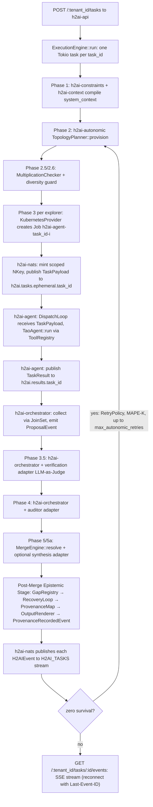

---

## 8. Event sourcing model

Every state transition is an `H2AIEvent` published to `h2ai.tasks.{task_id}`. Crash recovery is replay from the last snapshot offset; SSE clients reconnect with `Last-Event-ID`. Full event enumeration is in [`reference.md`](reference.md#event-vocabulary). Event payload schemas are stable: every field added since the initial release uses `#[serde(default)]` so old serialised events continue to deserialise.

`ProvenanceRecordedEvent` is published after the post-merge epistemic quality stage completes. Fields: `task_id`, `document_confidence` (string label: `High` | `ReviewRecommended` | `RequiresReview` | `Unverified`), `provision_count` (total provisions annotated), `open_gap_count` (gaps unresolved after recovery), `timestamp` (UTC). Downstream systems that need structured provenance data without inline annotations should consume this event rather than parsing the rendered output text. When `epistemic_quality.enabled = false`, this event is not emitted.

The authoritative log is NATS JetStream stream `H2AI_TASKS` (file-backed, replicated). Calibration data lives in the `H2AI_CALIBRATION` KV store. Snapshots are written to `H2AI_SNAPSHOTS` periodically — recovery loads the latest snapshot and replays only events with `sequence > last_sequence`.

Snapshot writes are triggered by `h2ai-state` every `snapshot_interval_events` events (default 50). Without snapshots, recovery time is linear in the task's event count. The snapshot stores the full `TaskState` — active proposals, pruned proposals, current phase, retry count — so replay only needs to process events since the last write.

---

## 9. Phase-output checkpointing

Crash recovery from the event log alone is insufficient for long-running tasks: replaying every event from scratch re-invokes LLM calls and re-charges token budgets. Phase-output checkpointing gives the engine a richer recovery surface by persisting the *output* of each completed phase, not just the event sequence.

### 9.1 TaskCheckpoint structure

After each phase completes, `ExecutionEngine` writes a `TaskCheckpoint` to the `H2AI_TASK_CHECKPOINTS` NATS KV bucket. The checkpoint carries:

- `task_id` and `phase` name — the identity key used for KV lookup.
- `node_id` and `lease_seq` — used during multi-node recovery to detect stale owners.
- `proposals`, `auditor_survivors`, `resolved_output` — phase-specific output, sufficient to resume from the *next* phase without re-invoking the adapter.
- `manifest_json` — the full task manifest at checkpoint time.
- `object_store_ref` — SHA-256 content address of the payload in the NATS Object Store, set when the checkpoint payload exceeds 800 KB.
- `created_at_ms`, `updated_at_ms` — wall-clock timestamps for orphan detection.

### 9.2 Storage format

Payloads are serialised to JSON and then zstd-compressed at level 3 before writing to the KV bucket. Repetitive LLM-generated text compresses to 10–25% of its original size, keeping checkpoint payloads well below the JetStream 1 MB message ceiling. On read, `get_task_checkpoint` decompresses before deserialisation. When the *uncompressed* payload would exceed 800 KB, the raw bytes are written to the NATS Object Store and only the content-addressed reference is stored in the KV entry.

**Delta encoding (2026-05-14):** Checkpoints use JSON Patch (RFC 6902) delta encoding. `CheckpointKind::Base` stores a full snapshot at seq=0 and every `base_interval` (default 10) sequences; `CheckpointKind::Delta` stores only the RFC 6902 diff against the prior base. Storage is O(N) rather than O(N²). An LRU cache (200 entries, 60s TTL) avoids repeat NATS lookups during reconstruction. All NATS bucket names are now config-driven via `StateConfig` in `[state]`; `NatsClient::connect_with_cfg(url, StateConfig)` replaces the old `connect(url)` call.

### 9.3 Startup recovery

On process start, `recover_in_flight_tasks()` (called by `h2ai-api` before the HTTP server accepts connections) scans `H2AI_TASK_CHECKPOINTS` for entries younger than `checkpoint_recovery_window_ms`. For each in-flight checkpoint it finds:

1. Reads the full `TaskCheckpoint` from the KV bucket (or from the Object Store via `object_store_ref`).
2. **Own-node tasks** (`checkpoint.node_id == local_node_id()`): spawned immediately — the owning node restarted, so there is no split-brain risk.
3. **Foreign-node orphans** (`node_id` belongs to a different node): applies a random jitter delay of 0–1500 ms, then performs a CAS claim via `put_task_checkpoint(..., Some(checkpoint.lease_seq))`. If another pod wins the CAS first (revision changed), the claim returns an error and this node skips the task. This prevents thundering-herd duplicate recovery during rolling restarts.
4. Spawns `ExecutionEngine::run_from_checkpoint(checkpoint)` as a new Tokio task for every successfully claimed checkpoint.

### 9.4 run_from_checkpoint phase routing

`run_from_checkpoint` inspects `checkpoint.phase`:

- **`"Merging"` phase**: `resolved_output` is already present; the engine short-circuits all LLM calls and jumps directly to post-merge event publishing and `SelfOptimizer` hints. No adapters are invoked.
- **`WaveCompleted(k)` phase** (reasoning checkpoint): `starting_wave_for_checkpoint(WaveCompleted(k)) = k + 1` — the pure function returns the next wave index. The checkpoint payload includes `domain_synthesis_cache` and `retry_context` serialised alongside the phase; on recovery both are deserialized and restored before starting wave k+1, preserving all gap research accumulated across prior waves and preventing repeated researcher queries.
- **Earlier phases** (`"ParallelGeneration"`, `"AuditorGate"`, etc.): the engine calls `run_offline` with the recovered proposals and survivors as seed state, resuming from the phase *following* the checkpoint.

This means a crash in the merge phase costs zero extra LLM tokens on recovery; a crash earlier in the pipeline costs only the phases that had not yet checkpointed.

### 9.5 HITL Approval Gate

After the `Merging` phase completes (Phase 5 or 5a), the engine evaluates approval conditions. The gate is active only when `hitl.enabled = true` (default). When enabled, the engine checks:

- If `oracle_spec.is_none()` — oracle tasks bypass the gate entirely (they always emit `MergeResolved` immediately).
- **AND** either `q_confidence < hitl.confidence_threshold` (default 0.50) or `manifest.require_approval = true`.

When the gate fires, the task is *parked*: instead of emitting `MergeResolved` and completing, the engine:

1. **Checkpoint**: writes the current `TaskCheckpoint` to `H2AI_TASK_CHECKPOINTS` (see §9.1), capturing `resolved_output` and all phase state.
2. **Record approval request**: writes an `ApprovalRecord` to the `H2AI_APPROVALS` NATS KV bucket, keyed by `task_id`, with:
   - `task_id`, `resolved_output`, `q_confidence`, `triggered_by` (`ManifestFlag` | `LowConfidence`)
   - `created_at_ms`, `timeout_at_ms` (now + `hitl.timeout_ms`, default 30 minutes)
3. **Publish event**: emits `PendingApproval` SSE event (with `risk_level`, `triggered_by`, `timeout_at_ms`) to connected clients.
4. **Phase update**: sets local `TaskStore` phase to `AwaitingApproval`.
5. **Thread exit**: the ExecutionEngine's Tokio task terminates. The review window holds zero server resources.

#### Approval endpoint and concurrent-write safety

`POST /{tenant_id}/tasks/{id}/approve` accepts `{approved, reviewer_note, operator_id}`. The handler:

1. Loads the `ApprovalRecord` from `H2AI_APPROVALS` **along with its KV revision**.
2. Returns `410 Gone` if `timeout_at_ms` has passed.
3. Atomically deletes the record via `delete_approval_record_if_revision(task_id, revision)` — a NATS KV CAS write. The first caller wins; subsequent callers (or concurrent nodes racing on the same task) receive a revision-mismatch error and a `409 Conflict`. This prevents double-approval in multi-node clusters.
4. Publishes `ApprovalResolved` to JetStream.
5. If `approved = true`: loads the checkpoint, calls `ExecutionEngine::finalize()`, publishes `MergeResolved` and closes normally.
6. If `approved = false`: calls `mark_failed()`, publishes `TaskFailed`, then calls `delete_task_checkpoint()` (which also cleans up any Object Store blob — see §9.2).

The `ApprovalDecision` (`operator_id`, `reviewer_note`, `decided_at_ms`) is appended to `TaskAttributionEvent` for permanent compliance audit trail.

### 9.6 Reasoning checkpoint (Phase 1)

See §10 for the `TaskReasoningCheckpoint` system, which runs in parallel with `TaskCheckpoint`. The two checkpoints are independent: `TaskCheckpoint` is the recovery source for execution-phase replay; `TaskReasoningCheckpoint` captures reasoning artifacts for the Persistent Reasoning Memory system. Both are written fire-and-forget and neither blocks task completion.

### 9.7 OOM circuit breaker

`OomGuardConfig` (`oom_guard.enabled`, `oom_guard.rss_abort_mb`, `oom_guard.check_interval_waves`) controls wave-boundary RSS polling. At each wave boundary, `read_rss_mb()` parses `/proc/self/status VmRSS`; `oom_signal(rss_mb, cfg)` returns `Some(OomSignal)` when RSS ≥ `rss_abort_mb` (default 4096 MB). On signal: the wave loop exits via the existing `BudgetExhausted` exit path → `graft_first=true` synthesis wave → clean checkpoint-and-exit. This detects the "slow leak" pattern — gradual RSS accumulation across waves — before the OS SIGKILL threshold is reached, allowing orderly task termination rather than an unclean kill. Single-wave LLM forward-pass spikes that would trigger an OS SIGKILL are not observable from user-space before they occur and remain OS-handled. Both `read_rss_mb` and `oom_signal` are pure functions in `crates/h2ai-autonomic/src/repair.rs`; `OomReadError` carries the I/O and parse error variants.

### 9.8 Spec repair non-fatal

Previously, `RepairOutcome::Failed` from `spec_repair.rs` caused `engine.rs` to immediately return `Err(MaxRetriesExhausted)`. This prevented the terminal synthesis wave from running when spec repair itself failed — the operator saw a hard failure with no best-partial output. The fix: `RepairOutcome::Failed` now logs a warning and falls through to the exhaustion handler (mark_failed + synthesis wave), matching the behaviour for other non-repair exhaustion paths. The guard block (lines 1371-1406, "cap restarts at 1") was updated identically. The terminal synthesis wave now always runs regardless of whether spec repair succeeded, so the operator receives a best-partial proposal even when the repair pass itself could not produce a rewrite.

#### Cross-node TaskStore consistency

`TaskStore` is in-memory per node. When the approval endpoint is served by a different node than the one that parked the task, the handling node publishes `ApprovalResolved` and `TaskFailed`/`TaskCompleted` to JetStream. Every node's event consumer loop (already subscribed to `h2ai.tasks.>` for SSE fan-out) handles these events and calls `mark_resolved` or `mark_failed` on its local store. JetStream at-least-once delivery bounds the inconsistency window to cluster delivery latency (typically < 100 ms).

#### Background reaper

A background task running every **60 seconds** in each control plane Pod scans `H2AI_APPROVALS` for expired records:

```rust
for (approval_record, revision) in scanned_records {
    if now_ms > approval_record.timeout_at_ms {
        // CAS delete: only one node in the cluster succeeds.
        // Others receive a revision-mismatch error and skip silently.
        match delete_approval_record_if_revision(task_id, revision) {
            Ok(()) => auto_reject(task_id, operator_id = "system:timeout"),
            Err(_) => {} // another node claimed this expiry — skip
        }
    }
}
```

`auto_reject` follows the same rejection path as a human denial (publishes `TaskFailed`, calls `delete_task_checkpoint`). The `operator_id = "system:timeout"` field in `TaskAttributionEvent` distinguishes automatic expiry from explicit operator rejection.

#### ResumeSignal — JetStream HITL (live 2026-05-19)

The KV-polling design above has been replaced by a typed, JetStream-delivered signal protocol. The `H2AI_APPROVALS` KV bucket is retained for backward compatibility but no longer written to; `approval_reaper.rs` has been removed.

**Signal delivery topology**

- A single `H2AI_SIGNALS` JetStream stream covers subject pattern `h2ai.signals.>`.
- Subject per task: `h2ai.signals.{tenant_bucket_safe}.{task_id}`.
- A durable push consumer `SIGNAL-{task_id_no_dashes}` is created before the phase loop starts and deleted at task resolution or failure.

**Engine behaviour at the HITL gate (Merging phase)**

1. Engine emits `PendingApproval` event.
2. Engine parks in a `tokio::select!` branch waiting for either a JetStream signal delivery or timeout expiry.
3. **On signal received** (`Approve`): publishes `ApprovalResolved` (before `MergeResolved`), resets `hitl_timeouts_fired` to 0, proceeds to `MergeResolved` and task close.
4. **On timeout**: auto-promotes with `operator_id = "system:timeout"`, increments `hitl_timeouts_fired` in `TaskReasoningCheckpoint`, proceeds to `MergeResolved`.

**Signal types** (adjacently-tagged `SignalPayload`):

| Kind | Purpose |
|---|---|
| `Approve` | Resolves the HITL gate. Fields: `approved: bool`, `operator_id: String`, `reviewer_note: Option<String>`. |
| `WaveContinue` | Injects grounding text or mandate override at a `WaveCompleted` boundary. Only processed when `signal_wave_window_ms > 0`. |
| `Unknown` | Catch-all for forward-compatible deserialization; ignored by the engine without error. |

**Adaptive timeout decay**

Consecutive non-responses shrink the review window exponentially:

```
effective_ms = timeout_ms × decay ^ hitl_timeouts_fired
effective_ms = max(effective_ms, timeout_floor_ms)
```

`hitl_timeouts_fired` is persisted in `TaskReasoningCheckpoint` and survives crash-recovery. Config fields: `timeout_decay` (default 0.5), `timeout_floor_ms` (default 300 000 ms).

**Endpoints**

- `POST /{tenant_id}/tasks/{task_id}/signal` — 202 accepted immediately; payload published to JetStream.
- `POST /{tenant_id}/tasks/{task_id}/approve` — **deprecated**, returns 301 redirect to `/signal` (one-release shim).
- `GET /{tenant_id}/tasks/{task_id}/approval` — **removed**, returns 410 Gone.

---

## 10. Persistent Reasoning Memory — Phase 1

### Overview

H2AI previously discarded all per-task reasoning artifacts on resolution. Phase 1 introduces a four-layer **Persistent Reasoning Memory** system. Only Layers 1a and 1b are live; Layers 2–4 are planned.

| Layer | Status | Responsibility |
|---|---|---|
| 1a. TaskReasoningCheckpoint | ✅ Phase 1 | Progressive checkpoint at each engine phase gate |
| 1b. TaskMetaState | ✅ Phase 1 | Immutable projection at resolution; feeds induction |
| 2. InductionScheduler + Semantic Distillation | ✅ Layer 2a complete (2026-06-19); Layer 2b data layer complete (2026-06-22) | Layer 2a: `NatsInductionScheduler` — tag-sharded `H2AI_MEMORY` KV (`{tenant_id}.tag.{tag}` → `TagPatternBucket`); two-round SAD retrieval; `InductionScheduler` trait: `load_priming_hints`, `run_retroactive`, `record_success`. Layer 2b (2026-06-22): `ArchetypePrior`, `TensionPattern`, `DecompositionTemplate` types + `DistillationResult`; `distill_archetype_priors`, `distill_tension_patterns`, `distill_decomposition_templates` pure functions; `run_distillation_cycle` / `load_semantic_memory` on trait (default no-ops); NATS persistence to `{tenant_id}.semantic` in `H2AI_MEMORY`; not yet called by engine |
| 3. Thinking loop integration | 🟡 Partial (RetryHintPattern priming complete 2026-06-19; archetype prior boost/tension seeding wiring pending) | `format_retry_hint_priors` prepends top-5 `RetryHintPattern` priors to archetype selection system prompt; corpus-seeded `n_archetypes`; `MapeKController` ZeroSurvival trigger spawns `run_retroactive`; `record_success` at Path A/B. Pending: `select_archetypes()` boost/penalty (+0.15/−0.20) from `ArchetypePrior`; iteration-0 tension seeding from `TensionPattern` — both require `run_distillation_cycle` engine wiring (now unblocked by Layer 2b) |
| 4. Hybrid retrieval | Planned | Tag-gate + embedding rerank at scale |

### Tenant model

`TenantId` (a newtype wrapping `String`) is the scope boundary for all reasoning memory storage. Each tenant's data lives in its own NATS KV buckets — isolation is enforced by construction, not by query filter. `TaskManifest.tenant_id` defaults to `TenantId::default_tenant()` for backward compatibility with single-tenant deployments.

### TaskReasoningCheckpoint vs. TaskCheckpoint

Two distinct checkpoint types coexist:

| Type | Location | Purpose | Storage |
|---|---|---|---|
| `TaskCheckpoint` | `H2AI_TASK_CHECKPOINTS` | Execution-phase recovery (proposals, auditor survivors, resolved output) | zstd + delta encoding |
| `TaskReasoningCheckpoint` | `H2AI_CHECKPOINT_{tenant_id}` | Reasoning artifact capture (thinking loop, archetype selection, retry context) + warm-start recovery | zstd, 7-day TTL |

`TaskReasoningCheckpoint.phase` uses `ReasoningCheckpointPhase` (Created → ThinkingDone → WaveCompleted(k) → MergeDone → Resolved), enabling future phase-level skip logic on crash recovery.

### TaskMetaState

At `MapeKDecision::Return` (task resolution), `TaskReasoningCheckpoint::into_meta_state()` projects the checkpoint into a `TaskMetaState` — wave-level detail stripped, reasoning artifacts kept:

- `shared_understanding`, `tensions`, `archetype_results` — from the thinking loop
- `retry_count`, `retry_context_that_resolved`, `tried_topologies`, `tau_values_that_converged` — retry history
- `system_context_with_rubric_hash`, `constraint_corpus_fingerprint` — rubric fingerprints for retrieval

`TaskMetaState` is written to `H2AI_META_{tenant_id}` (no TTL). `NatsInductionScheduler` (implemented 2026-06-19) queries cross-task patterns via two-round SAD retrieval from the tag-sharded `H2AI_MEMORY` KV bucket — see §10 Layer 2 and research-state.md §2 for the full induction loop description.

### Configuration

```toml
[reasoning_memory]
enabled                     = false   # all checkpoint writes skipped when false
induction_batch_size        = 10
induction_max_interval_secs = 86400
induction_max_tasks_per_run = 50
tag_gate_threshold          = 0.2
max_archetype_boost         = 0.15
max_archetype_penalty       = 0.20

[state]
reasoning_checkpoint_bucket_prefix = "H2AI_CHECKPOINT"
task_meta_state_bucket_prefix      = "H2AI_META"
```

### Fire-and-forget writes

All reasoning checkpoint writes are fire-and-forget: a write failure logs a warning at `h2ai.engine` level but never blocks task resolution. The control path is never affected by NATS unavailability for reasoning memory.

---

## 11. A2A Explorer Adapter

### 11.1 Diversity axis

H2AI's existing diversity signals measure differences *within* the LLM world: Hamming CG captures constraint-profile independence, cosine N_eff captures semantic independence. Both are bounded by the homogeneity of the LLM model family. Cross-framework diversity — running a planning agent built with LangChain, a reasoning agent built with AutoGen, and an H2AI ensemble as explorer peers — is a new N_eff axis that existing adapters cannot provide.

The `A2aExplorerAdapter` (`crates/h2ai-adapters/src/a2a.rs`) implements the `IComputeAdapter` trait and makes any [Agent2Agent (A2A)](https://a2aprotocol.ai) compatible remote agent a first-class ensemble participant. No changes to the orchestrator, planner, or calibration harness are required — the adapter is just another element in the `explorer_adapters` vector.

### 11.2 Agent Card discovery and caching

On first use (and after `agent_card_cache_ttl_s` seconds), the adapter fetches the remote agent's capability manifest:

```
GET https://{endpoint}/.well-known/agent.json
```

The parsed `AgentCard` is held in a `tokio::sync::RwLock<Option<CachedCard>>`. On a cache miss, the adapter upgrades to a write lock, performs a **double-checked lock** (re-checks whether another concurrent task already populated the cache), fetches if still empty, then releases back to a read lock. This prevents stampede fetches when multiple explorers share the same A2A endpoint.

Cache invalidation: any `failed` or `rejected` poll response resets the cached entry to `None`, forcing a fresh fetch before the next attempt.

### 11.3 Task delegation and polling

The adapter delegates via JSON-RPC 2.0 over HTTPS:

1. `POST /` with `method: "message/send"` — submits the task prompt, receives a remote `task_id`.
2. `POST /` with `method: "tasks/get"` — polls for completion. Each poll request has a 15-second per-request timeout, strictly separate from the overall task deadline.
3. The entire polling loop is wrapped in `tokio::time::timeout(timeout_minutes × 60s)` — the adapter returns `AdapterError::Timeout` if the deadline is reached regardless of task state.

**Exponential backoff with ±20% jitter** prevents synchronised polls from concurrent adapters creating a thundering herd against external rate-limited gateways. Initial interval: `poll_interval_ms`; each poll multiplies by 1.5, capped at `max_poll_interval_ms`.

Terminal state mapping:

| A2A state | AdapterError |
|---|---|
| `completed` | — (proceed to extraction) |
| `failed` | `Remote(reason)` |
| `canceled` | `Cancelled` |
| `rejected` | `Unavailable` (excluded from ensemble) |
| `input_required` | `Timeout` (H2AI cannot provide interactive input) |
| Agent Card unreachable | `Unavailable` |
| Empty extraction | `EmptyOutput` |

### 11.4 Artifact extraction pipeline

External agents produce inconsistent artifact formatting. Raw text from a markdown-fenced output would corrupt the Condorcet synthesis if passed directly into the merge phase. The adapter runs a 4-stage pipeline, stopping at the first successful extraction:

1. **Direct JSON**: if the expected format is JSON and the raw text parses, use it as-is.
2. **Fence stripping**: extract text from ` ``` ` blocks. For JSON output, all blocks are collected and iterated **last-to-first** — LLMs typically emit the final, complete answer in the last block, with preamble or partial plans in earlier ones.
3. **Preamble strip**: remove leading lines matching common preamble patterns (`"Here is the solution:"`, `"Based on the requirements:"`, etc.).
4. **Raw fallback**: return trimmed raw text and let the verifier and auditor assess it.

`token_cost: 0` is reported — A2A agents do not expose token cost.

### 11.5 Authentication

`auth_scheme` is `"bearer"`, `"api_key"`, or `"none"`. The `auth_token_env` env var is resolved **at adapter construction time** (fail-fast at server startup, not at first request). This follows the same startup-panic contract as `validate_tool_configs` for other tool executors.

### 11.6 Configuration

```toml
[[adapter_profiles]]
name = "specialist-planner"
[adapter_profiles.kind.A2a]
endpoint             = "https://my-specialist-agent.example.com"
auth_scheme          = "bearer"
auth_token_env       = "A2A_TOKEN"
timeout_minutes      = 10
poll_interval_ms     = 2000
max_poll_interval_ms = 30000
agent_card_cache_ttl_s = 3600
```

`AdapterFactory::build(&AdapterKind::A2a { .. })` produces an `Arc<dyn IComputeAdapter>`. The factory arm for `A2a` follows the same pattern as all built-in providers.

---

## 12. Multi-tenancy

H2AI supports multiple isolated tenants within a single control plane deployment. Tenant identity is a first-class routing primitive, carried as a URL path segment.

### 12.1 HTTP routing

All task-level routes include `:tenant_id` as a path segment. The path value is authoritative — any `tenant_id` field in the request body is overridden by it.

```
POST   /:tenant_id/tasks
GET    /:tenant_id/tasks/:task_id/events
GET    /:tenant_id/tasks/:task_id
POST   /:tenant_id/tasks/:task_id/merge
POST   /:tenant_id/tasks/:task_id/signal          ← live HITL gate (Approve / WaveContinue)
POST   /:tenant_id/tasks/:task_id/approve         ← deprecated; returns 301 → /signal
GET    /:tenant_id/tasks/:task_id/approval        ← removed; returns 410 Gone
POST   /:tenant_id/tasks/:task_id/clarify
GET    /:tenant_id/tasks/:task_id/recover
```

Global endpoints (`/calibrate`, `/health`, `/ready`, `/metrics`) are not tenant-scoped. Single-tenant deployments use `default` as the tenant ID.

### 12.2 Tenant isolation model

Each tenant has isolated runtime state created lazily on first request:

**`TenantState`** — created by `TenantRegistry::get_or_create` on first use, holds six `Arc<RwLock<…>>` fields:

| Field | Type | Scope |
|---|---|---|
| `calibration` | `Option<CalibrationCompletedEvent>` | seeded from default tenant on first task |
| `tao_multiplier_estimator` | `TaoMultiplierEstimator` | learns per-tenant TAO timing |
| `tau_spread_estimator` | `TauSpreadEstimator` | per-tenant τ adaptation |
| `bandit_state` | `BanditState` | per-tenant Thompson bandit for adapter selection |
| `rho_ema` | `RhoEmaState` | per-tenant coherence EMA |

**NATS KV isolation** — all per-tenant KV keys are prefixed with `{tenant_id.bucket_safe()}/` (hyphens replaced with underscores):

```
default/tao        default/bandit
acme_corp/tao      acme_corp/bandit
acme_corp/{task_id}   ← approval records
```

**Task ownership** — `TaskStore::get_for_tenant(task_id, tenant_id)` returns `None` for cross-tenant access. An HTTP handler querying another tenant's task ID receives `404 Not Found` regardless of whether the task exists.

**Approval records** — `ApprovalRecord.tenant_id` is written at creation time from the URL path tenant. The approval reaper uses the embedded tenant ID when publishing events — it never reconstructs the tenant from context.

### 12.3 Calibration: global-by-design

Calibration measures the adapter pool, not individual tenant workloads. A single global `CalibrationCompletedEvent` lives in `H2AI_CALIBRATION` KV (no tenant prefix). On first task submission for a non-default tenant, `AppState::seed_calibration_from_default_if_needed` copies the default tenant's calibration into the new tenant's `TenantState`. This gives new tenants an immediate N_max budget without requiring a dedicated calibration run.

### Calibration Drift Detection (closed 2026-05-26)

LLM API providers silently update model weights and RLHF profiles. Without detection, `EnsembleCalibration` stays stale indefinitely. The three-layer `DriftMonitor` (`crates/h2ai-autonomic/src/drift.rs`) detects distribution shifts online:

**Layer 1 — DDM fast layer** (`DdmDetector`, O(1)): sliding window of `consensus_agreement_rate` (fraction of tasks where all verification calls agree). Fires `CalibrationDriftWarning` when `|mean_recent − mean_reference| > drift_ddm_k × std_reference` (default window=20, k=2.5).

**Layer 2 — BOCPD** (`BocpdDetector`, O(t)): Bayesian Online Changepoint Detection (Adams & MacKay 2007) with Normal-Inverse-Gamma conjugate prior updated per observation. Posterior probability P(run_length ≤ 4) > `drift_bocpd_changepoint_threshold` (default 0.90) fires `CalibrationChangepoint`. A guard prevents false positives until ≥5 observations accumulate.

**Layer 3 — ORCA conformal margin**: when a changepoint is active and `drift_staleness_ttl_secs` has not expired, `DriftMonitor::active_conformal_margin()` returns `drift_conformal_margin`. `run_offline` in `engine.rs` subtracts this value from `verification_config.threshold` at task start, widening the gate to preserve coverage during drift. The margin is removed once TTL expires or recalibration occurs.

**Data flow**: `tasks.rs` reads `active_conformal_margin()` → passed as `EngineInput.conformal_margin` → engine applies margin → engine computes `consensus_agreement_rate_from_events(output.verification_events)` → `tasks.rs` calls `drift_monitor.observe(rate)`. On `CalibrationDriftWarning` or `CalibrationChangepoint`, a `tracing::warn!` event is emitted.

`DriftMonitor` is stored in `AppState` as `Arc<tokio::sync::Mutex<DriftMonitor>>`, initialised from config via `DriftMonitor::from_config(&cfg)`. Config fields: `drift_ddm_window`, `drift_ddm_k`, `drift_bocpd_hazard_rate`, `drift_bocpd_changepoint_threshold`, `auto_recalibrate_on_drift = false` (operator opt-in), `drift_staleness_ttl_secs`, `drift_conformal_margin`.

### 12.4 Adding a tenant

No administrative step is required. Any previously unused tenant ID in the URL path creates a tenant on first request:

```bash
curl -X POST http://localhost:8080/v1/acme/tasks \
  -H "Content-Type: application/json" \
  -d '{"description": "...", "pareto_weights": {...}, "explorers": {...}}'
```

---

## 13. What H2AI does *not* do better

The control plane is honest about its boundaries. The system does *not* compete with:

- **Single-shot inference latency.** A direct call to one model endpoint will always be cheaper and faster. H2AI buys reliability, not speed.
- **Generic agentic frameworks.** Frameworks that compose tools and memory solve a different problem; H2AI orchestrates an adversarial committee with calibrated physics. The two are complementary, not competing.
- **Specialised serving stacks** (vLLM, TGI). Those optimise per-request throughput. H2AI delegates to them via adapters.
- **Tasks where ground truth is hidden from verification.** The auditor and verifier need to observe the constraint surface. Tasks with hidden oracles get no benefit from the adversarial committee — at best, the system reduces to its single best adapter.
- **Workloads with a single dominant adapter.** When `n_eff_cosine_prior → 1.0`, the multiplication condition fails and the system correctly refuses to run. Buying more capacity from one model family does not produce a committee.

The reliability gain is real only when the calibrated adapter pool is genuinely diverse — both in constraint behaviour (Hamming CG) and in semantic embedding (cosine N_eff). When the pool is monoculture, no amount of orchestration recovers the missing independence.
