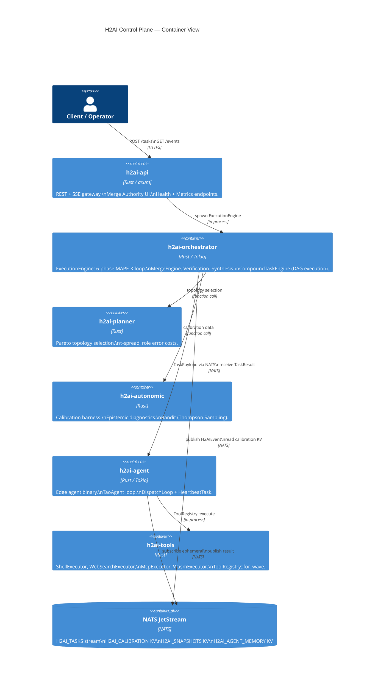
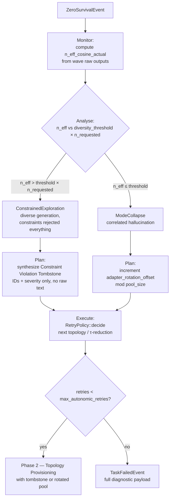
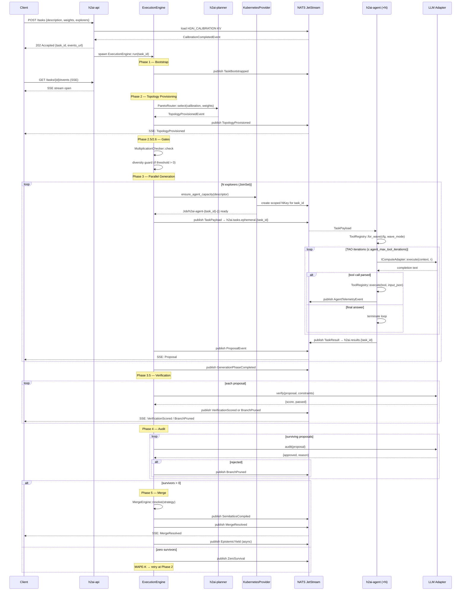
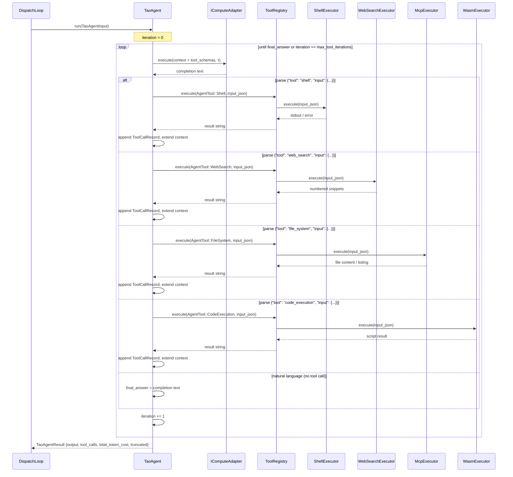
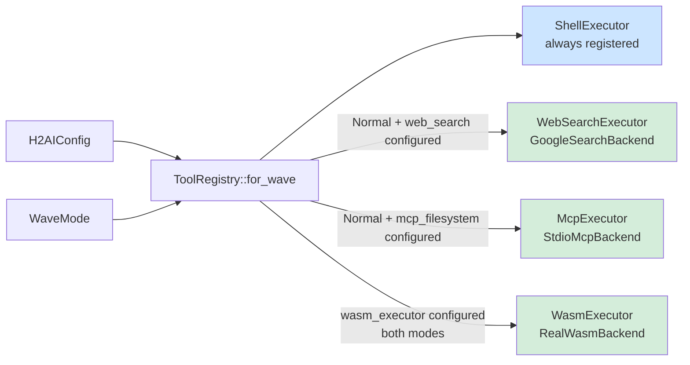
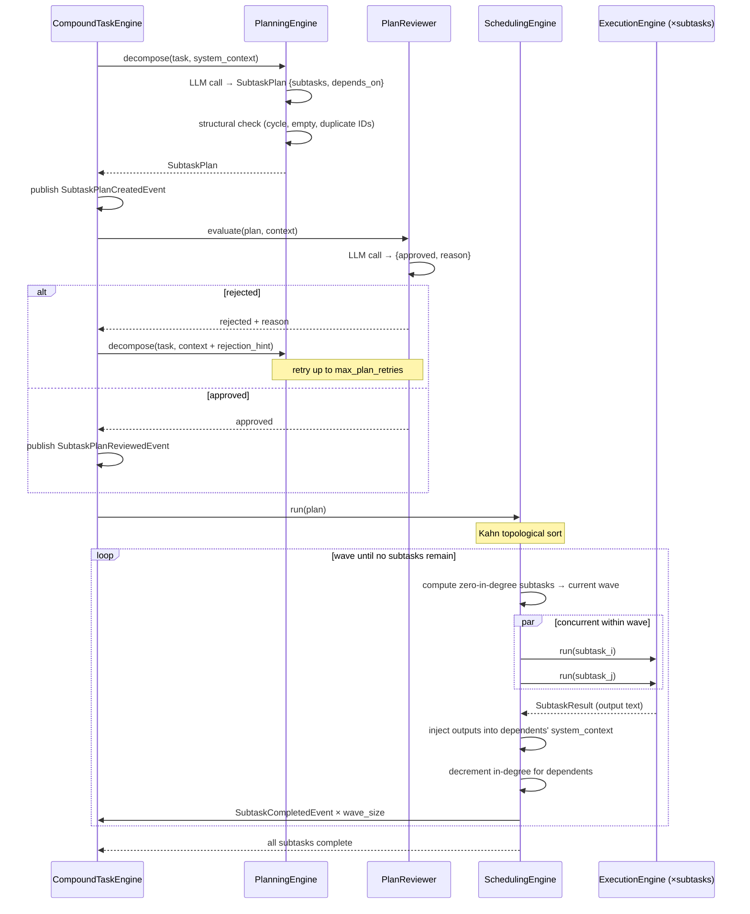
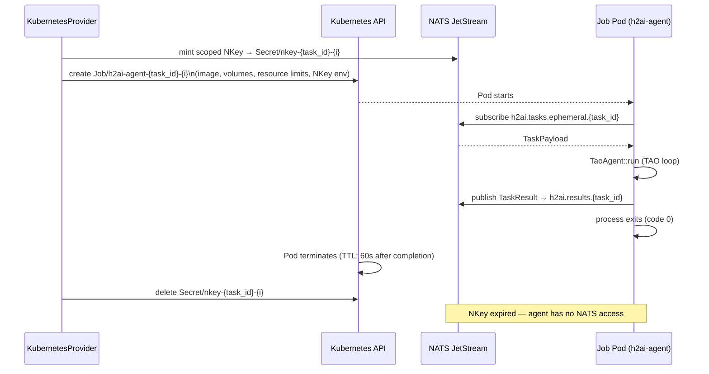
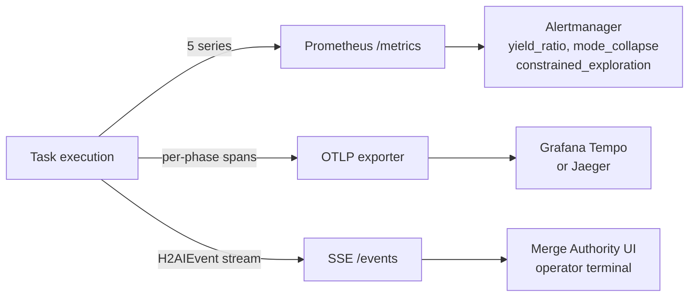
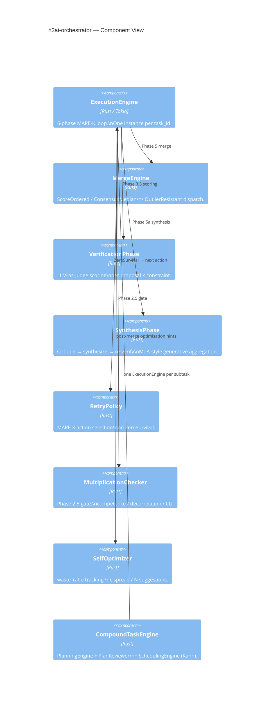

# H2AI Architecture

H2AI Control Plane is a Rust runtime that coordinates pools of LLM adapters as an *adversarial committee*: independent generators, an independent verifier, and an independent auditor produce a resolved output that is more reliable than any single adapter. The runtime treats this committee as a physical system — an ensemble whose throughput, diversity, and quality are computable, calibrated, and bounded.

This document is the system-level map: phases, components, wire protocol, and enterprise deployment. The math is in [`math.md`](math.md). The HTTP/event/config surface is in [`reference.md`](reference.md). Operational details are in [`operations.md`](operations.md). Open questions are in [`research-state.md`](research-state.md).

---

## 1. What the system is

### C4 Level 1 — System Context


The control plane orchestrates a single task as a 6-phase pipeline. Each phase is event-sourced to NATS JetStream — every state transition is replayable, and every retry decision is auditable. Two independent diversity signals govern execution:

- **Hamming Common Ground (CG)**: pairwise constraint-satisfaction agreement across the adapter pool, measured during calibration. Drives `β_eff = β₀ × (1 − CG_mean)` and the USL ceiling `N_max = round(√((1 − α) / β_eff))`.
- **Cosine N_eff**: participation-ratio diversity from the eigendecomposition of the embedding cosine kernel. A pool-level `n_eff_cosine_prior` is the Bayesian prior at calibration; a task-level `n_eff_cosine_actual` is computed at every MAPE-K decision point.

The two signals are not redundant. Hamming CG measures *behavioural* agreement on the constraint corpus. Cosine N_eff measures *semantic* independence at generation time. Both flow through the planner, the multiplication-condition gate, and the MAPE-K retry loop.

---

## 2. Execution phases

### C4 Level 2 — Containers



A task moves through six phases. Each phase emits one or more events, and every retry restarts at Phase 2.

### Phase 1 — Bootstrap

The orchestrator compiles the task description and the active constraint corpus into an immutable `system_context`. The `J_eff` gate enforces a minimum context-fill fraction; tasks below the threshold are rejected with `ContextUnderflow` rather than run with insufficient grounding. Emits `TaskBootstrapped`.

### Phase 2 — Topology Provisioning

The planner selects topology, explorer roles, and merge strategy from the calibration result and the task's Pareto weights:

```mermaid
flowchart TD
    A[CalibrationCompletedEvent\n+ ParetoWeights] --> B{topology_kind}
    B -->|diversity dominant\nN ≤ N_max| C[Ensemble\nO N² edges, peer committee]
    B -->|containment dominant\nor N > N_max| D[HierarchicalTree\nO N edges, k sub-groups]
    B -->|roles[] present| E[TeamSwarmHybrid\nRole-differentiated + Review Gates]
    C --> F[MergeStrategy::from_role_costs]
    D --> F
    E --> F
    F -->|max ci ≤ bft_threshold| G[ScoreOrdered]
    F -->|bft_threshold < max ci ≤ krum_threshold| H[ConsensusMedian]
    F -->|max ci > krum_threshold\nkrum_f > 0| I[OutlierResistant{f}]
    G --> J[TopologyProvisionedEvent]
    H --> J
    I --> J
```

Outputs: `topology_kind`, N explorer configs with τ values, one auditor config, `merge_strategy`, `n_max`, `interface_n_max`, `beta_eff` snapshots, and a `constraint_tombstone` field (populated only when retrying after `ConstrainedExploration`).

### Phase 2.5 — Multiplication Condition Gate

Three conditions must hold before the system commits compute. All three are evaluated against the calibrated `EnsembleCalibration`:

1. `p_mean > min_competence` — adapters are above chance.
2. `rho_mean < max_correlation` — error correlation is below the saturation point.
3. `cg_mean ≥ θ_coord` — the Common Ground floor.

Failure produces `MultiplicationConditionFailed` with one of `InsufficientCompetence`, `InsufficientDecorrelation`, or `CommonGroundBelowFloor`. The retry policy then selects the next topology or fails the task.

### Phase 2.6 — Pool Diversity Guard

A separate gate, evaluated only when `cfg.diversity_threshold > 0`. Compares the calibration's `n_eff_cosine_prior` against `1.0 + diversity_threshold`. When the pool's effective independent-adapter count is below the floor, the engine emits a synthetic `ZeroSurvival` with `failure_mode = ModeCollapse` and routes through `RetryPolicy`. This is the fourth multiplication condition: `InsufficientPoolDiversity`. It exists because Hamming CG can mark constraint-profile agreement as "high coordination" while the pool remains semantically near-degenerate (correlated hallucination risk).

### Phase 3 — Parallel Generation (TAO)

N explorers run their TAO (Thought–Action–Observation) loops in parallel through the Tokio executor. Each explorer independently:

- Receives the immutable `system_context`.
- Iterates up to `cfg.agent_max_tool_iterations` times, emitting `TaoIteration` per turn.
- On each turn: calls the LLM adapter, parses the output for a structured `{"tool": ..., "input": {...}}` JSON tool call, executes the tool locally via its `ToolRegistry`, appends the observation to the running message history, and continues until the output contains no tool call or the iteration cap is reached.
- Produces a `Proposal` event with raw output and token cost — or a `ProposalFailed` event on timeout, OOM, or adapter error.

`GenerationPhaseCompleted` summarises success/failure counts. Adapter rotation offset (set by `ModeCollapse` retries) is applied at adapter selection time so a retry sees a rotated subset of the pool.

### Phase 3.5 — Verification

A dedicated verification adapter (LLM-as-Judge) scores every proposal against the constraint corpus. Each scoring emits `VerificationScored {score, reason, passed}`. Proposals that fail verification become `BranchPruned` with their `violated_constraints` recorded.

### Phase 4 — Auditor Gate

A separate auditor adapter (typically a stronger reasoning model than the verifier) is the final non-negotiable gate. Its output is required to be JSON `{approved, reason}`. Non-JSON output is treated as rejection (fail-safe). Rejected proposals become additional `BranchPruned` events.

### Phase 5 — Merge

Surviving proposals enter `MergeEngine::resolve` with the strategy chosen at Phase 2:

- **ScoreOrdered**: pick the highest verification score.
- **ConsensusMedian**: pick the proposal with highest mean Jaccard similarity to the rest. *Not Byzantine-resistant — vulnerable to coordinated proposals at f ≥ n/2.*
- **OutlierResistant{f}**: smallest sum of distances to its `n − f − 2` nearest neighbours in Jaccard-distance space (Krum-style). Requires `n ≥ 2f + 3`.
- **MultiOutlierResistant{f, m}**: iteratively select m survivors via OutlierResistant, then take the highest verification score.

Emits `SemilatticeCompiled` and either `MergeResolved` (success) or `ZeroSurvival` (zero-survival → MAPE-K retry).

### Phase 5a — Synthesis (optional)

When `synthesis_enabled` and at least `synthesis_min_proposals` have survived audit, the synthesis adapter performs a critique→synthesis→re-verify pass over the candidate set. The re-verified score is compared against `max(individual_scores)`; the difference is recorded as `synthesis_gain` on `HarnessAttribution`. If synthesis improves the maximum, its output replaces the merge result.

### MAPE-K loop on zero survival



Both interventions are bookkept as Prometheus counters with a `failure_mode` label (`mode_collapse` and `constrained_exploration`).

### Post-merge async event

After `MergeResolved`, the engine spawns an async task that publishes `EpistemicYield {n_eff_cosine_actual, n_eff_prior, yield_ratio, adapters}`. `yield_ratio = n_eff_actual / N_requested` — the "financial yield": you paid for N adapters, you received `n_eff_actual` independent perspectives. This event never blocks task close.

---

## 3. Task execution lifecycle

### Sequence — full task from submission to resolution



### 3.1 Submission and bootstrapping

```
Client ──POST /tasks──► h2ai-api
         { description, pareto_weights, explorers, constraints, context }
```

1. **Validation** — weights must sum to 1.0; manifest structure must be valid. `503` if no current calibration in `H2AI_CALIBRATION` KV.
2. **task_id allocation** — a `TaskId` (UUID) is minted. Response is `202 Accepted` with `{"task_id": ..., "events_url": "/tasks/{id}/events"}`.
3. **ExecutionEngine::run** — spawned as a Tokio task. Loads `CalibrationCompletedEvent` from `H2AI_CALIBRATION` KV.
4. **Dark Knowledge compilation** — `h2ai-context` assembles the constraint corpus, task description, and prior session memory (from `H2AI_AGENT_MEMORY` KV) into a single immutable `system_context` string.
5. **TaskBootstrapped** published to `h2ai.tasks.{task_id}` on `H2AI_TASKS` stream.

### 3.2 Provisioning and gates

```
ExecutionEngine
  ──► h2ai-planner (ParetoRouter::select)
        reads: CalibrationCompletedEvent, pareto_weights, task.explorers
        writes: TopologyProvisionedEvent → h2ai.tasks.{task_id}
  ──► MultiplicationChecker::check (Phase 2.5)
  ──► diversity guard (Phase 2.6, if diversity_threshold > 0)
```

Gate failures write `MultiplicationConditionFailedEvent` and re-enter provisioning (up to `max_autonomic_retries`). On third failure, `TaskFailedEvent` is written and the engine exits.

### 3.3 Agent provisioning and NKey scoping

For each of the N explorers, the provisioner:

1. Calls `AgentProvider::ensure_agent_capacity(descriptor, task_load)` — selects or starts a container matching `descriptor.model`. In Kubernetes this calls `KubernetesProvider`, which creates a `Job/h2ai-agent-{task_id}-{i}` with:
   - Container image chosen from `descriptor.model` (registry-mapped, no hardcoded names in the orchestrator).
   - Volume mounts and security contexts derived from `descriptor.tools`: `Shell` → writable workspace + `SYS_PTRACE`; `CodeExecution` → isolated sandbox volume; `FileSystem` → shared read-only workspace mount; `WebSearch` → egress NetworkPolicy.
2. **NKey minting** — `h2ai-nats` mints a scoped NKey for this `task_id`. The key's `allowed_publish` set is exactly: `h2ai.telemetry.{agent_id}`, `audit.events.{agent_id}`, `h2ai.results.{task_id}`. The key's `allowed_subscribe` set is exactly: `h2ai.tasks.ephemeral.{task_id}`. No other subjects are accessible. The NKey is injected as an environment variable into the container at launch.
3. **TaskPayload publication** — the orchestrator publishes to `h2ai.tasks.ephemeral.{task_id}`:

```rust
pub struct TaskPayload {
    pub task_id:        TaskId,
    pub agent:          AgentDescriptor,   // model + tools
    pub instructions:   String,
    pub context:        ContextPayload,    // Inline(String) | Ref(hash) for offloaded blobs
    pub tau:            TauValue,
    pub max_tokens:     u64,
    pub wave_mode:      WaveMode,          // Normal | Hardened
}
```

When `system_context` exceeds `payload_offload_threshold_bytes` (default 512 KB), it is written to a content-addressed blob store and replaced with `ContextPayload::Ref(hash)`. The agent resolves the hash on receipt. This keeps every NATS message well below the 1 MB JetStream ceiling regardless of corpus size.

### 3.4 Edge agent dispatch loop

The edge agent binary (`h2ai-agent`) runs two concurrent Tokio tasks: `HeartbeatTask` (periodic liveness signal to `h2ai.agent.heartbeat`) and `DispatchLoop` (NATS subscriber on `h2ai.tasks.ephemeral.{task_id}`).

On receiving `TaskPayload`:

1. **ToolRegistry construction** — `ToolRegistry::for_wave(cfg, payload.wave_mode)`. Registers executors according to WaveMode and the `H2AIConfig` sections present. `config_validation::validate_tool_configs` is called at startup so any missing credentials or WASM binaries cause an immediate panic before any task is dispatched.
2. **Tool schema injection** — `registry.all_schemas()` is serialised as a `[TOOLS]` block and prepended to the system context so the LLM knows what tools it may call.
3. **TaoAgent::run** — the local TAO loop (see §4). Runs to completion or iteration cap.
4. **TaskResult publication** — agent publishes to `h2ai.results.{task_id}`:

```rust
pub struct TaskResult {
    pub task_id:          TaskId,
    pub output:           String,
    pub tool_calls:       Vec<ToolCallRecord>,
    pub total_token_cost: u64,
    pub truncated:        bool,
    pub adapter_failed:   bool,
}
```

5. The agent publishes `TaskResult`, then exits. The NKey expires. The Kubernetes Job terminates.

### 3.5 NATS subject namespace

| Subject | Direction | Content |
|---|---|---|
| `h2ai.tasks.{task_id}` | orchestrator → stream | `H2AIEvent` envelopes (phase events, proposals, merge decisions) |
| `h2ai.tasks.ephemeral.{task_id}` | orchestrator → agent | `TaskPayload` per explorer |
| `h2ai.results.{task_id}` | agent → orchestrator | `TaskResult` |
| `h2ai.telemetry.{task_id}` | agent → orchestrator | `AgentTelemetryEvent` (separate `H2AI_TELEMETRY` stream) |
| `h2ai.agent.heartbeat` | agent → orchestrator | liveness ticks |
| `audit.events.{agent_id}` | agent → audit log | structured audit records |

---

## 4. The Edge Agent TAO Loop

### Sequence — TAO agent iteration



The control plane never runs inference directly. Each Explorer is a stateless edge agent that receives a `TaskPayload` from NATS and runs a local Thought–Action–Observation loop:

```rust
pub struct TaoAgentInput {
    pub instructions:   String,
    pub system_context: String,
    pub tau:            TauValue,
    pub max_tokens:     u64,
}

pub struct TaoAgentResult {
    pub output:           String,
    pub total_token_cost: u64,
    pub tool_calls:       Vec<ToolCallRecord>,
    pub truncated:        bool,
    pub adapter_failed:   bool,
}
```

On each iteration the agent:

1. Builds the running context (instructions + tool observations accumulated so far).
2. Calls `IComputeAdapter::execute()` with the current τ and context.
3. Attempts to parse the response as `{"tool": "<name>", "input": {...}}`. If parsing succeeds, dispatches the tool call via `ToolRegistry::execute(AgentTool, input_json)` and records a `ToolCallRecord {tool, input_json, output, iteration}`.
4. If parsing fails (the model produced natural language, not a tool call), treats the response as the final answer and terminates.
5. Appends the observation to context and repeats. Stops when the final answer is found or `agent_max_tool_iterations` (default 5) is reached.

### ToolRegistry and WaveMode



| WaveMode | Shell | WebSearch | FileSystem | CodeExecution |
|---|---|---|---|---|
| `Normal` | ✅ `shell_allowlist` | ✅ if configured | ✅ if configured | ✅ if configured |
| `Hardened` | ✅ `shell_hardened_allowlist` | — | — | ✅ if configured |

`Hardened` mode activates automatically on `ConstrainedExploration` and `ModeCollapse` retry waves — restricting agents to local, deterministic tools only during retry so that retrieval nondeterminism and network-side-effects cannot compound an already-failing wave.

### Tool Executors

Each `AgentTool` variant maps to an executor that implements `ToolExecutor`:

```rust
#[async_trait]
pub trait ToolExecutor: Send + Sync {
    fn schema(&self) -> ToolSchema;
    async fn execute(&self, input: &str) -> Result<String, ToolError>;
}
```

Every executor follows the backend injection pattern — a `Box<dyn *Backend>` trait object provides the I/O implementation, making CI and production wiring independent:

#### ShellExecutor (`AgentTool::Shell`)

Input: `{"command": "<cmd>", "args": ["...", ...]}`. No shell interpreter — uses `Command::new(cmd).args(args)` with explicit argument separation. The allowlist is enforced before process spawn. On timeout, sends `SIGKILL` to the entire process group (PGID-scoped kill, PID captured before the timeout block to avoid a race). `ToolError::NotPermitted` is returned for any command absent from the configured allowlist.

#### WebSearchExecutor (`AgentTool::WebSearch`)

Input: `{"query": "<search string>"}`. Backend trait: `WebSearchBackend::search(query, max_results) → String`. Production backend: `GoogleSearchBackend` — calls the Google Custom Search API via `reqwest`, formats results as numbered snippets. `max_results` is capped at 10 (the API hard limit).

#### McpExecutor (`AgentTool::FileSystem`)

Input: `{"op": "read_file"|"list_directory", "path": "<relative path>"}`. Only two operations are permitted (`PERMITTED_OPS`); all others return `ToolError::NotPermitted`. Policy is enforced in the executor, not in the backend. Production backend: `StdioMcpBackend` — spawns a subprocess implementing the Model Context Protocol JSON-RPC 2.0 over stdio, writes a single request line, reads the response, and kills the process group on timeout.

#### WasmExecutor (`AgentTool::CodeExecution`)

Input: `{"language": "javascript", "script": "<code>"}`. Only `language = "javascript"` is permitted. Production backend: `RealWasmBackend` — loads a pre-compiled trusted interpreter WASM binary via `wasmtime`, configures fuel metering (`consume_fuel = true`), and evaluates the script via the `alloc → write → eval → dealloc` memory protocol. No WASI host imports are linked — the sandbox has zero filesystem, network, or OS access. Execution terminates safely when fuel is exhausted.

### Startup Config Validation

`config_validation::validate_tool_configs(&cfg)` is called once at agent startup before the dispatch loop begins. The rule: an absent config section silently omits the executor; a present but broken section (missing env var, missing WASM file) panics immediately.

---

## 5. Compound task execution

### Sequence — compound task DAG execution



Long or structured tasks can be decomposed into a directed acyclic graph of subtasks by the `CompoundTaskEngine`. Each node in the DAG is a full H2AI wave (all 6 phases), and edges express output-dependency.

### Decomposition — PlanningEngine

`PlanningEngine::decompose(task)` calls the LLM adapter with the task description and the constraint corpus as grounding context. The LLM produces a `SubtaskPlan`:

```rust
pub struct SubtaskPlan {
    pub subtasks: Vec<Subtask>,
}

pub struct Subtask {
    pub id:           SubtaskId,
    pub description:  String,
    pub depends_on:   Vec<SubtaskId>,
}
```

Structural validity is checked in Rust before any LLM review: empty plan, duplicate IDs, and cycles all fail immediately. Emits `SubtaskPlanCreatedEvent`.

### Review — PlanReviewer

`PlanReviewer::evaluate(plan, context)` calls a separate LLM pass to assess whether the decomposition is coherent, complete, and consistent with the constraint corpus. Returns `{approved: bool, reason: String}` (same fail-safe JSON-or-reject contract as the Phase 4 auditor). Emits `SubtaskPlanReviewedEvent`. A rejected plan is returned to the `PlanningEngine` with the rejection reason as a hint; the engine may retry decomposition up to `max_plan_retries` times.

### Execution — SchedulingEngine

`SchedulingEngine::run(plan, context)` uses Kahn's algorithm to execute the DAG in topological waves:

1. Compute in-degree for every subtask. All zero-in-degree subtasks form the first wave.
2. Dispatch every subtask in the current wave as a full H2AI task. Each subtask emits `SubtaskStartedEvent`.
3. Wait for all subtasks in the wave. Each completion emits `SubtaskCompletedEvent` and injects the subtask's output into every dependent's `system_context`.
4. Decrement in-degree for all dependents. Zero-in-degree dependents join the next wave.
5. Repeat until no subtasks remain.

Subtasks within a wave run concurrently. Subtasks across waves are strictly sequential — a wave does not begin until the prior wave is fully resolved. Failed subtasks propagate upward: a subtask whose dependency failed is itself failed with a dependency-chain reason rather than run with incomplete context.

---

## 6. Enterprise architecture

### C4 Level 3 — Kubernetes Deployment


### 6.1 Kubernetes topology

All task state lives in NATS JetStream, not in the control plane Pods. Pod restarts are transparent: the new Pod loads the latest snapshot from `H2AI_SNAPSHOTS` KV and replays events from `sequence > last_sequence`. Horizontal scaling of `Deployment/h2ai-control-plane` is safe because each task's execution engine runs as a Tokio task inside one Pod instance, and JetStream's at-least-once delivery with consumer sequence tracking prevents duplicate processing.

### 6.2 Agent Job lifecycle

Each explorer is a Kubernetes Job, not a long-lived Deployment:



Key Job spec properties:
- `restartPolicy: Never` — a failed agent reports `ProposalFailed` via a separate liveness path; it does not retry silently.
- `activeDeadlineSeconds` = `task_deadline_secs + grace` — the Kubernetes scheduler hard-kills the Job if the NATS timeout is not enforced.
- `resources.limits` — CPU and memory set from `AgentDescriptor.tools`: `CodeExecution` gets a stricter memory cap than a pure-LLM agent.
- `securityContext.readOnlyRootFilesystem: true` — except for the explicitly mounted workspace volume when `Shell` or `FileSystem` tools are present.

### 6.3 Security model

The security boundary is the NATS NKey system. Every agent Job has exactly one credential, minted at dispatch and deleted at Job completion. There are no long-lived shared credentials.

```mermaid
flowchart TD
    CP[Control Plane] -->|allowed_publish| TS[h2ai.tasks.*]
    CP -->|allowed_publish| CS[h2ai.calibration.*]
    CP -->|allowed_subscribe| RS[h2ai.results.*]
    CP -->|allowed_subscribe| TE[h2ai.telemetry.*]
    CP -->|allowed_subscribe| HB[h2ai.agent.heartbeat]

    AJ[Agent Job\nscoped NKey] -->|allowed_publish| AT[h2ai.telemetry.{agent_id}]
    AJ -->|allowed_publish| AE[audit.events.{agent_id}]
    AJ -->|allowed_publish| AR[h2ai.results.{task_id}]
    AJ -->|allowed_subscribe| EP[h2ai.tasks.ephemeral.{task_id}]

    style CP fill:#cce5ff
    style AJ fill:#d4edda
```

An agent Job cannot read another task's payload, cannot write to the main event bus, and cannot inject events into the task stream it is responding to. These restrictions are enforced at the NATS server level, not by application code.

### 6.4 NATS cluster configuration

The three-node NATS cluster provides JetStream quorum and survives a single node failure:

```
jetstream {
  store_dir:        /data/jetstream
  max_memory_store: 8GB
  max_file_store:   500GB
}
cluster {
  name:   h2ai-cluster
  listen: 0.0.0.0:6222
  routes: [
    nats-route://nats-0.nats.h2ai.svc:6222
    nats-route://nats-1.nats.h2ai.svc:6222
    nats-route://nats-2.nats.h2ai.svc:6222
  ]
}
```

All streams are created with `replicas: 3`. `H2AI_ESTIMATOR` and `H2AI_SNAPSHOTS` use `replicas: 1` (non-critical, rebuilt on recalibration).

### 6.5 Observability



Three observability layers run concurrently and independently of the control path:

**Prometheus** — five series from `/metrics`. Scraped by the `ServiceMonitor`. Primary alerting signals: `yield_ratio < 0.5`, `mode_collapse` rate climbing, `constrained_exploration` rate climbing.

**OpenTelemetry** — `h2ai-telemetry` emits structured spans for every phase transition. Root span: `task.{task_id}`. Child spans per phase: `phase.bootstrap`, `phase.provisioning`, `phase.generation`, `phase.verification`, `phase.audit`, `phase.merge`, `phase.synthesis`. Adapter latency is a sub-span of `phase.generation`. Exported via OTLP.

**SSE event stream** — `GET /tasks/:task_id/events` exposes the raw `H2AIEvent` sequence as Server-Sent Events. Every event carries its NATS sequence number as the SSE `id` field. Clients reconnect with `Last-Event-ID: <sequence>` to resume without replaying the full log.

### 6.6 Multi-region considerations

H2AI's state is entirely in NATS JetStream. For multi-region deployments:

- Run a NATS cluster per region with JetStream mirroring to a hub cluster.
- Keep control plane Pods co-located with their NATS cluster — cross-region writes increase α measurably.
- Run calibration per region against the local adapter pool. Different network topology means different `β₀`; a single global calibration would produce an inaccurate N_max per region.
- The constraint corpus is read-only and can be replicated as a `ConfigMap` across regions without coordination.

---

## 7. Component map

### C4 Level 3 — Components (orchestrator internals)



The workspace contains 16 crates, organised by responsibility. Every crate compiles standalone; cross-crate communication is event-typed.

```
h2ai-types          Pure value types + math primitives (USL, EigenCalibration, EnsembleCalibration,
                    MergeStrategy, MultiplicationConditionFailure, EpistemicYieldEvent, FailureMode,
                    H2AIEvent enum, AgentTool, WaveMode, TaskPayload, TaskResult, ToolCallRecord,
                    SubtaskId, SubtaskPlan, SubtaskResult, PlanStatus).

h2ai-config         Layered config loading (reference.toml + env overrides). Single source of truth.
                    Includes WebSearchConfig, McpFilesystemConfig, WasmExecutorConfig.

h2ai-adapters       Adapter trait + per-provider implementations (Anthropic, OpenAI, Gemini, Ollama,
                    LlamaCpp, CloudGeneric, Mock, SequencedMockAdapter for TAO loop testing).
                    Tokio-native via async-trait.

h2ai-context        EmbeddingModel trait, fastembed wrapper, cosine_similarity utilities.
                    ContextPayload offload/resolve for blobs exceeding the NATS message ceiling.

h2ai-constraints    Constraint corpus parser (markdown ADR format), predicate types
                    (VocabularyPresence, AllOf, AnyOf, ...), severity weights.

h2ai-autonomic      Calibration harness, epistemic diagnostics (compute_n_eff_cosine,
                    classify_failure_mode, synthesize_tombstone), ensemble calibration plumbing,
                    Talagrand rank histogram, Thompson Sampling bandit over N.

h2ai-memory         InMemoryCache + NatsKvStore implementations of the SessionMemory trait.

h2ai-nats           NATS JetStream client, stream/KV creation, event publish/subscribe.
                    NKey minting and scoped credential management per task_id.

h2ai-orchestrator   ExecutionEngine — the 6-phase MAPE-K loop. MergeEngine. Verification phase.
                    Synthesis phase. RetryPolicy, MultiplicationChecker, SelfOptimizer.
                    CompoundTaskEngine — PlanningEngine + PlanReviewer + SchedulingEngine (Kahn waves).

h2ai-planner        Pareto-weighted topology selection, role assignment, τ spread, role error costs.

h2ai-provisioner    Static / NATS / Kubernetes agent providers.
                    KubernetesProvider — dynamic Job creation, scoped NKey lifecycle, volume mapping.

h2ai-state          CRDT-friendly TaskState, ProposalSet (LUB by generation, then score),
                    snapshot/replay machinery.

h2ai-telemetry      tracing→OTLP plumbing, structured spans for every phase.
                    RedactionMiddleware — scrubs secrets from AgentTelemetryEvent before audit.

h2ai-tools          Tool execution ecosystem for edge agents.
                    ShellExecutor  — JSON-contract, no shell interpreter, PGID process group kill.
                    WebSearchExecutor — Google Custom Search API via GoogleSearchBackend.
                    McpExecutor    — read-only filesystem via StdioMcpBackend (MCP JSON-RPC 2.0).
                    WasmExecutor   — sandboxed JS via RealWasmBackend (wasmtime, fuel metering, no WASI).
                    ToolRegistry::for_wave(cfg, WaveMode) — WaveMode-gated executor set (live backends).
                    ToolRegistry::for_wave_with_mocks(cfg, WaveMode) — identical gating, mock backends.

h2ai-agent          Edge agent binary.
                    TaoAgent — local TAO loop: LLM call → tool dispatch → observation → repeat.
                    DispatchLoop — NATS task subscriber; builds ToolRegistry::for_wave per task.
                    config_validation::validate_tool_configs — fail-fast startup check.
                    HeartbeatTask — liveness signalling to h2ai.agent.heartbeat.

h2ai-api            Axum HTTP server: POST /tasks, SSE event stream, calibration endpoints,
                    health/ready/metrics, Merge Authority UI assets.
```

### Concrete request flow

```
POST /tasks           h2ai-api
                        → ExecutionEngine::run (Tokio task, one per task_id)
  Phase 1               h2ai-constraints (corpus) + h2ai-context (compile system_context)
  Phase 2               h2ai-planner (ParetoRouter::select)
  Phase 2.5/2.6         h2ai-orchestrator (MultiplicationChecker, diversity guard)
  Phase 3 (per explorer)
    KubernetesProvider  create Job/h2ai-agent-{task_id}-{i}
    h2ai-nats           mint scoped NKey, publish TaskPayload → h2ai.tasks.ephemeral.{task_id}
    h2ai-agent          DispatchLoop receives TaskPayload
                          TaoAgent::run (tool dispatch via h2ai-tools ToolRegistry)
                          publishes TaskResult → h2ai.results.{task_id}
    h2ai-orchestrator   collects TaskResult via JoinSet, converts to ProposalEvent
  Phase 3.5             h2ai-orchestrator + verification adapter (LLM-as-Judge)
  Phase 4               h2ai-orchestrator + auditor adapter
  Phase 5/5a            MergeEngine::resolve + optional synthesis adapter
  Each event  ──────►   h2ai-nats → H2AI_TASKS stream → h2ai.tasks.{task_id}
  Each retry  ──────►   RetryPolicy → MAPE-K → Phase 2 (up to max_autonomic_retries)

GET /tasks/:id/events  h2ai-api SSE ← NATS consumer on h2ai.tasks.{task_id}
                        id: <nats_sequence>  (reconnect with Last-Event-ID)
```

---

## 8. Event sourcing model

Every state transition is an `H2AIEvent` published to `h2ai.tasks.{task_id}`. Crash recovery is replay from the last snapshot offset; SSE clients reconnect with `Last-Event-ID`. Full event enumeration is in [`reference.md`](reference.md#event-vocabulary). Event payload schemas are stable: every field added since the initial release uses `#[serde(default)]` so old serialised events continue to deserialise.

The authoritative log is NATS JetStream stream `H2AI_TASKS` (file-backed, replicated). Calibration data lives in the `H2AI_CALIBRATION` KV store. Snapshots are written to `H2AI_SNAPSHOTS` periodically — recovery loads the latest snapshot and replays only events with `sequence > last_sequence`.

Snapshot writes are triggered by `h2ai-state` every `snapshot_interval_events` events (default 50). Without snapshots, recovery time is linear in the task's event count. The snapshot stores the full `TaskState` — active proposals, pruned proposals, current phase, retry count — so replay only needs to process events since the last write.

---

## 9. What H2AI does *not* do better

The control plane is honest about its boundaries. The system does *not* compete with:

- **Single-shot inference latency.** A direct call to one model endpoint will always be cheaper and faster. H2AI buys reliability, not speed.
- **Generic agentic frameworks.** Frameworks that compose tools and memory solve a different problem; H2AI orchestrates an adversarial committee with calibrated physics. The two are complementary, not competing.
- **Specialised serving stacks** (vLLM, TGI). Those optimise per-request throughput. H2AI delegates to them via adapters.
- **Tasks where ground truth is hidden from verification.** The auditor and verifier need to observe the constraint surface. Tasks with hidden oracles get no benefit from the adversarial committee — at best, the system reduces to its single best adapter.
- **Workloads with a single dominant adapter.** When `n_eff_cosine_prior → 1.0`, the multiplication condition fails and the system correctly refuses to run. Buying more capacity from one model family does not produce a committee.

The reliability gain is real only when the calibrated adapter pool is genuinely diverse — both in constraint behaviour (Hamming CG) and in semantic embedding (cosine N_eff). When the pool is monoculture, no amount of orchestration recovers the missing independence.
