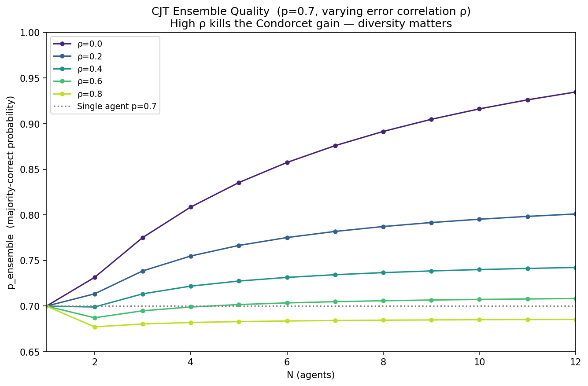
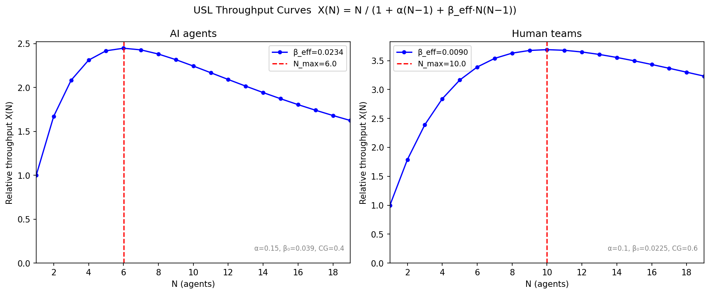
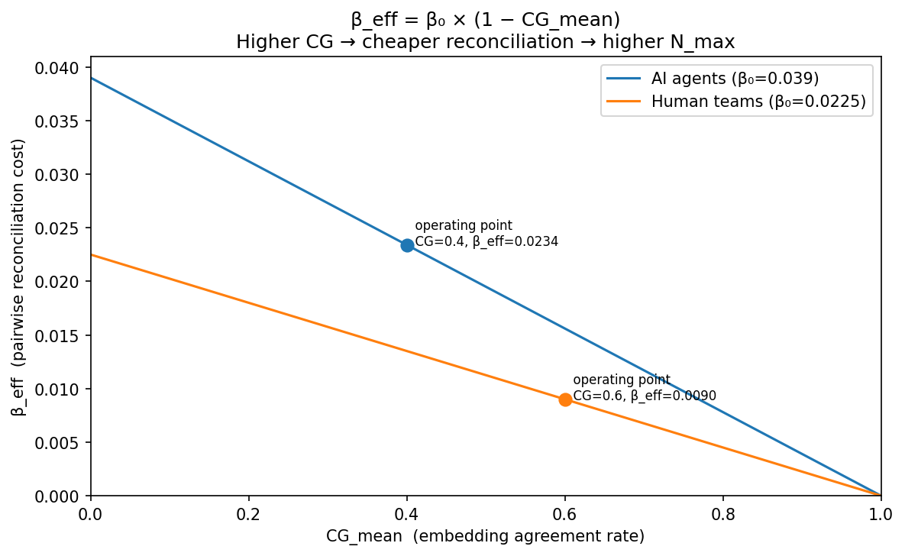
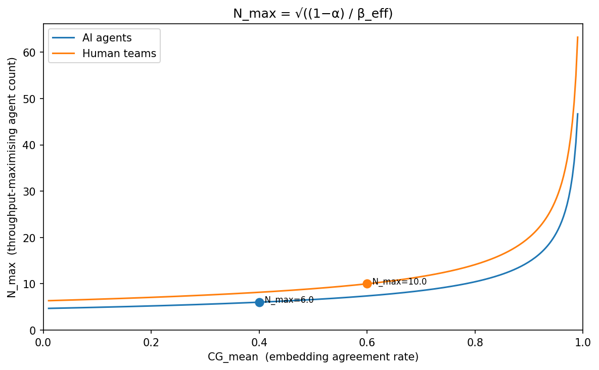
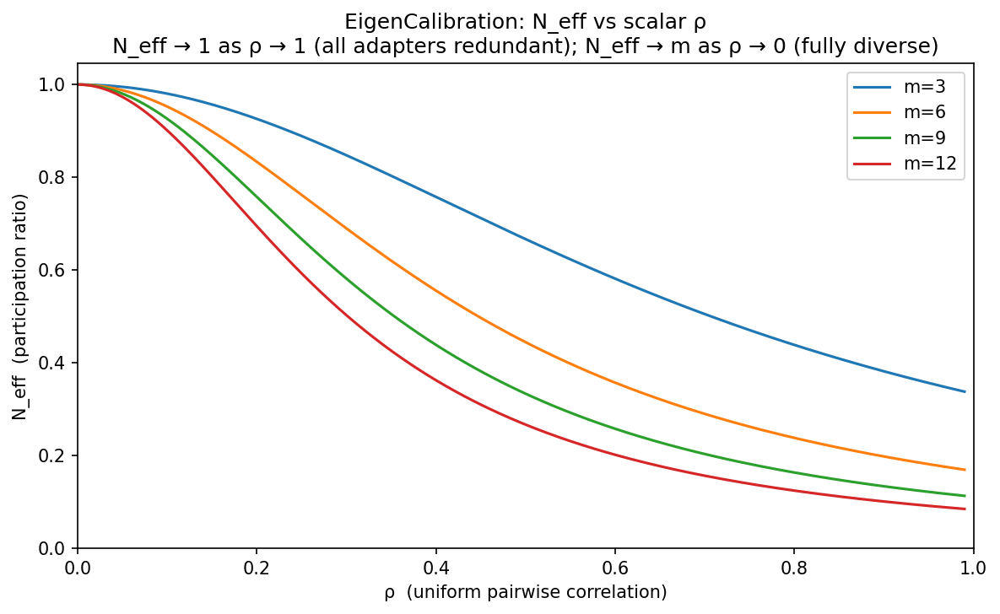
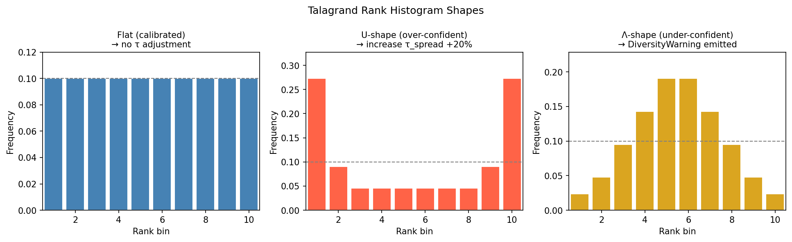

# H2AI Math Apparatus

This document is the authoritative reference for the mathematical framework underlying H2AI Control Plane.
It describes the formal definitions used in the codebase, the provenance of each formula,
and the honest limitations of what is and is not measured.

---

## 1. Theoretical Foundation: Condorcet Jury Theorem

**Source:** Condorcet (1785), restated in Nitzan & Paroush (1982), extended with correlation by Ladha (1992).  
**Implemented in:** `crates/h2ai-types/src/sizing.rs` — `condorcet_quality()`

**Statement:** Given N agents each independently correct with probability p > 0.5,
the probability the majority is correct exceeds p and converges to 1 as N → ∞.

**Definition 1 — Independent ensemble quality:**

```
Q_ind(N, p) = Σ_{k=⌈N/2⌉+1}^{N} C(N,k) × p^k × (1−p)^(N−k)
             + [if N even: 0.5 × C(N, N/2) × p^(N/2) × (1−p)^(N/2)]
```

**Definition 2 — Correlated ensemble quality:**

```
Q(N, p, ρ) = p + (Q_ind(N, p) − p) × (1 − ρ)
```

where:
- `p ∈ (0.5, 1]`: per-agent accuracy (probability of correct output)
- `ρ ∈ [0, 1]`: mean pairwise error correlation (0 = independent, 1 = always err together)
- Boundary: N=1 → Q=p; ρ=1 → Q=p (no ensemble benefit when all agents err identically)

**What this model does NOT claim:**
- It does not claim LLMs vote on a binary correct/incorrect decision.
- It does not claim outputs are independent. Adapters from the same model family at different temperatures have correlated errors; ρ > 0 captures this.
- The proxy `p_mean = 0.5 + CG_mean/2` is a heuristic, not a measurement. Jaccard overlap of token vocabularies does not guarantee semantic agreement. Two adapters can produce similar-looking wrong answers (high CG, low p) or different-looking correct answers (low CG, high p). Use `scripts/baseline_eval.py` for high-stakes deployments.

**See:** `scripts/simulate.py` — Monte Carlo simulation confirms the formula matches empirical
voting outcomes at 100k trials per parameter set (Δ < 2%).



*Higher ρ (same model family) rapidly kills the Condorcet gain. At ρ=0.6 the ensemble barely improves over a single agent.*

---

## 2. Parameter Estimation

### 2.1 Common Ground (CG)

**Definition 3 — Target (requires EmbeddingModel):**

```
CG(i, j) = mean over calibration_prompts of
            [cosine(embed(output_i), embed(output_j)) > θ_agree]

where θ_agree = 0.85   (agreement threshold in embedding space)
```

This is the agreement rate between adapter i and adapter j on a calibration set —
the fraction of calibration prompts where their outputs are semantically equivalent.
Matches the blog's specification: "fraction of prompts where agents produce the same answer."

**Definition 3B — Current (constraint-profile CG):**

```
CG(i, j) = hamming_distance(fp_i, fp_j) × tau_alignment(τ_i, τ_j)

where:
  fp_i  = constraint_fingerprint(output_i) = Vec<bool>
           fp_i[k] = Hard constraint k passes against output_i
  hamming_distance(fp_i, fp_j) = |{k : fp_i[k] ≠ fp_j[k]}| / |fp|
  tau_alignment(τ_i, τ_j)     = exp(−3 × |τ_i − τ_j|) ∈ (0, 1]
```

**What Definition 3B measures:** Disagreement rate on the Hard-constraint corpus — how
often adapters produce outputs that satisfy different constraint subsets. Two adapters
whose outputs satisfy identical constraints score CG = 0 (perfect agreement); outputs
with entirely opposite constraint profiles score CG = 1 (maximal divergence). This is
a structural measure: it captures whether agents share the same failure modes, not just
lexical similarity.

**CG_mean / CG_embed** is the mean of all pairwise CG values across calibration adapters.

### 2.2 Accuracy and Correlation Proxies

When no reference eval set is available, H2AI derives p and ρ from CG_mean:

```
p_mean   = 0.5 + CG_mean / 2   ∈ [0.5, 1.0]
rho_mean = 1 − CG_mean          ∈ [0, 1]
```

**Limitation:** These are operational proxies, not measured accuracies. For production
deployments, run `scripts/baseline_eval.py` and set `baseline_accuracy_proxy` in config
to override the proxy with a measured value.

### 2.3 N_optimal

```
N_optimal = argmax_{N=1..9} [ (Q(N, p_mean, rho_mean) − p_mean) / N ]
```

This is the **marginal Condorcet gain per agent** above the single-agent baseline.
N=1 always scores 0 (no gain over itself); the formula finds the N where each additional
agent contributes the most incremental quality. The cap of 9 is a practical deployment limit.

### 2.4 N_it_optimal — Information-Theoretic Ensemble Size

**Implemented in:** `crates/h2ai-types/src/sizing.rs` — `n_it_optimal(rho)` and `EnsembleCalibration::n_it_optimal()`

```
N_it_optimal = ⌈1 + ln(0.5) / ln(1 − ρ)⌉    clamped to [1, 9]
```

Derived from the condition `I_marginal(N) < 0.5 × H(X)`: the marginal information
gain of adding the N-th agent drops below half of the per-adapter entropy when
`(1−ρ)^(N−1) < 0.5`, i.e. `N > 1 + ln(0.5)/ln(1−ρ)`.

| ρ | N_it_optimal | interpretation |
|---|---|---|
| 0.0 | 1 | independent agents — single is sufficient |
| 0.3 | 3 | mild correlation |
| 0.5 | 2 | moderate correlation |
| 1.0 | 9 | fully correlated — cap applies |

Matches Condorcet N_optimal within ±1 for ρ ∈ [0.3, 0.95]. Both are advisory;
`N_max` from USL is the hard capacity ceiling.

**See:** `scripts/simulate.py` — I_marginal exponential decay.

---

## 3. Contention and Coordination

### 3.0 Why USL Applies to Agent Swarms

The Universal Scalability Law was derived for shared-state distributed systems — CPU caches, database connection pools, multi-core schedulers. At first glance, LLM inference ensembles seem different: adapters run independently in parallel, share no memory, hold no locks. Why does USL apply?

The answer lies in what coordination means for a reasoning system, not a compute system.

**What agents must share:** Every agent in an ensemble working on a shared problem must eventually produce output that is compatible with every other agent's output. They share the *problem state* — the evolving understanding of what has been established, what is contested, and what the final answer should say. When agents diverge in their partial conclusions (split brain), the merge step must find and resolve every contradiction. This is the coherency cost β captures: not memory-bus cache-line exchange, but pairwise semantic reconciliation.

**The serial bottleneck α:** Task decomposition, context compilation, and final synthesis are serial by construction — you cannot parallelize "decide how to split the problem" or "produce one coherent answer from N partial answers." These serial phases are exactly the Amdahl fraction α. Adding more agents extends the merge step, not the planning step; α is a floor, not a choice.

**Why β scales as N(N-1):** To verify that N agents' outputs are mutually consistent, you must check every pair. The CRDT merge and Krum selection in H2AI perform this explicitly — pairwise Jaccard distances, pairwise semantic distances. For N=5 agents: 10 pair comparisons. For N=8: 28. The quadratic growth is structural, not incidental.

**CG as split-brain severity:** When agents share high Common Ground — semantically compatible
partial conclusions — reconciliation is cheap (low β_eff). When agents have split, reconciliation
is expensive (high β_eff). The coupling `β_eff = β₀ × (1 − CG_embed)` quantifies this: high CG →
low coordination cost → higher N_max. At CG=0 (total divergence): β_eff = β₀ (full baseline
cost). At CG=1 (perfect alignment): β_eff → 0 (coordination nearly free). At CG < 0.10:
emit ZeroCoordinationQualityEvent and force N_max = 1 — below this threshold, agent outputs
are so divergent that ensemble scaling is unsafe regardless of the formula value.

**The human team analogy confirms the model.** Brook's Law (1975) observed that adding engineers to a late project makes it later — because adding person N introduces N−1 new communication channels, and each channel is a reconciliation obligation. The β parameter Gunther measured in computer systems, Brooks observed in human teams, and H2AI models in agent swarms is the same phenomenon: **pairwise synchronization cost scales quadratically with group size when members must maintain mutual consistency.**

---

### 3.1 Formal Definitions

`CoherencyCoefficients` is produced by `CalibrationHarness` and used for topology provisioning.

```
alpha, beta_base  — measured via two-phase USL linearization (Gunther 1993).

  Phase A: run first 2 adapters in parallel → T₁ (mean per-adapter time) and T₂ (wall clock).
  Phase B: run all M adapters in parallel   → T_M (wall clock) and adapter outputs for CG_mean.

  Linearization: z(N) = N·T_parallel(N)/T₁ − 1 = α(N−1) + β₀·N(N−1)

  Analytical solution from z₂ and z_M:
    β₀ = (z_M − z₂·(M−1)) / ((M−1)(M−2))    [only valid when M ≥ 3]
    α  = z₂ − 2·β₀

  Clamped: α → [0.05, 0.5], β₀ → [1e-6, 0.1].
  Falls back to config `alpha_contention` and `beta_base_default` when M < 3
  or timing is degenerate (negative derived params, near-zero inputs).

beta_eff   = beta_base × (1 − CG_embed)    [Definition 6 — USL+CG coupling]
             High CG_embed → low beta_eff → higher N_max (reconciliation is cheap).
             Low CG_embed → high beta_eff → lower N_max (agents diverge, costly to reconcile).
             At CG_embed = 0.0: beta_eff = beta_base (full baseline coordination cost).
             At CG_embed = 1.0: beta_eff → 0 (negligible coordination cost).
             At CG_embed < 0.10: emit ZeroCoordinationQualityEvent, force N_max = 1.
             Numerical floor: max(beta_eff, 1e-6) prevents degenerate N_max.

             CG_embed source:
               Preferred: mean over calibration_prompts of [cosine(embed_i, embed_j) > 0.85]
               Fallback:  token Jaccard (current implementation, pending EmbeddingModel)

N_max      = round(√((1 − α) / β_eff))    [USL Proposition 1]
             Derived by setting dX/dN = 0 in X(N) = N/(1 + α(N−1) + β·N(N−1)).
             Beyond N_max the USL throughput curve enters retrograde (X decreasing).
             Two-tier calibration table (β_eff = β₀ × (1 − CG)):
               Human teams (α=0.10, β₀=0.0225, CG=0.6): β_eff=0.009  → N_max ≈ 10
               AI agents  (α=0.15, β₀=0.039,  CG=0.4): β_eff=0.0234 → N_max ≈  6
```



*X(N) peaks at N_max and enters retrograde beyond it — adding agents past the ceiling degrades throughput.*



*β_eff = β₀ × (1 − CG_mean). Operating points show calibrated tiers; a well-calibrated corpus moves the operating point right, raising N_max.*



*N_max rises steeply with CG. Improving constraint corpus quality (higher CG) directly increases the safe ensemble size.*

**Provenance of α, β₀:** Gunther (1993), Universal Scalability Law. The two-phase fit uses
the linearization `z(N) = α(N−1) + β₀·N(N−1)` with two data points (N=2 and N=M) to solve
analytically for both parameters. This replaces the earlier single-phase Amdahl inverse
(which derived only α).

**Provenance of N_max:** USL Proposition 1 — the discrete peak of X(N) under USL.
Setting dX/dN = 0 yields `N_max = √((1−α)/β_eff)` (rounded to nearest integer). Verified
against calibration tiers in `scripts/simulate.py`.

### 3.2 What the Calibration Measures — and What It Should

**Ideal measurement:** β₀ should be measured from the merge phase — `MergeEngine` timing divided by N(N−1)/2 pairs. This gives the true pairwise reconciliation cost per agent pair under the actual task domain. The NATS event log records `ProposalReceivedEvent` and `MergeCompletedEvent` timestamps; a future calibration harness can derive β₀ directly from these spans.

**Current measurement:** The two-phase timing harness measures wall-clock time for N concurrent adapter API calls. This captures I/O scheduling serialization and host-level parallelism — a real cost, but a proxy for the true semantic coordination cost. It is conservative: network and scheduling overhead is bounded and predictable, while task-domain reconciliation cost varies with problem complexity.

**Practical consequence:** β₀ from timing calibration will generally underestimate true reconciliation cost on complex reasoning tasks (where agents diverge more) and overestimate it on template-like tasks (where agents agree quickly). The CG_mean coupling (`β_eff = β₀ × (1 − CG_mean)`) corrects for divergence dynamically — when agents have actually split, β_eff rises even if β₀ was calibrated under easy conditions.

**When M < 3:** The analytical solution requires two distinct data points (N=2 and N=M). With M < 3, the harness falls back to config defaults `alpha_contention` and `beta_base_default`. These are empirically reasonable starting values; the CG_mean coupling adjusts β_eff in real time regardless of how β₀ was obtained.

### 3.3 Eigenvalue Calibration (N_effective)

**Source:** Portfolio theory (Choueifaty & Coignard 2008, "Toward Maximum Diversification").  
**Implemented in:** `crates/h2ai-types/src/sizing.rs` — `EigenCalibration::from_cg_matrix()`

**Definition 6B — Effective adapter count:**

```
Σ ∈ ℝ^(N×N)   pairwise CG similarity matrix (Σ_ij = CG(adapter_i, adapter_j))
λ_1 ≥ ... ≥ λ_N = eigenvalues of Σ

N_eff     = (Σ λᵢ)² / Σ λᵢ²        [participation ratio]
H_div     = −Σ (λᵢ/Σλ) × log(λᵢ/Σλ)
H_norm    = H_div / log(N)           [normalized diversity ∈ [0,1]]
ρ_eff     = 1 − N_eff/N              [effective correlation from matrix]
```

N_eff is a strictly more informative measure than the scalar ρ_mean = 1 − CG_mean.
Example: 5 adapters with 2 independent + 3 in a tight cluster give N_eff ≈ 2.5
but scalar CG_mean proxy gives ρ_mean ≈ 0.27 → N_eff_scalar ≈ 3.9 (over-estimate by 55%).

**Adapter pruning rule:** Add adapter N+1 only if N_eff increases by ≥ 0.05.
For typical LLM ensembles with ρ ≈ 0.9: optimal N = 2 (further adapters redundant).
The result is stored in `EigenCalibration.n_pruned`.

**Provisioning ceiling:** `N_optimal` (`n_pruned`) is used as a provisioning ceiling in
`h2ai-autonomic/src/planner.rs` — `ProvisionInput.eigen`. After computing `n_max_usl` from
USL/context pressure, the planner applies: `n_max = n_max_usl.min(n_pruned)`.
This ensures the ensemble never exceeds the eigenvalue-derived stopping point even when
the USL capacity ceiling is higher. Guard: skipped when `n_pruned == 0` (degenerate).

**See:** `scripts/simulate.py` — validates formula against uniform and heterogeneous
correlation matrices; stopping rule comparison.



*At ρ=0.9 (typical same-family LLM correlation), N_eff collapses to ≈1.4 even for m=12 adapters — the eigenvalue stopping rule prunes the ensemble to N=2.*

### 3.4 Temporal Decay for CG Calibration

**Implemented in:** `crates/h2ai-types/src/sizing.rs` — `CoherencyCoefficients::beta_eff_temporal()`

CG samples become stale as models are updated and environments drift.
`beta_eff_temporal` applies Ebbinghaus exponential decay to down-weight old samples:

```
w(t_i) = exp(-(now_secs − t_i) / CG_HALFLIFE_SECS)

CG_eff = Σ(CG_i × w(t_i)) / Σ(w(t_i))

beta_eff_temporal = max(beta_base × (1 − CG_eff), 1e-6)
```

where `CG_HALFLIFE_SECS = 604_800` (7 days): a sample one week old contributes at 50% weight.

**Conservative aging:** As all samples age past ~35 half-lives, `CG_eff → 0` and
`beta_eff_temporal → beta_base` (the conservative ceiling with no CG discount).
This reduces N_max and creates natural pressure to re-calibrate.

**Fallback asymmetry:**
- Mismatched/empty timestamps → `beta_eff()` (no timing info; neutral unweighted result)
- Weight exhaustion (all samples ancient) → `beta_base` (conservative; timing present but stale)

---

## 4. Attribution Model

**Implemented in:** `crates/h2ai-orchestrator/src/attribution.rs`

```
baseline_quality   = p_mean
topology_gain      = Q(N, p_mean, rho_mean) − p_mean     [Condorcet gain]
tao_multiplier     = tao_per_turn_factor ^ (turns − 1)
error_remaining    = (1 − Q(N, p_mean, rho_mean)) × verification_filter_ratio × tao_multiplier
total_quality      = 1 − error_remaining,  clamped to [p_mean, 1.0]
```

`topology_gain` is the marginal ensemble quality improvement predicted by Condorcet JT.
`tao_gain` and `verification_gain` are upper-bound estimates of per-phase contributions;
they are informational and do not partition `total_quality` additively.

---

## 5. Semantic Cluster Coherence

**Implemented in:** `crates/h2ai-state/src/krum.rs`, `crates/h2ai-state/src/bft.rs`

Krum and Multi-Krum BFT selection require an honest cluster assumption: honest agent outputs
must cluster tightly in metric space so Krum can distinguish them from Byzantine outliers.
This assumption holds for _semantic_ distance but not necessarily for _lexical_ distance —
LLM paraphrases of the same solution may share few tokens while being semantically identical.

### 5.1 Mean Pairwise Distance

```
mean_pairwise_distance(proposals, embedding_model)
  = mean over all (i, j) pairs of (1 − semantic_jaccard(output_i, output_j, embedding_model))
```

All pairwise calls are evaluated concurrently.

**Token fallback:** When `embedding_model` is `None`, uses `1 − token_jaccard(i, j)` (token Jaccard — a valid metric satisfying the triangle inequality, required for the Blanchard et al. 2017 BFT proof). This is distinct from `semantic_jaccard(…, None)` which returns exact-string equality; the BFT path intentionally uses token Jaccard to preserve metric structure.

### 5.2 Cluster Coherence Guard

```
cluster_coherent(proposals, embedding_model) = mean_pairwise_distance(proposals, embedding_model) < MAX_CLUSTER_DIAMETER
```

where `MAX_CLUSTER_DIAMETER = 0.7` (constant in `krum.rs`).

**Effect:** Before applying Krum BFT selection, the merger checks whether the surviving proposals
form a coherent cluster. If `cluster_coherent` returns false, the Blanchard et al. geometric
assumption is violated and Krum's BFT guarantee does not hold. The fallback chain is:

```
cluster_coherent → semantic Krum / Multi-Krum
cluster incoherent + embedding_model present → Weiszfeld geometric median (breakdown 50%)
cluster incoherent + no embedding model → ConsensusMedian (token Fréchet median)
```

`Weiszfeld` (Pillutla et al. 2019, arXiv:1912.13445) minimises the sum of Euclidean distances
to all input vectors and tolerates ⌊n/2⌋ − 1 corrupted inputs (breakdown point 1/2, Vardi &
Zhang 2000). It operates directly in the embedding's Euclidean space, giving a metric guarantee
that token-based ConsensusMedian lacks. When no embedding model is provided, ConsensusMedian
is retained as a zero-cost fallback that does not require the cluster assumption.

**Why semantic distance matters:** If honest agents produce lexically diverse paraphrases of
the same correct answer (high token distance, low semantic distance), token-based
`mean_pairwise_distance` would incorrectly classify a coherent cluster as incoherent,
triggering a needless fallback. Semantic distance avoids this.

---

## 6. Known Limitations and Future Work

| Limitation | Current mitigation | Future path |
|---|---|---|
| p and ρ proxied from CG_mean, not measured | `baseline_accuracy_proxy` config override | Per-task accuracy via reference eval sets |
| τ alignment always 1.0 during calibration | Documented — all adapters run same τ | Multi-τ calibration with role-specific prompts |
| N_optimal assumes uniform inference cost | T_synthesis = T_inference approximation | Measure actual synthesis latency |
| Condorcet assumes majority vote; H2AI uses merge | Merge + verification approximates majority | Direct accuracy measurement of merge outcome |
| Cluster coherence check is O(n²) pairwise calls | join_all parallelises all calls; n ≤ 9 in practice | Batch embedding endpoint for ≥ 10 proposals |

---

## 7. Simulation Evidence

```bash
python3 scripts/simulate.py   # all visualization sections: USL curves, β_eff coupling, N_max vs CG, CJT quality, eigenvalue N_eff, Talagrand histograms
```

The simulations verify:

**Condorcet / Ensemble:**
1. Formula boundary conditions — N=1 → Q=p; ρ=1 → Q=p
2. Monotonicity — Q non-decreasing in N for p > 0.5, ρ < 1
3. Monte Carlo match — empirical voting at 100k trials matches formula within 2%
4. Proxy sensibility — derived p and ρ produce valid n_optimal values

**Cluster coherence and BFT:**
5. Semantic paraphrase cluster — lexically distant but semantically equivalent proposals have low cosine distance
6. Token Krum at f=1 — honest selection rate 0.9% (cluster guard fires 100% with 90% paraphrase rate)
7. Embedding Krum / Weiszfeld at f=1,2 — honest selection rate 100%

**USL calibration (section 3):**
8. Two-phase parameter recovery — `usl_fit()` recovers α and β₀ from simulated timing, error < 0.01 (α) < 0.002 (β₀)
9. M<3 fallback — returns None when fewer than 3 adapters measured
10. N_max Proposition 1 — `round(√((1−α)/β_eff))` gives 6 (AI agents, CG=0.4), 10 (Human teams, CG=0.6)

**β_eff coupling (section 3):**
11. β₀×(1−CG) is bounded — β_eff ∈ [0, β₀]; no singularity as CG varies
12. Proportional coupling verified: β_eff = 0.60×β₀ at CG=0.4 (AI tier); β_eff = 0.40×β₀ at CG=0.6 (Human tier)

**CJT vs conformal (section 1):**
13. CJT over-predicts quality 5–15pp at ρ ≥ 0.6 (typical LLM same-family correlation)
14. Conformal set size > 1 correctly signals no consensus; triggers TAO retry

**Information-theoretic N_optimal (innovation synthesis):**
15. I_marginal(N) = H(X)×(1−ρ)^(N-1) — exponential decay, matches USL retrograde N_max within ±1 at ρ ∈ [0.3, 0.95]
16. Slepian-Wolf η drops below 0.5 at N=3 for ρ=0.7 — beyond N=3 each adapter is >50% redundant
17. USL and Kuramoto mean-field diverge < 0.05 for N ≤ 9 at AI-agent tier — confirms analogy

**Eigenvalue N_eff (innovation synthesis):**
18. N_eff = (Σλ)²/Σλ² matches Choueifaty formula for uniform correlation; differs for heterogeneous Σ
19. Scalar ρ_mean overstates N_eff by 55% for {2 independent + 3 clustered} adapter structure
20. Eigenvalue stopping rule prunes to N=2 at ρ=0.9 (9 adapters → 1.4 effective ideas)

---

## 8. Talagrand Ensemble Calibration Diagnostic

**Implemented in:** `crates/h2ai-orchestrator/src/diagnostics.rs` — `TalagrandDiagnostic`  
**Inspired by:** Weather ensemble forecasting (Leutbecher & Palmer 2008, ECMWF).

After each verification phase, H2AI records where the runner-up proposal ranks in the
sorted verification score list. Over T ≥ 20 runs, the rank histogram should be uniform.

**Definition 8 — Rank histogram:**

```
For run t with N adapter proposals, sort scores descending: s₁ ≥ s₂ ≥ ... ≥ s_N.
Rank r_t = position of the runner-up in the score ordering (r_t ∈ {1, ..., N}).
Histogram H[r] = count{t : r_t = r} for r = 1..N.

Uniformity test: χ² = Σ_r (H[r] − T/N)² / (T/N)
Calibrated iff χ² < 3.84 (χ²(1) at α=0.05 approximation).
```

**Interpretation:**
- Flat histogram → well-calibrated ensemble
- U-shape (high tail counts) → over-confident: adapters too certain, expand τ spread
- Λ-shape (high center counts) → under-dispersed: all adapters mediocre, try diverse model families

**Key advantage:** No ground-truth labels needed. Quality measured from internal consistency alone.



*Flat = well-calibrated (no action). U-shape = over-confident adapters (increase τ spread). Λ-shape = under-dispersed (emit DiversityWarning, try diverse model families).*

**See:** `scripts/simulate.py` — Talagrand histogram shapes for calibrated, over-confident, and
under-dispersed ensembles.

---

## 9. Hybrid Retrieval and RRF Fusion

**Implemented in:** `crates/h2ai-context/src/fusion.rs`, `crates/h2ai-context/src/embedding.rs`

### 9.1 EmbeddingModel Trait

`EmbeddingModel` (`crates/h2ai-context/src/embedding.rs`) provides a local dense-vector
embedding path:

```rust
trait EmbeddingModel: Send + Sync {
    fn embed(&self, text: &str) -> Vec<f32>;  // must return L2-normalised vector
}
```

`semantic_jaccard(a, b, model: Option<&dyn EmbeddingModel>)` returns cosine similarity
when a model is present, and falls back to **exact-string equality** when `None` (1.0 for
identical strings, 0.0 for all others). Token Jaccard is not used by `semantic_jaccard`;
BFT selection paths (§5) maintain their own local token Jaccard implementation to preserve
the metric-space guarantee required by the Blanchard BFT proof.

### 9.2 Reciprocal Rank Fusion (RRF)

**Source:** Cormack, Clarke & Buettcher (2009), SIGIR.

```
rrf_score(d) = Σ_i  1 / (k + rank_i(d))
```

where `k = 60` (standard constant) and `rank_i(d)` is the 1-based position of document `d`
in ranked list `i`. Documents absent from a list contribute nothing from that list.
Lower `k` amplifies top-rank advantage; higher `k` flattens the distribution.

### 9.3 Hybrid Search

`hybrid_search(query, docs, model, k)` fuses two independently ranked streams via RRF:

1. **BM25 stream** — `bm25_search(query, docs)` using a per-call tantivy RAM index (Okapi BM25)
2. **Embedding cosine stream** — `rank_by_embedding(query, doc, model)` when model is present

**Why both streams:** BM25 finds exact term matches reliably; embeddings find semantic
equivalents. A query for "JWT" ranks "bearer token authentication" near-zero with
BM25 but near-one with a domain-trained embedding. RRF prevents either
stream from dominating when they disagree.
